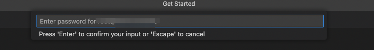
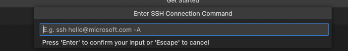

# Abstract

In order to easily read the code of OceanBase, we suggest using one IDE which is easily index the symbols of OceanBase. In Windows, we recommend `Souce Insight` can be used, and in Mac or Linux, we recommend that `VSCode + ccls` can be used to read the oceanbase code. Due to it is very easy to use `Source Ingisht`, so this document skip introduction how to use `Souce Insight`.

This document introduce how to setup `VSCode + ccls`, which is very convenient to read the code of OceanBase. [ccls](https://github.com/MaskRay/ccls) is based on [cquery](https://github.com/jacobdufault/cquery), which is one of C/C++/Objective-C [LSP](https://en.wikipedia.org/wiki/Language_Server_Protocol)s (In one word, LSP is used to provide programming language-specific features like code completion, syntax highlighting and marking of warnings and errors, as well as refactoring routines).

The number of OceanBase code is pretty huge and OceanBase can't be compiled under Mac or Windows, so we recommend that download the code on the remote server, and start VSCode to access the code under the remote server.

# Config ccls on Remote Server

**Attention**
The following `/path/to` just means the path example, please replace it with your real path.

## Introduction

In the C/C++ LSP domain, the famous tools are clangd and ccls. Here we recommend ccls, because:

1. The speed of building index of ccls is slower than that of clangd, but after building, the speed of accessing index of ccls is faster than that of clangd.
2. Unity building doesn't be supported by clangd, but OceanBase is being built by unity, failed to build index through compile_commands.json by clangd.

# ccls Installation

## Install ccls on CentOS

> NOTE: if you don't have the permission for `yum`, please use `sudo yum ...` instead.

```bash
yum install epel-release
yum install snapd # On centos8: yum install snapd --nobest
systemctl enable --now snapd.socket
ln -s /var/lib/snapd/snap /snap
snap install ccls --classic
```

And then add the command below into your env source file, such as '~/.bashrc' or '~/.bash_profile'

```bash
export PATH=/var/lib/snapd/snap/bin:$PATH
```

Now, refresh your environment like this:

```bash
source ~/.bashrc   # or
source ~/.bash_profile
```

## Install ccls on Ubuntu

```bash
apt-get -y install ccls
```

> NOTE: If you don't have the permission, please use `sudo` as the command prefix.

## Check the Installation

You can run the command below to check whether the installation was success.

```bash
ccls --version
```

# VSCode Configuration

## Remote Plugin

Once the source code has been located in the remote machine, it is easy to setup debugging environment in remote machine. At the same time, the application can be run faster because remote machine is more powerful.  User can easily access the source code on the remote machine even when something is wrong with the network, just wait reload after reconnect the remote server.

### Installation

Download and install the Remote plugin from the VSCode extension store.


### Usage

**NOTE**：Make sure the connection between the local machine and the remote machine is fine.
After installation the plugin, there is one icon in the left bottom corner of VSCode.


Press the icon and select `Connect to Host`, or press shortkey `ctrl+shift+p` and select `Remote-SSH:Connect to Host`:


Input user@remote_ip in the input frame, VSCode will create one new window, please input password in the new window:



After input the password, VSCode will connect to the remote server, and it is ready to open the remote machine's file or directory.

If you want to use the specific port, please choose `Add New SSH Host`, then input ssh command, then choose one configuration file to store the ssh configuration.




After that, the configured machines can be found in the `Connect to Host`.

Password need to be input everytime. If you want to skip this action, please configure SSH security login with credential.

## C/C++ Plugin

We do **not** recommend using C/C++ plugins as they do not provide good indexing capabilities for OceanBase, and they are not compatible with the ccls plugin.

C/C++ plugin can be download and installed in VSCode extension store in the case of simple scenarios:


C/C++ plugin can automatically code completion and syntax highlighting, but this plugin failed to build index for OceanBase, it is hard to jump the symbol of OceanBase.

## ccls Plugin

### Install ccls Plugin


> if ccls will be used, it suggest to uninstall C/C++ plugin.

### Configure ccls Plugin

1. press the setting icond and choose **Extension Settings**


2. Set config ccls.index.threads. CCLS uses 80% of the system cpu cores as the parallelism in default. We can search `threads` in vscode config page and set the number like below.

> As default, oceanbase built in unity mode and it costs more memory than usual case. The system maybe hangs if the parallelism is too high such as 8C 16G system.


## Usage

1. git clone the source code from [https://github.com/oceanbase/oceanbase](https://github.com/oceanbase/oceanbase)
2. Run the command below to generate `compile_commands.json`

   ```bash
   bash build.sh ccls --init
   ```

After that, compile_commands.json can be found in the directory of `code_path_of_oceanbase`.

After finish previous steps, please restart VSCode, the building index precedure can be found at the bottom of VSCode:


After finish building index, the function's reference and class member can be easily found for any opened file as the following example:


Recommend ccls shortkey settings:


