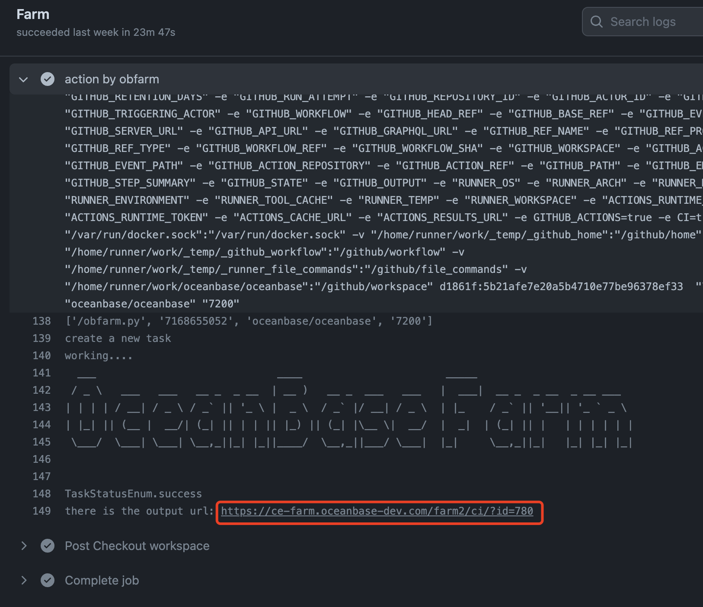

# Write and run unittest

## How to build and run all unittest?

[OceanBase](https://github.com/oceanbase/oceanbase) has two unittest directories.

- `unittest` . These are the main unittest cases, and it tests the code in the `src` directory.

- `deps/oblib/unittest`. Cases for oblib.

First, you should build `unittest`. You should enter the `unittest` directory in the build directory and build explicitly. When you build the oceanbase project, it does't build the unittest in default. For example:

```bash
bash build.sh --init --make # init and build a debug mode project
cd build_debug/unittest  # or cd build_debug/deps/oblib/unittest
make -j4 # build unittest
```

Then you can execute the script file `run_tests.sh` to run all test cases.

## How to build and run a single unittest

You can also build and test a single unittest case. You can enter the `build_debug` directory, and execute `make case-name` to build the specific case and run the binary file built. For example:

```bash
cd build_debug
# **NOTE**: don't enter the unittest directory
make -j4 test_chunk_row_store
find . -name "test_chunk_row_store"
# got ./unittest/sql/engine/basic/test_chunk_row_store
./unittest/sql/engine/basic/test_chunk_row_store
```

## How to write unittest

As a C++ project, [OceanBase](https://github.com/oceanbase/oceanbase) uses [google test](https://github.com/google/googletest) as the unittest framework.

OceanBase use `test_xxx.cpp` as the unittest file name. You can create a `test_xxx.cpp` file and add the file name into the specific `CMakeLists.txt` file.

In the `test_xxx.cpp` file, you should add a header file `#include <gtest/gtest.h>` and the main function below.

```cpp
int main(int argc, char **argv)
{
  testing::InitGoogleTest(&argc, argv);
  return RUN_ALL_TESTS();
}
```

You can then add some functions to test different scenarios. Below is an example from `test_ra_row_store_projector.cpp`.

```cpp
///
/// TEST is a google test macro.
/// You can use it to create a new test function
///
/// RARowStore is the test suite name and alloc_project_fail
/// is the test name.
///
TEST(RARowStore, alloc_project_fail)
{
  ObEmptyAlloc alloc;
  ObRARowStore rs(&alloc, true);

  /// ASSERT_XXX are some testing macros help us decide the results are
  /// expected, and it will terminate the test if failed.
  ///
  /// There are some other testing macros begin with `EXPECT_` which
  /// don't terminate the test if failed.
  ///
  ASSERT_EQ(OB_SUCCESS, rs.init(100 << 20));
  const int64_t OBJ_CNT = 3;
  ObObj objs[OBJ_CNT];
  ObNewRow r;
  r.cells_ = objs;
  r.count_ = OBJ_CNT;
  int64_t val = 0;
  for (int64_t i = 0; i < OBJ_CNT; i++) {
    objs[i].set_int(val);
    val++;
  }

  int32_t projector[] = {0, 2};
  r.projector_ = projector;
  r.projector_size_ = ARRAYSIZEOF(projector);

  ASSERT_EQ(OB_ALLOCATE_MEMORY_FAILED, rs.add_row(r));
}
```

Please refer to [google test document](https://google.github.io/googletest/) to get more details about `TEST`, `ASSERT` and `EXPECT`.


## Unittest on GitHub CI

Before a pull request is merged, the CI will test your pull request. The `Farm` will test the `mysql test` and `unittest`. You can see the details follow the `Details` link like below.





