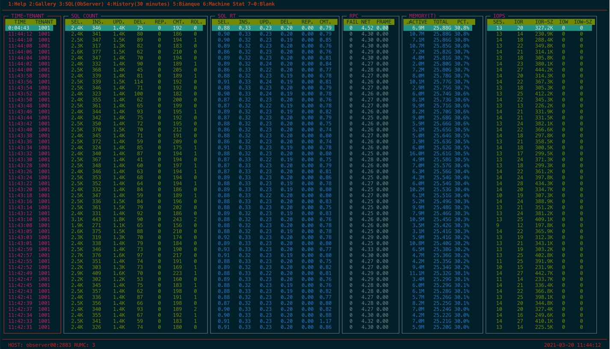
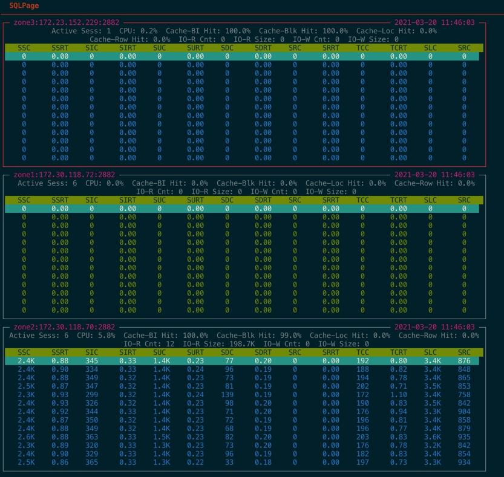

# 如何对 OceanBase 进行简单性能诊断

## 如何使用 TSAR 实时监控 OceanBase 主机性能

`tsar` 是阿里巴巴开源的主机性能采集软件，C语言开发，工作效率非常高，对主机性能占用很低。
`tsar` 开源地址：`github.com/alibaba/tsar` 。`tsar` 可以编译安装。安装后默认每分钟采集一次主机性能，数据存放在 `/var/log/` 目录下，文件名是 `tsar.data` 。文件滚动存放，占用空间很小。

`tsar` 常用用法如下：

```bash
#查看历史性能数据概况，每分钟一笔
tsar -i 1

# 查看 CPU、LOAD、网络历史性能数据，每分钟一笔
tsar --cpu --load --traffic -i 1

# 查看实时 CPU、IO 性能数据，每3秒一笔记录
[root@obce00 ob-loader-dumper-2.1.13-SNAPSHOT]# df -h
文件系统                 容量  已用  可用 已用% 挂载点
devtmpfs                  15G     0   15G    0% /dev
tmpfs                     15G     0   15G    0% /dev/shm
tmpfs                     15G  508K   15G    1% /run
tmpfs                     15G     0   15G    0% /sys/fs/cgroup
/dev/vda1                100G  6.8G   94G    7% /
/dev/mapper/obvg-lvredo   20G   45M   19G    1% /redo
/dev/mapper/obvg-lvdata   79G   57M   75G    1% /data
tmpfs                    3.0G     0  3.0G    0% /run/user/0
[root@obce00 ob-loader-dumper-2.1.13-SNAPSHOT]# ll /dev/mapper/obvg-lvredo
lrwxrwxrwx 1 root root 7 9月  22 20:10 /dev/mapper/obvg-lvredo -> ../dm-0
[root@obce00 ob-loader-dumper-2.1.13-SNAPSHOT]# tsar --cpu --io -I dm-0 -l -i 3
Time              -----------------------cpu---------------------- ------------------------------------------------------------------dm-0------------------------------------------------------------------
Time                user     sys    wait    hirq    sirq    util    rrqms   wrqms   %rrqm   %wrqm      rs      ws   rsecs   wsecs  rqsize  rarqsz  warqsz  qusize   await  rawait  wawait   svctm    util
29/09/21-22:32:30   0.08    0.08    0.00    0.08    0.04    0.29     0.00    0.00    0.00    0.00    0.00    0.00    0.00    0.00    0.00    0.00    0.00    0.00    0.00    0.00    0.00    0.00    0.00
^C
```

## 查看 CPU 性能

CPU用`top`命令也可以看。原理相同。通常情况下，数据库很忙的时候，`load`会偏高、`user`利用率会相对比较高。再从`top`命令里看是哪个进程。如果是数据库进程，那基本确认是数据库内部性能问题。如果`sys`利用率也相对比较高(如超过`20`)，则留意OS的异常。如果`wait`利用率相对比较高，则看看`IO`的性能。

`load`的结果里`load1`，`load5`，`load15`分别代表1分钟内，5分钟内，15分钟内平均值。可以看出`load`变化趋势。

```bash
$tsar --cpu --load -l -i 3
Time              -----------------------cpu---------------------- -------------------load-----------------
Time                user     sys    wait    hirq    sirq    util    load1   load5  load15    runq    plit
07/07/19-15:24:54  25.59   10.62    3.08    0.00    0.42   36.63    13.78   12.99   12.15    5.00    2.8K
07/07/19-15:24:57  25.42   10.63    7.10    0.00    0.42   36.46    13.72   12.99   12.15   10.00    2.8K
07/07/19-15:25:00  25.25   10.11    3.85    0.00    0.40   35.77    13.58   12.97   12.15    3.00    2.8K
07/07/19-15:25:03  29.34   11.31    4.89    0.00    0.48   41.13    13.58   12.97   12.15    7.00    2.8K
07/07/19-15:25:06  24.80    9.93    5.92    0.00    0.36   35.09    13.37   12.94   12.14   25.00    2.8K
^C

```

## 查看网络性能

首先通过`ethtool`命令查看网卡的速度。然后通过`tsar`命令看网卡实际上传下载速度以及丢包率。如果接近或者超过网卡的能力，则表示网卡此刻接近吞吐量瓶颈。

```bash
#ethtool  bond0
Settings for bond0:
 Supported ports: [ ]
 Supported link modes:   Not reported
 Supported pause frame use: No
 Supports auto-negotiation: No
 Advertised link modes:  Not reported
 Advertised pause frame use: No
 Advertised auto-negotiation: No
 Speed: 2000Mb/s
 Duplex: Full
 Port: Other
 PHYAD: 0
 Transceiver: internal
 Auto-negotiation: off
 Link detected: yes

[root@OceanBase081181186.et15sqa /home/qing.meiq]
#tsar --traffic -l -i 3
Time              ---------------------traffic--------------------
Time               bytin  bytout   pktin  pktout  pkterr  pktdrp
07/07/19-15:58:24   8.7M    2.3M    9.9K    6.1K    0.00    0.00
07/07/19-15:58:27   9.0M    2.6M   10.0K    6.2K    0.00    0.00
07/07/19-15:58:30   9.7M    2.7M   10.7K    6.5K    0.00    0.00
07/07/19-15:58:33  10.7M    2.6M   11.0K    6.1K    0.00    0.00
07/07/19-15:58:36   8.5M    2.2M    9.5K    5.7K    0.00    0.00
^C

```

在分析带宽流量的时候，还可以借助 OS 自己的命令：`iftop` 。

```bash
# 查看网卡 IP 流量
iftop -i eth0 -nNB
# 按 L 、T 、3 、t 、 B 、l 、 p  找出具体哪个 IP 和 PORT 流量最大
```

## 查看内存性能

Memory主要是关注`free`、`buffer`、`cache`的变化是否正常。通常运行一段时间后数据库主机的内存分布就比较固定了。如有异常变化，还需要结合其他信息判断。

```
#tsar --mem -l -i 3
Time              -----------------------mem----------------------
Time                free    used    buff    cach   total    util
07/07/19-15:31:46   3.0G   31.2G    1.8G   58.2G   94.2G   33.16
07/07/19-15:31:49   3.0G   31.2G    1.8G   58.2G   94.2G   33.13
07/07/19-15:31:52   3.0G   31.2G    1.8G   58.2G   94.2G   33.15
07/07/19-15:31:55   3.0G   31.2G    1.8G   58.2G   94.2G   33.15
^C
```

## 查看 IO 性能

看IO性能首先要确认当前的磁盘分区、文件系统设置等。通过`fdisk`、`mount`和`df -h`命令查看。找到数据库数据和文件所在的磁盘，使用`tsar`观察`IO`性能。对于一个磁盘的吞吐能力，响应时间水平应该事先有所了解。

```bash
[root@OceanBase081181186.et15sqa /home/qing.meiq]
#ll /dev/mapper/ob_vg-ob_data
lrwxrwxrwx 1 root root 7 Jun 12 15:28 /dev/mapper/ob_vg-ob_data -> ../dm-1

[root@OceanBase081181186.et15sqa /home/qing.meiq]
#ll /dev/mapper/ob_vg-ob_log
lrwxrwxrwx 1 root root 7 Jun 12 15:28 /dev/mapper/ob_vg-ob_log -> ../dm-0

[root@OceanBase081181186.et15sqa /home/qing.meiq]
#tsar --io -I dm-0 -l -i 3
Time              ------------------------------------------dm-0------------------------------------------
Time               rrqms   wrqms      rs      ws   rsecs   wsecs  rqsize  qusize   await   svctm    util
07/07/19-15:38:09   0.00    0.00    0.00  251.67    0.00    5.3K   21.67    2.00    8.89    3.97   99.87
07/07/19-15:38:12   0.00    0.00    0.00  231.67    0.00    4.7K   20.85    2.00    9.08    3.95   91.50
07/07/19-15:38:15   0.00    0.00    0.00  227.33    0.00    1.7K    7.73    1.00    8.71    4.39   99.73
07/07/19-15:38:18   0.00    0.00    0.00  213.33    0.00    1.3K    6.36    1.00    8.31    4.31   92.00
07/07/19-15:38:21   0.00    0.00    0.00  202.33    0.00    1.1K    5.54    1.00    9.09    4.51   91.20
07/07/19-15:38:24   0.00    0.00    0.00  230.67    0.00    1.3K    5.57    1.00    8.34    4.32   99.73
07/07/19-15:38:27   0.00    0.00    0.00  203.33    0.00    1.1K    5.65    1.00    8.65    4.49   91.27
07/07/19-15:38:30   0.00    0.00    0.00  224.67    0.00    1.5K    6.84    1.00    8.34    4.43   99.47
07/07/19-15:38:33   0.00    0.00    0.00  232.33    0.00    3.0K   13.11    2.00    8.61    3.96   92.07
07/07/19-15:38:36   0.00    0.00    0.00  210.67    0.00    1.2K    5.80    1.00    8.27    4.36   91.87
07/07/19-15:38:39   0.00    0.00    0.00  227.33    0.00    1.3K    5.75    1.00    8.16    4.39   99.90
^C
```

其中`IO Util`是个比较复杂的参数。如果是机械盘，这个`Util`可以反映出磁盘的繁忙程度，`svctm`会在几毫秒以上。如果是`SSD`盘，`svctm`会在零点几毫秒。 关于利用率有个近似公式:`利用率U = 吞吐量 * 每次平均服务时间`. 所以SSD盘需要看响应时间(`svctm`)、等待时间(`await`)等信息综合判断是否到瓶颈。

**备注：**
主机的性能是最容易看最基础的，如果主机在某方面呈现性能瓶颈，数据库的性能和稳定性很可能会受影响。二者之间的联系并不会表现的很直接，需要多观察总结成经验。

## 如何使用DOOBA 实时监控 OceanBase 租户性能

`dooba.py` 是 Python 语言编写的脚本，作用是实时读取 OceanBase 租户的性能。

ORACLE 数据库有 AWR 报表，可以方便诊断人员快速了解数据库在某个时间点的性能问题和原因。AWR 依赖很多内部视图，其中部分视图在 OceanBase 里也实现了。只是暂时 OceanBase 还没有实现 AWR 报表。OceanBase 运维平台 OCP 里提供了丰富的性能展示功能方便对 OceanBase 进行诊断。

OceanBase 里也记录了会话和 SQL 的等待事件，这一块功能还不是很成熟，大部分性能问题只要分析 SQL 就能解决。所以等待事件就不看了。
OceanBase 的 SQL 诊断，建议关注 租户的 `QPS`（每秒 SQL 请求数，包括 `SELECT` 、`INSERT`、`UPDATE`、`DELETE` ）以及其 `RT`（SQL 执行耗时）、`TPS`（每秒事务数，跟 ORACLE 一致 ）以及其 `RT`（事务提交延时）。此外，关注这些指标在 OceanBase 集群节点上的性能信息。
OceanBase 集群的性能瓶颈不会首先在 IO ，而更容易在内存，其次是 CPU 。所以还需要关注 每秒内存的变化。具体是指增量内存的使用情况。

使用 OceanBase 自带的命令行监控脚本 `dooba` 可以观察很方便实时观察 OceanBase 租户性能。

在 sys 租户创建一个只读的账户，能查看系统视图。

```sql
grant select on oceanbase.* to dbamonitor identified by '123456';
```

```bash
python dooba.py -hobserver00 -udbamonitor@sys#obdemo -P2883 -p123456
```

## 快捷键

运行之后，按 `1` 查看 帮助。

```bash
  Help                                                                                                                                                                  Shown: 0 / Valid: 0 / Total: 0
──────────────────────────────────────────────────────────────────────────────────────────────────────────────────────────────────────────────────────────────────────────────────────────────────────────
    Global Keys  -  oceanbase
  ----------------------------------------------
        c             : Switch between tenants
        w             : write a screenshot file to current window

    Global Keys  -  Widget
  ----------------------------------------------
        Tab           : Select next widget
        m             : Connect to oceanbase lms for this cluster using mysql
        j             : ssh to selected host

    Global Keys  -  Page
  ----------------------------------------------
        1 F1          : Help page
        2 F2          : Gallery page
        3 F3          : Observer page
        4 F4          : History page
        d             : Delete selected widget
        R             : Restore deleted widgets
        =             : Filter Columns for current page (ms,cs,ups page only)

    Global Keys  -  Test
  ----------------------------------------------
        p             : Messsage box tooltips

    Global Keys  -  Selection Box
  ----------------------------------------------
        DOWN TAB J P  : Next item
        UP K N        : Previous item
        SPC ENTER     : Select current item
        Q q           : Quit selection box

    Global Keys  -  System
  ----------------------------------------------
        q             : quit dooba

    Support
  ----------------------------------------------
        Author        : Yudi Shi (fufeng.syd)
        Mail          : fufeng.syd@alipay.com

        project page  :
        bug report    :
        feature req   :
```

使用最多的快捷键如下：

+ `1` : 查看帮助
+ `2` ：查看租户性能总览
+ `3` ： 查看各个节点的性能总览。节点多的时候展示不全。
+ `c` ：选择租户。通常要观察业务租户。
+ `tab` :  在各个 TAB 之间跳转。
+ `d` ：删除当前 TAB 。屏幕显示不够的时候用。
+ `R` : 恢复所有的 TAB 。





## 性能指标说明

查看脚本内容就知道各个指标缩写的含义。其数据多取自于视图 `gv$sysstat` 。各项指标如下。

| 一级分类     | 二级分类      | 缩写            | 全称                    | 含义                 |
|----------|-----------|---------------|-----------------------|--------------------|
| Gallery  | SQL COUNT |               |                       | 租户 SQL QPS数据       |
|          |           | SEL.          | sql select count      | 平均每秒查询次数           |
|          |           | INS.          | sql insert count      | 平均每秒插入次数           |
|          |           | UPD.          | sql update count      | 平均每秒更新次数           |
|          |           | DEL.          | sql delete count      | 平均每秒删除次数           |
|          |           | REP.          | sql replace count     | 平均每秒替换次数           |
|          |           | CMT.          | trans commit count    | 平均每秒事务提交次数         |
|          |           | ROL.          | trans rollback count  | 平均每秒事务回滚次数         |
|          |  SQL RT   |               |                       | 租户 SQL延时数据         |
|          |           | SEL.          | sql select time       | 平均每次查询耗时           |
|          |           | INS.          | sql insert time       | 平均每次插入耗时           |
|          |           | UPD.          | sql update time       | 平均每次更新耗时           |
|          |           | DEL.          | sql delete time       | 平均每次删除耗时           |
|          |           | REP.          | sql replace time      | 平均每次替换耗时           |
|          |           | CMT.          | trans commit time     | 平均每次事务提交延时         |
|          | RPC       |               |                       | 网络信息，不准，忽略         |
|          | MEMORY(T) |               |                       | 租户内存性能数据           |
|          |           | ⊿ACTIVE       | active memstore used  | 平均每秒增量内存变化量        |
|          |           | TOTAL         | total memstore used   | 增量内存累计总量           |
|          |           | PCT.          | total memstore used   | 增量内存占比             |
|          | IOPS      |               |                       | 集群的IO性能数据          |
|          |           | SES.          | active sessions       | 当前活跃会话数            |
|          |           | IOR           | io read count         | 平均每秒读IO次数          |
|          |           | IOR-SZ        | io read bytes         | 平均每次读IO大小          |
|          |           | IOW           | io write count        | 平均每秒写IO次数          |
|          |           | IOW-SZ        | io write bytes        | 平均每次写IO大小          |
| SQL Page | zone      |               |                       | 每个节点的性能数据          |
|          |           | Active Sess   | active sessions       | 租户在该节点当前活跃会话数      |
|          |           | CPU           | cpu usage             | 租户在该节点的CPU利用率（相对值） |
|          |           | Cache-BI Hit  | block index cache hit | 租户在该节点数据块的索引块的命中率  |
|          |           | Cache-Blk Hit | block cache hit       | 租户在该节点数据块的命中率      |
|          |           | Cache-Loc Hit | location cache hit    | 租户分区在该节点位置缓存命中率    |
|          |           | Cache-Row Hit | row cache hit         | 租户分区在该节点行缓存命中率     |
|          |           | IO-R Cnt      | io read count         | 租户在该节点平均每秒读IO次数    |
|          |           | IO-R Size     | io read bytes         | 租户在该节点平均每次读IO大小    |
|          |           | IO-W Cnt      | io write count        | 租户在该节点平均每次写IO次数    |
|          |           | IO-W Size     | io write bytes        | 租户在该节点平均每次写IO大小    |
|          | SQL       |               |                       | 每个节点的SQL性能数据       |
|          |           | SSC           | sql select count      | 租户在该节点平均每秒查询次数     |
|          |           | SSRT          | sql select time       | 租户在该节点平均每次查询耗时     |
|          |           | SIC           | sql insert count      | 租户在该节点平均每秒插入次数     |
|          |           | SIRT          | sql insert time       | 租户在该节点平均每次插入耗时     |
|          |           | SUC           | sql update count      | 租户在该节点平均每秒更新次数     |
|          |           | SURT          | sql update time       | 租户在该节点平均每次更新耗时     |
|          |           | SDC           | sql delete count      | 租户在该节点平均每秒删除次数     |
|          |           | SDRT          | sql delete time       | 租户在该节点平均每次删除耗时     |
|          |           | SRC           | sql replace count     | 租户在该节点平均每秒替换次数     |
|          |           | SRRT          | sql replace time      | 租户在该节点平均每次替换耗时     |
|          |           | TCC           | trans commit count    | 租户在该节点平均每秒事务提交次数   |
|          |           | TCRT          | trans commit time     | 租户在该节点平均每次事务提交延时   |
|          |           | SLC           | sql local count       | 租户在该节点平均每秒本地SQL次数  |
|          |           | SRC           | sql remote count      | 租户在该节点平均每秒远程SQL次数  |

这些指标可以解答如下问题：

+ 是不是每个节点都在提供读写服务？性能分别如何？
+ 连接数达到多少了？每个节点是多少？
+ IO吞吐量有多少？每个节点是多少？
+ 数据库SQL耗时有多少？每个节点是多少？
+ 每个节点的跨节点访问的SQL是多少？
+ 每个节点的数据缓存命中率多少？

从上面截图的监控数据，可以简单看出以下信息：

+ 租户虽然是3节点，实际只有一个节点在提供读写服务。
+ 业务SQL大头是查询和更新，其次是少量插入和删除。
+ 查询平均延时 900us (微秒)，插入平均延时 320us ，更新平均延时 230us ， 删除平均延时 200us 。
+ 租户事务平均延时 800us，事务比较小。
+ 租户有少量的IO读，吞吐量在230MB.
+ 节点远程SQL比例约占总SQL比例在 20% 左右

## 如何对 OceanBase 租户内存进行调优

前面章节“如何管理 OceanBase 内存”里介绍了 OceanBase 内存的组成。每个租户的内存默认会有一半用于增量写入（MEMSTORE)，剩余的用于基线数据、SQL 执行以及其他等模块。实际经验中，调优租户内存主要是调整 MEMSTORE 和 SQL工作区内存大小。

## 调优增量内存

调优租户内存的思路是两方面。一方面尽可能扩大节点总内存资源、租户内存配额以及 MEMSTORE 内存的比例。MEMSTORE 内存占比默认是 50%，如果写比读多时，这个值可以小范围上调。另外一方面思路就是调优内存转储，当 MEMSTORE 内存剩余不多的时候，尽可能的转储释放内存。下面是示例，具体参数值的大小还要根据实际内存和性能情况微调。第三个思路就是租户设置内存写入限速，也有的是应用自身设置内存限速（比如说 DATAX 就有自己限速的设计）。

```sql
alter system set memory_limit_percentage = 90;    --  OB占系统总内存的比例，提高OB可用的内存量。默认值是 80， 主机内存大于 256G 时，这个可以设置到 90，最大不要超过 90 。
alter system set memstore_limit_percentage = 55;  --  memstore占租户的内存比，尽量增大memstore的空间（但是可能对读操作有负面影响）。
alter system set freeze_trigger_percentage = 40;  --  启动major/minor freeze的时机，让转储（minor freeze）尽早启动，memstore内存尽早释放。
alter system set minor_freeze_times = 100;        --  minor freeze的次数，尽量不在测试期间触发major freeze。
alter system set minor_warm_up_duration_time = 0;  --  加快minor freeze

```

在调整的过程中也可以通过视图 `gv$memstore` 观察 MEMSTORE 的使用情况，使用下面 SQL：

视图说明：

| 字段名称           | 类型           | 是否可以为 NULL | 描述                           |
|----------------|--------------|------------|------------------------------|
| CON_ID         | NUMBER(38)   | NO         | 租户 ID                        |
| SVR_IP         | VARCHAR2(32) | NO         | 服务器的 IP                      |
| SVR_PORT       | NUMBER(38)   | NO         | 服务器端口                        |
| ACTIVE         | NUMBER(38)   | NO         | 当前活跃的 Memtable 的内存占用大小，单位为字节 |
| TOTAL          | NUMBER(38)   | NO         | 当前所有 Memtable 的内存占用大小，单位为字节  |
| FREEZE_TRIGGER | NUMBER(38)   | NO         | 触发 Memtable 冻结的内存大小，单位为字节    |
| MEM_LIMIT      | NUMBER(38)   | NO         | Memtable 的内存大小限制，单位为字节       |
| FREEZE_CNT     | NUMBER(38)   | NO         | Memtable 的冻结次数               |

```sql
SELECT tenant_id, ip, round(active/1024/1024/1024) active_gb, round(total/1024/1024/1024) total_gb, round(freeze_trigger/1024/1024/1024) freeze_trg_gb, round(mem_limit/1024/1024/1024) mem_limit_gb
    , freeze_cnt , round((active/freeze_trigger),2) freeze_pct, round(total/mem_limit, 2) mem_usage
FROM `gv$memstore`
WHERE tenant_id =1002
ORDER BY tenant_id, ip;

输出：
+-----------+---------------+-----------+----------+---------------+--------------+------------+------------+-----------+
| tenant_id | ip            | active_gb | total_gb | freeze_trg_gb | mem_limit_gb | freeze_cnt | freeze_pct | mem_usage |
+-----------+---------------+-----------+----------+---------------+--------------+------------+------------+-----------+
|      1002 | 172.20.249.49 |         1 |        1 |             4 |            5 |          0 |       0.35 |      0.25 |
|      1002 | 172.20.249.51 |         1 |        1 |             4 |            5 |          0 |       0.33 |      0.23 |
|      1002 | 172.20.249.52 |         1 |        2 |             4 |            5 |          0 |       0.34 |      0.41 |
+-----------+---------------+-----------+----------+---------------+--------------+------------+------------+-----------+
3 rows in set (0.004 sec)

```

一般来说要维持 `mem_usage` 在 90% 以下，如果达到或超过 90%，则有可能触发租户内存写入限速，从而显著降低应用写入速度。

## 调优其他内存

其他内存模块的大小可以查看视图 `__all_virtual_mem_info` 。

```sql
select zone, svr_ip, label, ctx_name, mod_name, round(hold/1024/1024) hold_mb, round(used/1024/1024) used_mb, count, alloc_count
from __all_virtual_memory_info
where tenant_id = 1002 and label <> 'OB_MEMSTORE'
order by hold desc limit 10;

输出：
+-------+---------------+------------------+----------------+------------------+---------+---------+-------+-------------+
| zone  | svr_ip        | label            | ctx_name       | mod_name         | hold_mb | used_mb | count | alloc_count |
+-------+---------------+------------------+----------------+------------------+---------+---------+-------+-------------+
| zone1 | 172.20.249.52 | MysqlRequesReco  | DEFAULT_CTX_ID | MysqlRequesReco  |     197 |     196 |    99 |           0 |
| zone2 | 172.20.249.49 | MysqlRequesReco  | DEFAULT_CTX_ID | MysqlRequesReco  |     189 |     188 |    95 |           0 |
| zone3 | 172.20.249.51 | MysqlRequesReco  | DEFAULT_CTX_ID | MysqlRequesReco  |     125 |     124 |    63 |           0 |
| zone1 | 172.20.249.52 | TransAudit       | DEFAULT_CTX_ID | TransAudit       |      32 |      32 |     1 |           0 |
| zone2 | 172.20.249.49 | TransAudit       | DEFAULT_CTX_ID | TransAudit       |      32 |      32 |     1 |           0 |
| zone3 | 172.20.249.51 | TransAudit       | DEFAULT_CTX_ID | TransAudit       |      32 |      32 |     1 |           0 |
| zone2 | 172.20.249.49 | SqlPlanMon       | DEFAULT_CTX_ID | SqlPlanMon       |      15 |      15 |     8 |           0 |
| zone3 | 172.20.249.51 | OB_KVSTORE_CACHE | DEFAULT_CTX_ID | OB_KVSTORE_CACHE |      14 |      14 |     7 |           0 |
| zone2 | 172.20.249.49 | OB_KVSTORE_CACHE | DEFAULT_CTX_ID | OB_KVSTORE_CACHE |      14 |      14 |     7 |           0 |
| zone1 | 172.20.249.52 | Election         | DEFAULT_CTX_ID | Election         |      12 |      12 |     6 |           0 |
+-------+---------------+------------------+----------------+------------------+---------+---------+-------+-------------+
10 rows in set (0.019 sec)
```

找出内存比较大的模块，联系 OceanBase 技术支持一起分析。
