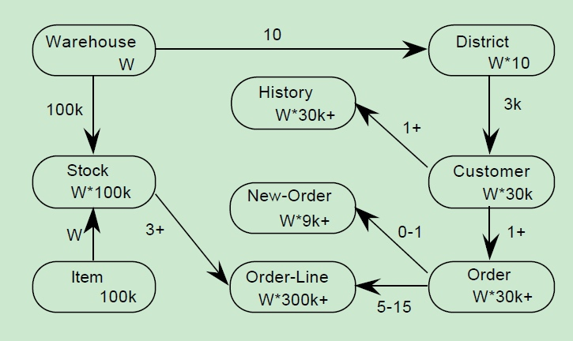

# 如何跑 TPC-C 测试

TPC(Transaction Processing Performance Council，事务处理性能委员会)是由数十家会员公司创建的非盈利组织，总部设在美国。 TPC的成员主要是计算机软硬件厂家，而非计算机用户，其功能是制定商务应用基准程序的标准规范、性能和价格度量，并管理测试结果的发布。
TPC-C是TPC（事务处理性能委员会）推出的一系列性能测试标准中的一款，自1992年推出，便成为了数据库性能测试的标杆，各个数据库大厂都向TPC委员会提交了测试结果，以期在TPC-C测试的排行榜上拥有一席之地。2019 年之前，TPC-C 榜首一直是 ORACLE 公司，持续 8 年多。2019 年 9 月底，OceanBase 以分布式数据库身份参与 TPC-C 评测，夺得榜首成绩。2020 年 5 月，OceanBase 再次参与 TPC-C 评测，刷新了之前的成绩（提升了 10 倍）。

OceanBase 参加第一次 TPC-C 使用的是云服务器，规模在204 台。第二次依然是云服务器，规模在 1500台左右。这是由于 TPC-C 的标准定义非常严格，对数据量、业务读写行为要求都很具体，导致机器规模数很大。普通的企业测试肯定不能采取这个标准。业界参照 TPC-C 的业务模型和标准有类似的测试程序开源。如 BenchmarkSQL 。

## TPC-C 简介

### 数据库模型

在测试开始前，TPC-C Benchmark规定了数据库的初始状态，也就是数据库中数据生成的规则，其中ITEM表中固定包含10万种商品，仓库的数量可进行调整，假设WAREHOUSE表中有W条记录，那么：

+ STOCK 表中应有 W×10万 条记录(每个仓库对应 10万 种商品的库存数据)；
+ DISTRICT 表中应有 W×10 条记录(每个仓库为 10 个地区提供服务)；
+ CUSTOMER 表中应有 W×10×3000 条记录(每个地区有 3000 个客户)；
+ HISTORY 表中应有 W×10×3000 条记录(每个客户一条交易历史)；
+ ORDER 表中应有 W×10×3000 条记录(每个地区 3000 个订单)，并且最后生成的 900 个订单被添加到 NEW-ORDER 表中，每个订单随机生成 5~15 条 ORDER-LINE 记录。

在测试过程中，每一个地区（DISTRICT）都有一个对应的终端（Terminal），模拟为用户提供服务。在每个终端的生命周期内，要循环往复地执行各类事务，每个事务的流程如图所示，当终端执行完一个事务的周期后，就进入下一个事务的周期，如下图所示。



客户下单后，包含若干个订单明细（ORDER-LINE）的订单（ORDER）被生成，并被加入新订单（NEW-ORDER）列表。
客户对订单支付还会产生交易历史（HISTORY）。
每个订单(ORDER) 平均包含10条订单项(ORDER-LINE), 其中1% 需要从远程仓库中获取.
这些就是TPC-C模型中的9个数据表。其中，仓库的数量W可以根据系统的实际情况进行调整，以使系统性能测试结果达到最佳。

### 事务类型

事务类型
该benchmark包含5类事务

+ NewOrder: 新订单的生成从某一仓库随机选取5-15件商品, 创建新订单. 其中1%的事务需要回滚(即err). 一般来说新订单请求不可能超出全部事务请求的45% |
+ Payment : 订单付款更新客户账户余额, 反映其支付情况. 占比 43%
+ OrderStatus : 最近订单查询 随机显示一个用户显示其最有益条订单, 显示该订单内的每个商品状态. 占比4%
+ Delivery  : 配送, 模拟批处理交易更新该订单用户的余额, 把发货单从neworder中删除. 占比4%
+ StockLevel  : 库存缺货状态分析 , 占比4%

## 软件准备

### BenchmarkSQL 下载

BenchmarkSQL 是开源的项目，官方下载地址是：[https://sourceforge.net/projects/benchmarksql/](https://sourceforge.net/projects/benchmarksql/) 。
OceanBase 团队对这个程序稍微修改了一下，允许导入数据报错的时候，能只针对报错的仓库进行补充加载，而不是所有数据重新导入，节省测试时间。该版本可以向 OceanBase 技术支持人员获取。或者直接从 [https://github.com/obpilot/benchmarksql-5.0] 下载。

下载后直接使用。需要有 JAVA 运行环境，版本不低于 1.8.0 。

```bash
[root@obce-0000 bmsql_vivid]# pwd
/root/bmsql_vivid
[root@obce-0000 bmsql_vivid]# tree -L 1
.
├── build
├── build.xml
├── dist
├── doc
├── HOW-TO-RUN.txt
├── lib
├── README.md
├── run
└── src

6 directories, 3 files
[root@obce-0000 bmsql_vivid]#
```

### 配置文件

配置文件 `props.ob` 在 `run` 目录下。。

```
db=oracle
driver=com.alipay.oceanbase.jdbc.Driver
// conn=jdbc:oceanbase://122.71.221.125:2883/icbc?useUnicode=true&characterEncoding=utf-8
conn=jdbc:oceanbase://172.20.249.52:2883/tpccdb?useUnicode=true&characterEncoding=utf-8&rewriteBatchedStatements=true&allowMultiQueries=true
user=u_tpcc@obmysql#obce-3zones
password=123456

warehouses=10
loadWorkers=2
//fileLocation=/data/temp/

terminals=10
//To run specified transactions per terminal- runMins must equal zero
runTxnsPerTerminal=0
//To run for specified minutes- runTxnsPerTerminal must equal zero
runMins=10
//Number of total transactions per minute
limitTxnsPerMin=0

//Set to true to run in 4.x compatible mode. Set to false to use the
//entire configured database evenly.
terminalWarehouseFixed=true

//The following five values must add up to 100
newOrderWeight=45
paymentWeight=43
orderStatusWeight=4
deliveryWeight=4
stockLevelWeight=4

// Directory name to create for collecting detailed result data.
// Comment this out to suppress.
resultDirectory=my_result_%tY-%tm-%td_%tH%tM%tS
osCollectorScript=./misc/os_collector_linux.py
osCollectorInterval=1
//osCollectorSSHAddr=user@dbhost
//osCollectorDevices=net_eth0 blk_sda

//LoadStartW=1
//LoadStopW=1000
```

说明：

+ `db` 指定数据库类型。这里复用 `oracle` 的类型。后面 OceanBase 相应的 LIBRARY 放到对应目录下 `lib/` 。
+ `warehouses` 指定仓库数。通常仓库数就决定了这个性能测试理论上的成绩。如果期望测试结果越高，仓库数就不能太低。生产环境机器测试，建议 5000 仓库起步。机器配置差的话，建议 100 仓起步。
+ `loadWorkers` 指定仓库数据加载时的并发。如果机器配置很好，这个可以设置大一些，比如说 100 个。 如果机器配置不高（尤其是内存），这个就小一些，如 10个 并发。并发指定的过高，可能导致内存消耗的太快，出现报错，导致数据加载前功尽弃。第一次使用时，建议就并发低一些，宁可慢一点，也不要报错。
+ `terminals` 指定性能压测时的并发数。这个并发数不要高于仓库数*10 。否则，有不必要的锁等待。生产环境的经验，这个并发数能到 1000 就很高了。一般环境测试建议从 100 开始。
+ `runMins` 指定性能测试持续的时间。时间越久，越能考验数据库的性能和稳定性。建议不要少于 10 分钟。生产环境机器建议不少于 1 小时。
+ `LoadStartW` 和  `LoadStopW` 指定补仓的时候，开始值和截止值。如果导数据发现某个仓库数据导入失败（大事务超时），则可以指定这个仓库重新导入。

### 库文件

OceanBase 提供自己的驱动文件 `oceanbase-client-x.x.x.jar` 文件。不管是测试 MySQL 租户还是 ORACLE 租户，都可以使用这个驱动文件。
驱动文件的读取是脚本 `run/func.sh` 里的逻辑。

```bash
# ----
# getCP()
#
#   Determine the CLASSPATH based on the database system.
# ----
function setCP()
{
    case "$(getProp db)" in
        firebird)
            cp="../lib/firebird/*:../lib/*"
            ;;
        oracle)
            cp="../lib/oracle/*"
            if [ ! -z "${ORACLE_HOME}" -a -d ${ORACLE_HOME}/lib ] ; then
                cp="${cp}:${ORACLE_HOME}/lib/*"
            fi
            cp="${cp}:../lib/*"
            ;;
        postgres)
            cp="../lib/postgres/*:../lib/*"
            ;;
        oceanbase)
            # cp="../lib/oceanbase/oceanbase-client-1.0.1.jar:../lib/oceanbase/guava-parent-18.0-site.jar:../lib/*"
            cp="../lib/oceanbase/*:../lib/*"
            ;;
    esac
    myCP=".:${cp}:../dist/*"
    export myCP
}
```

所以只要把 OceanBase 的驱动放到 `lib/` 目录或  `lib/oracle` 下即可。

```bash
[root@obce-0000 bmsql_vivid]# tree lib/
lib/
├── apache-log4j-extras-1.1.jar
├── firebird
│   ├── connector-api-1.5.jar
│   └── jaybird-2.2.9.jar
├── gsjdbc4.jar
├── log4j-1.2.17.jar
├── mysql-connector-java-5.1.47.jar
├── oceanbase
│   ├── commons-lang-2.3.jar
│   ├── guava-18.0.jar
│   ├── json-20160810.jar
│   ├── oceanbaseclient1.1.10.jar
│   └── toolkit-common-logging-1.10.jar
├── oracle
│   ├── oceanbaseclient1.1.10.jar
│   └── README.txt
└── postgres
    └── postgresql-9.3-1102.jdbc41.jar

4 directories, 14 files
```

## 数据准备

### 建表

建表脚本通常放在 `run/sql.common` 下或者 其他指定目录也行。
建表脚本可以选择非分区表方案 和 分区表方案。

+ 非分区表

```sql
[root@obce-0000 run]# sh runSQL.sh props.ob sql.common/tableCreates.sql
# ------------------------------------------------------------
# Loading SQL file sql.common/tableCreates.sql
# ------------------------------------------------------------
.:../lib/oracle/*:../lib/*:../dist/*
-Dprop=props.ob -DcommandFile=sql.common/tableCreates.sql
create table bmsql_config (
cfg_name    varchar(30) primary key,
cfg_value   varchar(50)
);
create tablegroup tpcc_group ;
create table bmsql_warehouse (
w_id        integer   not null,
w_ytd       decimal(12,2),
w_tax       decimal(4,4),
w_name      varchar(10),
w_street_1  varchar(20),
w_street_2  varchar(20),
w_city      varchar(20),
w_state     char(2),
w_zip       char(9),
primary key(w_id)
)tablegroup=tpcc_group;
create table bmsql_district (
d_w_id       integer       not null,
d_id         integer       not null,
d_ytd        decimal(12,2),
d_tax        decimal(4,4),
d_next_o_id  integer,
d_name       varchar(10),
d_street_1   varchar(20),
d_street_2   varchar(20),
d_city       varchar(20),
d_state      char(2),
d_zip        char(9),
PRIMARY KEY (d_w_id, d_id)
)tablegroup=tpcc_group ;
create table bmsql_customer (
c_w_id         integer        not null,
c_d_id         integer        not null,
c_id           integer        not null,
c_discount     decimal(4,4),
c_credit       char(2),
c_last         varchar(16),
c_first        varchar(16),
c_credit_lim   decimal(12,2),
c_balance      decimal(12,2),
c_ytd_payment  decimal(12,2),
c_payment_cnt  integer,
c_delivery_cnt integer,
c_street_1     varchar(20),
c_street_2     varchar(20),
c_city         varchar(20),
c_state        char(2),
c_zip          char(9),
c_phone        char(16),
c_since        timestamp,
c_middle       char(2),
c_data         varchar(500),
PRIMARY KEY (c_w_id, c_d_id, c_id)
)tablegroup=tpcc_group ;
create table bmsql_history (
hist_id  integer,
h_c_id   integer,
h_c_d_id integer,
h_c_w_id integer,
h_d_id   integer,
h_w_id   integer,
h_date   timestamp,
h_amount decimal(6,2),
h_data   varchar(24)
)tablegroup=tpcc_group ;
create table bmsql_new_order (
no_w_id  integer   not null ,
no_d_id  integer   not null,
[detached from 1248.pts-0.obce-0000]
[root@obce-0000 run]# cat sql.common/tableCreates.sql
create table bmsql_config (
  cfg_name    varchar(30) primary key,
  cfg_value   varchar(50)
);

create tablegroup tpcc_group ;

create table bmsql_warehouse (
  w_id        integer   not null,
  w_ytd       decimal(12,2),
  w_tax       decimal(4,4),
  w_name      varchar(10),
  w_street_1  varchar(20),
  w_street_2  varchar(20),
  w_city      varchar(20),
  w_state     char(2),
  w_zip       char(9),
  primary key(w_id)
)tablegroup=tpcc_group;

create table bmsql_district (
  d_w_id       integer       not null,
  d_id         integer       not null,
  d_ytd        decimal(12,2),
  d_tax        decimal(4,4),
  d_next_o_id  integer,
  d_name       varchar(10),
  d_street_1   varchar(20),
  d_street_2   varchar(20),
  d_city       varchar(20),
  d_state      char(2),
  d_zip        char(9),
  PRIMARY KEY (d_w_id, d_id)
)tablegroup=tpcc_group ;

create table bmsql_customer (
  c_w_id         integer        not null,
  c_d_id         integer        not null,
  c_id           integer        not null,
  c_discount     decimal(4,4),
  c_credit       char(2),
  c_last         varchar(16),
  c_first        varchar(16),
  c_credit_lim   decimal(12,2),
  c_balance      decimal(12,2),
  c_ytd_payment  decimal(12,2),
  c_payment_cnt  integer,
  c_delivery_cnt integer,
  c_street_1     varchar(20),
  c_street_2     varchar(20),
  c_city         varchar(20),
  c_state        char(2),
  c_zip          char(9),
  c_phone        char(16),
  c_since        timestamp,
  c_middle       char(2),
  c_data         varchar(500),
  PRIMARY KEY (c_w_id, c_d_id, c_id)
)tablegroup=tpcc_group ;


create table bmsql_history (
  hist_id  integer,
  h_c_id   integer,
  h_c_d_id integer,
  h_c_w_id integer,
  h_d_id   integer,
  h_w_id   integer,
  h_date   timestamp,
  h_amount decimal(6,2),
  h_data   varchar(24)
)tablegroup=tpcc_group ;

create table bmsql_new_order (
  no_w_id  integer   not null ,
  no_d_id  integer   not null,
  no_o_id  integer   not null,
  PRIMARY KEY (no_w_id, no_d_id, no_o_id)
)tablegroup=tpcc_group ;

create table bmsql_oorder (
  o_w_id       integer      not null,
  o_d_id       integer      not null,
  o_id         integer      not null,
  o_c_id       integer,
  o_carrier_id integer,
  o_ol_cnt     integer,
  o_all_local  integer,
  o_entry_d    timestamp,
  PRIMARY KEY (o_w_id, o_d_id, o_id)
)tablegroup=tpcc_group ;

create table bmsql_order_line (
  ol_w_id         integer   not null,
  ol_d_id         integer   not null,
  ol_o_id         integer   not null,
  ol_number       integer   not null,
  ol_i_id         integer   not null,
  ol_delivery_d   timestamp,
  ol_amount       decimal(6,2),
  ol_supply_w_id  integer,
  ol_quantity     integer,
  ol_dist_info    char(24),
  PRIMARY KEY (ol_w_id, ol_d_id, ol_o_id, ol_number)
)tablegroup=tpcc_group ;

create table bmsql_item (
  i_id     integer      not null,
  i_name   varchar(24),
  i_price  decimal(5,2),
  i_data   varchar(50),
  i_im_id  integer,
  PRIMARY KEY (i_id)
)tablegroup=tpcc_group;

create table bmsql_stock (
  s_w_id       integer       not null,
  s_i_id       integer       not null,
  s_quantity   integer,
  s_ytd        integer,
  s_order_cnt  integer,
  s_remote_cnt integer,
  s_data       varchar(50),
  s_dist_01    char(24),
  s_dist_02    char(24),
  s_dist_03    char(24),
  s_dist_04    char(24),
  s_dist_05    char(24),
  s_dist_06    char(24),
  s_dist_07    char(24),
  s_dist_08    char(24),
  s_dist_09    char(24),
  s_dist_10    char(24),
  PRIMARY KEY (s_w_id, s_i_id)
)tablegroup=tpcc_group;

```

+ 分区表语法

分区表是一种水平拆分方案，大部分表安装仓库ID 做 HASH 分区。分区数取决于要测试的数据规模和机器数。如果只有三台机器，分区数以 3-9 个为宜。如果是 5000仓，9台机器之类，那分区数可以调整到 99 或 100 都行。通常来说 HASH 分区数没必要过 100 。

```sql
[root@obce-0000 run]# cat sql.common/tableCreates_parts.sql
create table bmsql_config (
  cfg_name    varchar(30) primary key,
  cfg_value   varchar(50)
);

-- drop tablegroup tpcc_group;
create tablegroup tpcc_group partition by hash partitions 3;

create table bmsql_warehouse (
  w_id        integer   not null,
  w_ytd       decimal(12,2),
  w_tax       decimal(4,4),
  w_name      varchar(10),
  w_street_1  varchar(20),
  w_street_2  varchar(20),
  w_city      varchar(20),
  w_state     char(2),
  w_zip       char(9),
  primary key(w_id)
)tablegroup='tpcc_group' partition by hash(w_id) partitions 3;

create table bmsql_district (
  d_w_id       integer       not null,
  d_id         integer       not null,
  d_ytd        decimal(12,2),
  d_tax        decimal(4,4),
  d_next_o_id  integer,
  d_name       varchar(10),
  d_street_1   varchar(20),
  d_street_2   varchar(20),
  d_city       varchar(20),
  d_state      char(2),
  d_zip        char(9),
  PRIMARY KEY (d_w_id, d_id)
)tablegroup='tpcc_group' partition by hash(d_w_id) partitions 3;

create table bmsql_customer (
  c_w_id         integer        not null,
  c_d_id         integer        not null,
  c_id           integer        not null,
  c_discount     decimal(4,4),
  c_credit       char(2),
  c_last         varchar(16),
  c_first        varchar(16),
  c_credit_lim   decimal(12,2),
  c_balance      decimal(12,2),
  c_ytd_payment  decimal(12,2),
  c_payment_cnt  integer,
  c_delivery_cnt integer,
  c_street_1     varchar(20),
  c_street_2     varchar(20),
  c_city         varchar(20),
  c_state        char(2),
  c_zip          char(9),
  c_phone        char(16),
  c_since        timestamp,
  c_middle       char(2),
  c_data         varchar(500),
  PRIMARY KEY (c_w_id, c_d_id, c_id)
)tablegroup='tpcc_group' partition by hash(c_w_id) partitions 3;


create table bmsql_history (
  hist_id  integer,
  h_c_id   integer,
  h_c_d_id integer,
  h_c_w_id integer,
  h_d_id   integer,
  h_w_id   integer,
  h_date   timestamp,
  h_amount decimal(6,2),
  h_data   varchar(24)
)tablegroup='tpcc_group' partition by hash(h_w_id) partitions 3;

create table bmsql_new_order (
  no_w_id  integer   not null ,
  no_d_id  integer   not null,
  no_o_id  integer   not null,
  PRIMARY KEY (no_w_id, no_d_id, no_o_id)
)tablegroup='tpcc_group' partition by hash(no_w_id) partitions 3;

create table bmsql_oorder (
  o_w_id       integer      not null,
  o_d_id       integer      not null,
  o_id         integer      not null,
  o_c_id       integer,
  o_carrier_id integer,
  o_ol_cnt     integer,
  o_all_local  integer,
  o_entry_d    timestamp,
  PRIMARY KEY (o_w_id, o_d_id, o_id)
)tablegroup='tpcc_group' partition by hash(o_w_id) partitions 3;

create table bmsql_order_line (
  ol_w_id         integer   not null,
  ol_d_id         integer   not null,
  ol_o_id         integer   not null,
  ol_number       integer   not null,
  ol_i_id         integer   not null,
  ol_delivery_d   timestamp,
  ol_amount       decimal(6,2),
  ol_supply_w_id  integer,
  ol_quantity     integer,
  ol_dist_info    char(24),
  PRIMARY KEY (ol_w_id, ol_d_id, ol_o_id, ol_number)
)tablegroup='tpcc_group' partition by hash(ol_w_id) partitions 3;

create table bmsql_item (
  i_id     integer      not null,
  i_name   varchar(24),
  i_price  decimal(5,2),
  i_data   varchar(50),
  i_im_id  integer,
  PRIMARY KEY (i_id)
) duplicate_scope='cluster';

create table bmsql_stock (
  s_w_id       integer       not null,
  s_i_id       integer       not null,
  s_quantity   integer,
  s_ytd        integer,
  s_order_cnt  integer,
  s_remote_cnt integer,
  s_data       varchar(50),
  s_dist_01    char(24),
  s_dist_02    char(24),
  s_dist_03    char(24),
  s_dist_04    char(24),
  s_dist_05    char(24),
  s_dist_06    char(24),
  s_dist_07    char(24),
  s_dist_08    char(24),
  s_dist_09    char(24),
  s_dist_10    char(24),
  PRIMARY KEY (s_w_id, s_i_id)
)tablegroup='tpcc_group' use_bloom_filter=true partition by hash(s_w_id) partitions 3;

```

运行命令建表。

```bash
sh runSQL.sh props.ob sql.common/tableCreates_parts.sql

输出：
[root@obce-0000 run]# sh runSQL.sh props.ob sql.common/tableCreates_parts.sql
# ------------------------------------------------------------
# Loading SQL file sql.common/tableCreates_parts.sql
# ------------------------------------------------------------
.:../lib/oracle/*:../lib/*:../dist/*
-Dprop=props.ob -DcommandFile=sql.common/tableCreates_parts.sql

<.....>

```

### 加载数据

加载数据就是做数据初始化，仓库数越多时间越长。1000 仓可能要近 1个小时，5000 仓可能要半天以上。具体性能取决于机器配置。

```bash
sh runLoader.sh props.ob

输出：
[root@obce-0000 run]# sh runLoader.sh props.ob
Starting BenchmarkSQL LoadData

driver=com.alipay.oceanbase.jdbc.Driver
conn=jdbc:oceanbase://172.20.249.52:2883/tpccdb?useUnicode=true&characterEncoding=utf-8&rewriteBatchedStatements=true&allowMultiQueries=true
user=u_tpcc@obmysql#obce-3zones
password=***********
warehouses=10
loadWorkers=2
fileLocation (not defined)
csvNullValue (not defined - using default 'NULL')
LoadStartW (not defined)
LoadStopW (not defined)

Worker 000: Loading ITEM
Worker 001: Loading Warehouse      1
Worker 000: Loading ITEM done
Worker 000: Loading Warehouse      2

<.....>

```

加载数据的 INSERT SQL 都使用了 `batch insert` 特性。这点是在 `props.ob` 里的 JDBC URL 里指定的。这个写入性能最好。

### 创建索引

当数据初始化完后再补充两个索引。

```sql
[root@obce-0000 run]# cat sql.common/indexCreates.sql
create index bmsql_customer_idx1
  on  bmsql_customer (c_w_id, c_d_id, c_last, c_first) local;
create  index bmsql_oorder_idx1
  on  bmsql_oorder (o_w_id, o_d_id, o_carrier_id, o_id) local;
  
  ```
  
### (可选)删除表

删除表就是删除所有的表和表分组。当需要修改表结构分区数的时候执行这个。

```bash
[root@obce-0000 run]# cat sql.common/tableDrops.sql
drop table bmsql_config;
drop table bmsql_new_order;
drop table bmsql_order_line;
drop table bmsql_oorder;
drop table bmsql_history;
drop table bmsql_customer;
drop table bmsql_stock;
drop table bmsql_item;
drop table bmsql_district;
drop table bmsql_warehouse;

purge recyclebin;

-- tpcc_group
drop tablegroup tpcc_group;
```

运行命令：

```bash
sh runSQL.sh props.ob sql.common/tableDrops.sql

输出：
[root@obce-0000 run]# sh runSQL.sh props.ob sql.common/tableDrops.sql
# ------------------------------------------------------------
# Loading SQL file sql.common/tableDrops.sql
# ------------------------------------------------------------
.:../lib/oracle/*:../lib/*:../dist/*
-Dprop=props.ob -DcommandFile=sql.common/tableDrops.sql
drop table bmsql_config;
pdrop table bmsql_new_order;
wdrop table bmsql_order_line;
drop table bmsql_oorder;
ddrop table bmsql_history;

drop table bmsql_customer;
drop table bmsql_stock;
drop table bmsql_item;
drop table bmsql_district;
drop table bmsql_warehouse;
purge recyclebin;
-- tpcc_group
drop tablegroup tpcc_group;
purge recyclebin;
```

## 性能测试

数据初始化确认没有错误（没有仓库数据报错），就可以跑性能测试。建议跑之前先做一次集群合并（ `major freeze` ）。

```bash
sh runBenchmark.sh props.ob

输出：
[root@obce-0000 run]# sh runBenchmark.sh props.ob
10:21:44,894 [main] INFO   jTPCC : Term-00,
10:21:44,896 [main] INFO   jTPCC : Term-00, +-------------------------------------------------------------+
10:21:44,896 [main] INFO   jTPCC : Term-00,      BenchmarkSQL v5.0
10:21:44,896 [main] INFO   jTPCC : Term-00, +-------------------------------------------------------------+
10:21:44,896 [main] INFO   jTPCC : Term-00,  (c) 2003, Raul Barbosa
10:21:44,896 [main] INFO   jTPCC : Term-00,  (c) 2004-2016, Denis Lussier
10:21:44,898 [main] INFO   jTPCC : Term-00,  (c) 2016, Jan Wieck
10:21:44,898 [main] INFO   jTPCC : Term-00, +-------------------------------------------------------------+
10:21:44,898 [main] INFO   jTPCC : Term-00,
10:21:44,898 [main] INFO   jTPCC : Term-00, db=oracle
10:21:44,898 [main] INFO   jTPCC : Term-00, driver=com.alipay.oceanbase.jdbc.Driver
10:21:44,898 [main] INFO   jTPCC : Term-00, conn=jdbc:oceanbase://172.20.249.52:2883/tpccdb?useUnicode=true&characterEncoding=utf-8&rewriteBatchedStatements=true&allowMultiQueries=true
10:21:44,898 [main] INFO   jTPCC : Term-00, user=u_tpcc@obmysql#obce-3zones
10:21:44,898 [main] INFO   jTPCC : Term-00,
10:21:44,899 [main] INFO   jTPCC : Term-00, warehouses=10
10:21:44,899 [main] INFO   jTPCC : Term-00, terminals=10
10:21:44,900 [main] INFO   jTPCC : Term-00, runMins=10
10:21:44,900 [main] INFO   jTPCC : Term-00, limitTxnsPerMin=0
10:21:44,900 [main] INFO   jTPCC : Term-00, terminalWarehouseFixed=true
10:21:44,900 [main] INFO   jTPCC : Term-00,
10:21:44,900 [main] INFO   jTPCC : Term-00, newOrderWeight=45
10:21:44,900 [main] INFO   jTPCC : Term-00, paymentWeight=43
10:21:44,900 [main] INFO   jTPCC : Term-00, orderStatusWeight=4
10:21:44,901 [main] INFO   jTPCC : Term-00, deliveryWeight=4
10:21:44,901 [main] INFO   jTPCC : Term-00, stockLevelWeight=4
10:21:44,901 [main] INFO   jTPCC : Term-00,
10:21:44,901 [main] INFO   jTPCC : Term-00, resultDirectory=my_result_%tY-%tm-%td_%tH%tM%tS
10:21:44,901 [main] INFO   jTPCC : Term-00, osCollectorScript=./misc/os_collector_linux.py
10:21:44,901 [main] INFO   jTPCC : Term-00,
10:21:44,925 [main] INFO   jTPCC : Term-00, copied props.ob to my_result_2021-10-01_102144/run.properties
10:21:44,926 [main] INFO   jTPCC : Term-00, created my_result_2021-10-01_102144/data/runInfo.csv for runID 326
10:21:44,926 [main] INFO   jTPCC : Term-00, writing per transaction results to my_result_2021-10-01_102144/data/result.csv
10:21:44,926 [main] INFO   jTPCC : Term-00, osCollectorScript=./misc/os_collector_linux.py
10:21:44,926 [main] INFO   jTPCC : Term-00, osCollectorInterval=1
10:21:44,927 [main] INFO   jTPCC : Term-00, osCollectorSSHAddr=null
10:21:44,927 [main] INFO   jTPCC : Term-00, osCollectorDevices=null
10:21:45,031 [main] INFO   jTPCC : Term-00,
10:21:45,611 [main] INFO   jTPCC : Term-00, C value for C_LAST during load: 144
10:21:45,613 [main] INFO   jTPCC : Term-00, C value for C_LAST this run:    215
10:21:45,614 [main] INFO   jTPCC : Term-00,

0:21:45,611 [main] INFO   jTPCC : Term-00, C value for C_LAST during load: 14Term-00, Running Average tpmTOTAL: 5376.32    Current tpmTOTAL: 356448    Memory Usage: 44MB / 366MB                        10:31:46,707 [Thread-7] INFO   jTPCC : Term-00,                                                                                                                                                           10:31:46,707 [Thread-7] INFO   jTPCC : Term-00,                                                                                                                                                           10:31:46,707 [Thread-7] INFO   jTPCC : Term-00, Measured tpmC (NewOrders) = 2410.28
10:31:46,708 [Thread-7] INFO   jTPCC : Term-00, Measured tpmTOTAL = 5376.33
10:31:46,708 [Thread-7] INFO   jTPCC : Term-00, Session Start     = 2021-10-01 10:21:46
10:31:46,708 [Thread-7] INFO   jTPCC : Term-00, Session End       = 2021-10-01 10:31:46
10:31:46,708 [Thread-7] INFO   jTPCC : Term-00, Transaction Count = 53776
[root@obce-0000 run]#
```

TPC-C用 `tpmC` 值（Transactions per Minute）来衡量系统最大有效吞吐量. 其中 Transactions 以 NewOrder Transaction 为准，即最终衡量单位为每分钟处理的订单数。

## 性能调优

性能测试的结果取决于租户资源大小、内存转储的设置、客户端的性能（JVM 的大小）等等。

### 转储&合并

|                         | 合并转储前     | 合并后       | 提升率    |
|-------------------------|-----------|-----------|--------|
| bmsql(1000仓、600并发 tpmc) | 230211.65 | 264401.03 | 11.30% |

### 调整 PRIMARY_ZONE

|                        | 集中式部署（zone1）    | random部署         |
|------------------------|-----------------|------------------|
| bmsql                  | 88592.24        | 264401.03        |

### 使用 TABLEGROUP

使用 `table_group` 可以减少分布式查询和事务，提升性能。

|                        | 未使用pg          | 使用pg           |
|------------------------|----------------|----------------|
| bmsql                  | 60383.72       | 250249.36      |

## 常见问题

+ `Could not find the main class: ExecJDBC.  Program will exit.`

可能原因有两个：要么升级jdk，要么升级jdbc版本

+ `Invalid number of terminals!`

这是my_oracle.properties中设置的terminals值不对，需填写正确范围内的terminals值
numTerminals <= 0 || numTerminals > 10*numWarehouses

+ 事务超时报错 `transaction timeout` .
需增大超时时间，建议为：36000000000
