# 如何使用 跑业务场景测试

## 数据库驱动

使用 JMeter 测试OceanBase性能的时候也需要加载OceanBase的 Java 驱动。文件可以从官网的下载文件中获取。地址：[https://help.aliyun.com/document_detail/212815.html](https://help.aliyun.com/document_detail/212815.html)  

下载的`oceanbase-client-1.x.x.jar`需要放到 `Jmeter` 的 `lib` 文件夹夹中。

## 业务场景定义

### 建表语句

请在obmysql租户下业务账户执行下面SQL 。

```sql
$obclient -h127.1 -utpcc@obbmsql#obdemo -P2883 -p123456 -c -A tpcc

CREATE TABLE account(id bigint NOT NULL AUTO_INCREMENT PRIMARY KEY
 , name varchar(50) NOT NULL UNIQUE 
 , value bigint NOT NULL
 , gmt_create timestamp DEFAULT current_timestamp NOT NULL 
 , gmt_modified timestamp DEFAULT current_timestamp NOT NULL  );
 

```

### 场景SQL

此次测试模拟一个分布式事务，SQL类似如下：

```sql
-- session A
begin ;
select value from account where id = 174 for update ;
update account set  value = value - 7 , gmt_modified = current_timestamp where id = 174 ;
update account set  value = value + 7 , gmt_modified = current_timestamp where id = 165 ;
-- commit or rollback;
commit;
```

## 新建JMeter测试计划

JMeter能在命令行下运行，也可以以图形界面运行。这里我简单点直接用图形界面这种方式。

新建测试计划

### 测试计划属性

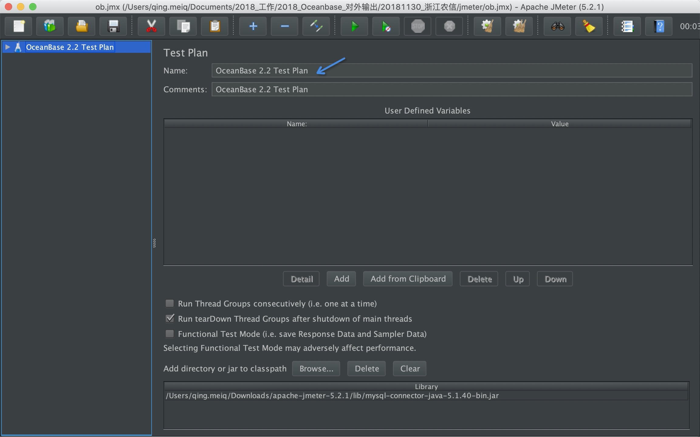

新建 `Thread-Group`

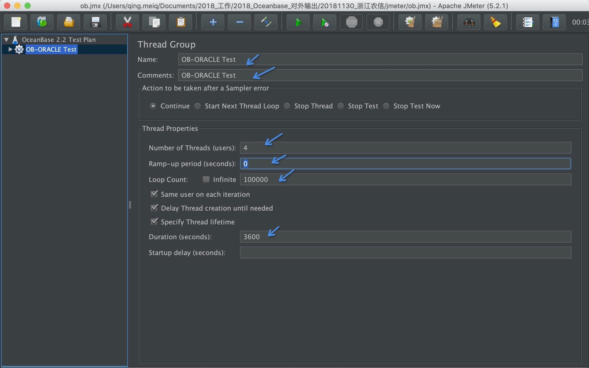

这里有很多跟多线程运行有关的JMeter参数，具体说明可以查看JMeter官网文档。
注意这里的`bigint of Threads`是指压测的客户端线程数。

### JDBC连接属性

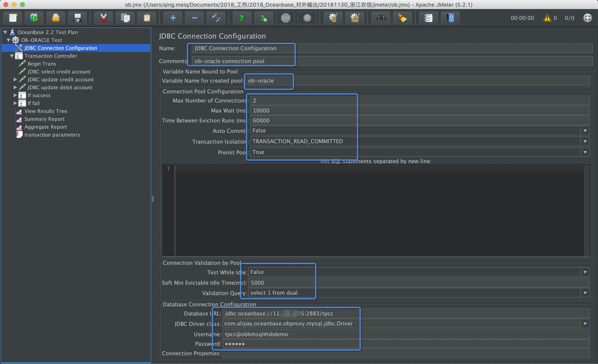

这里面属性很多，都是一个连接池常具备的参数。有兴趣的可以看看网上关于Java连接池配置的经验。
这里面也有几个参数强调一下：

+ `Max bigint of Connections`：这个指连接池里最多多少个连接。如果压测线程数远高于这个值，那么压测线程可能会需要等待这个连接池创建或返还数据库连接(即到OceanBase的连接)给它。如果等不到可能会报错。在这个环节，客户端压测线程拿不到连接，不一定跟OceanBase数据库有直接关系。在Java应用里面也同理。
+ `Transaction Isolation`：这个是数据库连接使用的事务隔离级别，OceanBase支持两种事务隔离级别：读已提交(`Read-Committed`)和序列化(`Serializable`)。前者很常见容易理解，后者是ORACLE特有隔离级别，OceanBase也兼容了。有兴趣的可以看看《OceanBase事务引擎特性和应用实践分享》。理解序列化隔离级别的特点和场景可以加深自己对数据库事务的理解。
+ `Test While Idle`：这个是连接探活(`keepalive`)设置。这个设置对应用却很优必要。有时候应用会说数据库连接报错说在一个关闭的连接上执行SQL报错，这个就是因为连接池中的数据库连接因为其他原因已断开了。所以，数据库连接池通常都需要探活机制。这里由于是压测场景基本无闲置连接，所以可以设置为`False`。
+ `Database URL`：数据库连接URL格式，直接类似填写 `jdbc:oceanbase://11.***.***.5:2883/tpcc` 。
+ `JDBC Driver Class`：数据库驱动中的Main类名，这个要按OceanBase格式填写，`com.alipay.oceanbase.obproxy.mysql.jdbc.Driver`。
+ `Username`：用户格式，OceanBase的用户名格式比较特别，是`租户里用户名@租户名#集群名`或`集群名:租户名:租户里用户名`。如 `tpcc@obbmsql#obdemo`

### 事务参数(变量)

在这个测试里，有三个变量：账户A，账户B，转账金额，所以需要设置参数

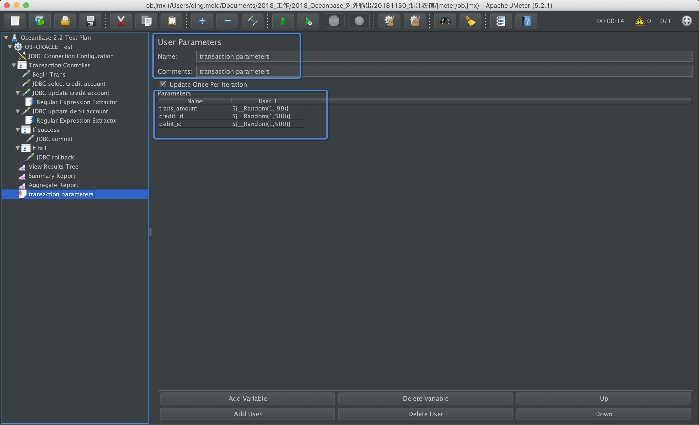

账户参数和金额采取随机数，随机数的值不要超出测试数据实际范围。

### 事务控制器

这里面是维护每个事务的逻辑。事务由一组`JDBC`请求组成。

+ 开启事务

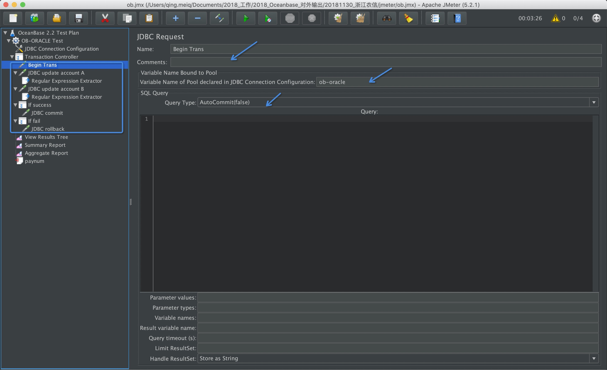

选择 `Autocommit(false)`，开启显式事务。

+ 查询账户A的余额

这里查询账户A的记录会同时锁住这笔记录，即常用的悲观锁技术。 这一步看测试需要，不是必需的。

```sql
select value from account where id = ? for update ;
```

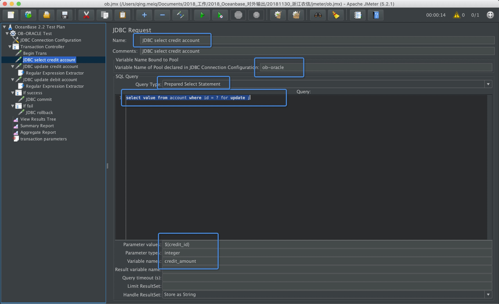

注意所有参数都使用`Prepared Statement`，以下同。

这一步后面按业务设计应该检查一下返回值是否大于要转账的值，如果不满足就是“转账余额不足”。这里我没有去研究JMeter如果根据查询返回值进行逻辑判断。有兴趣的朋友可以自己研究。

+ 扣减账户A的余额

SQL很简单。

```sql
update account set  value = value - ? , gmt_modified = current_timestamp where id = ? ;
```

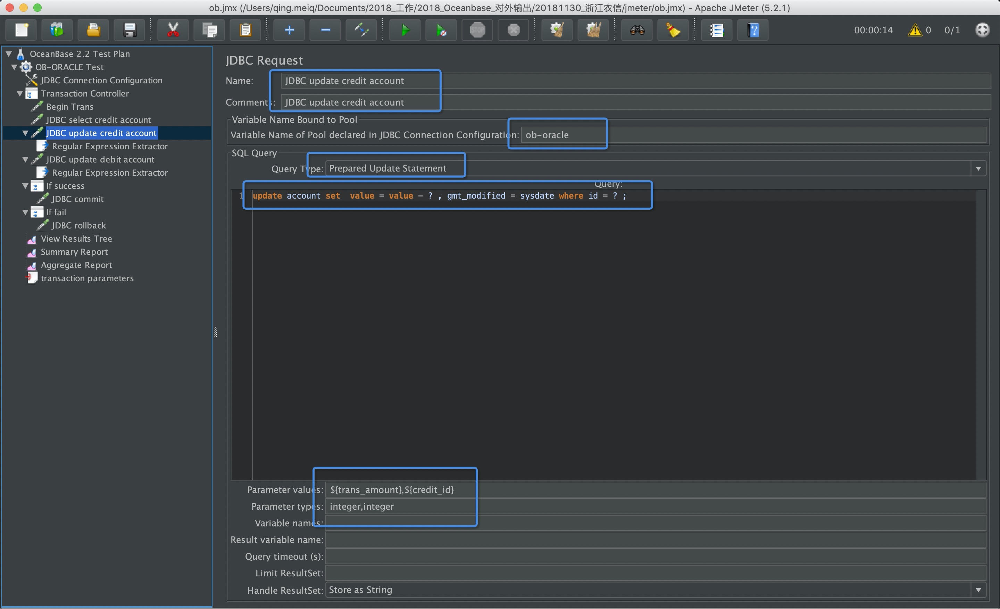

多个绑定参数使用逗号(，)分隔。

然后要新增一个Post处理逻辑，获取更新返回值

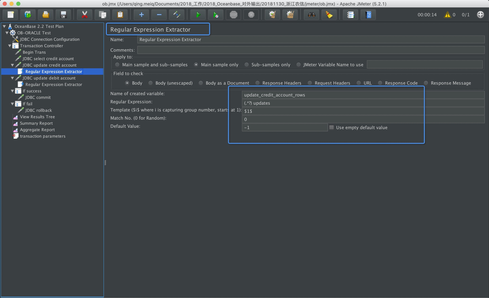

+ 增加账户B的余额

SQL很简单。

```sql
update account set  value = value + ? , gmt_modified = current_timestamp where id = ? ;
```

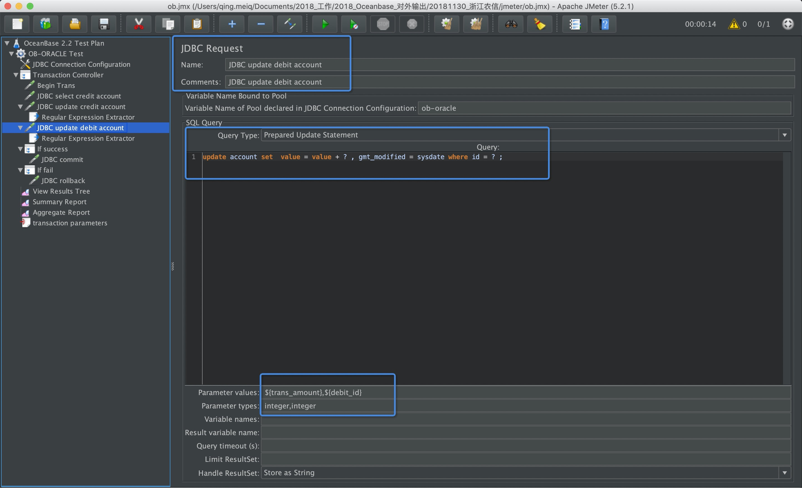

同样，需要增加一个Post处理器

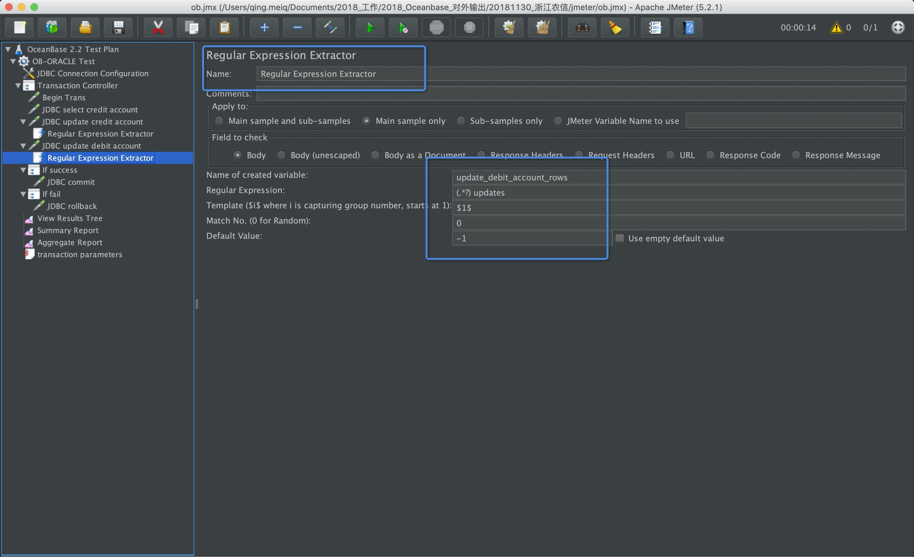

+ 判断逻辑——成功流程

如果上面两笔账户的更新成功，则提交事务。

新增判断控制 `IF`

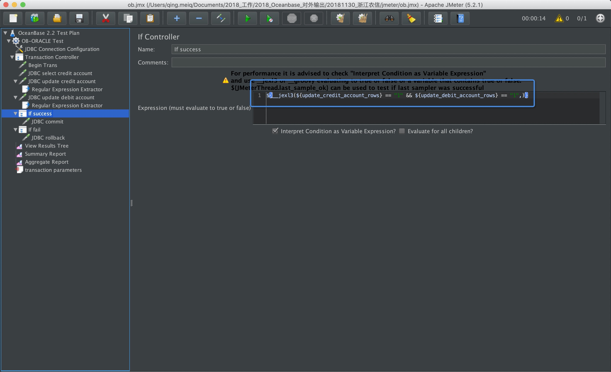

新增动作

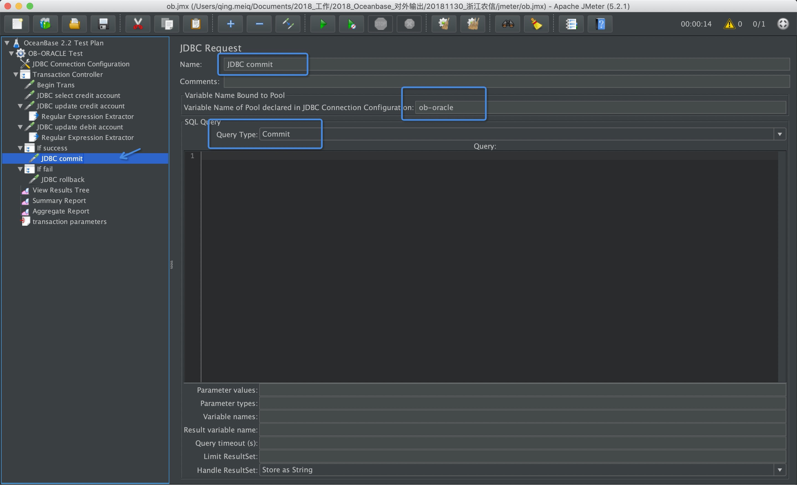

### 判断逻辑——失败流程

如果上面两笔账户的更新有一笔失败，则回滚事务。

新增判断控制 `IF`

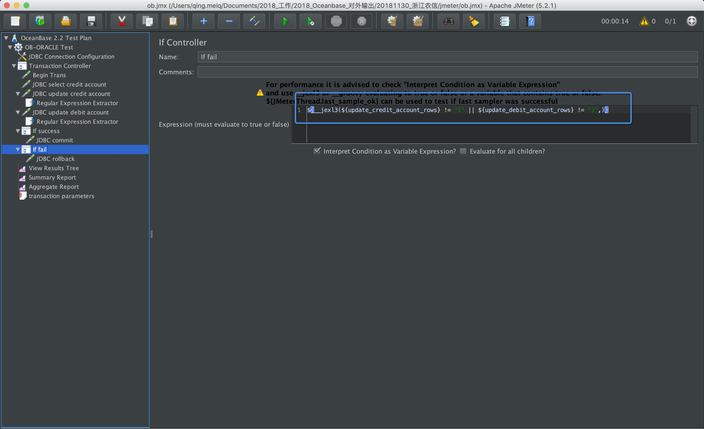

新增动作

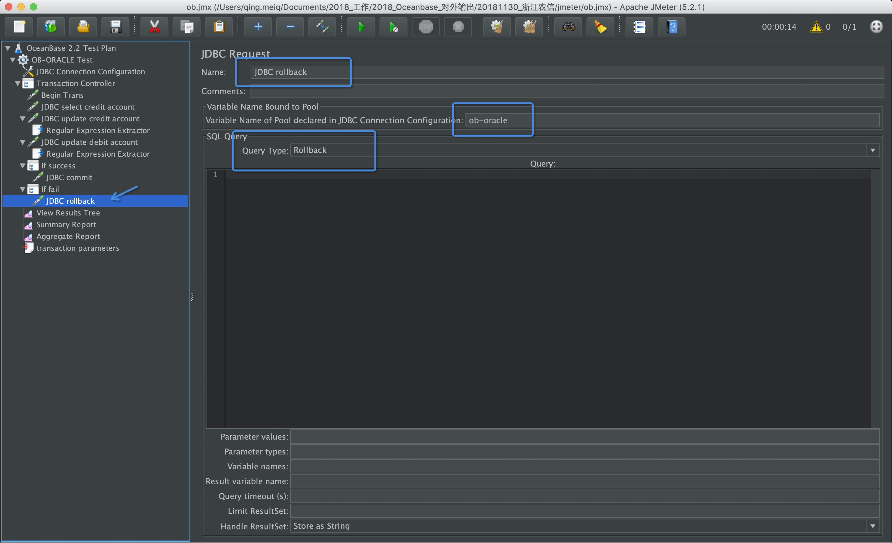

### 查看结果

可以查看成功、失败的结果

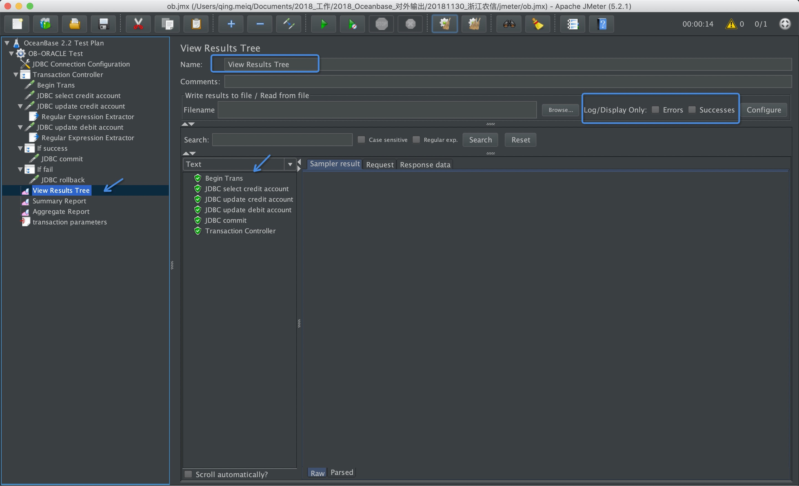

查看汇总报告

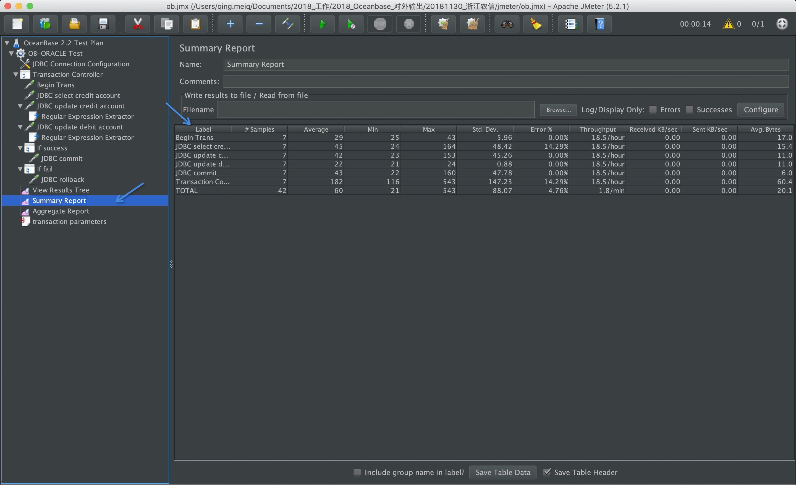

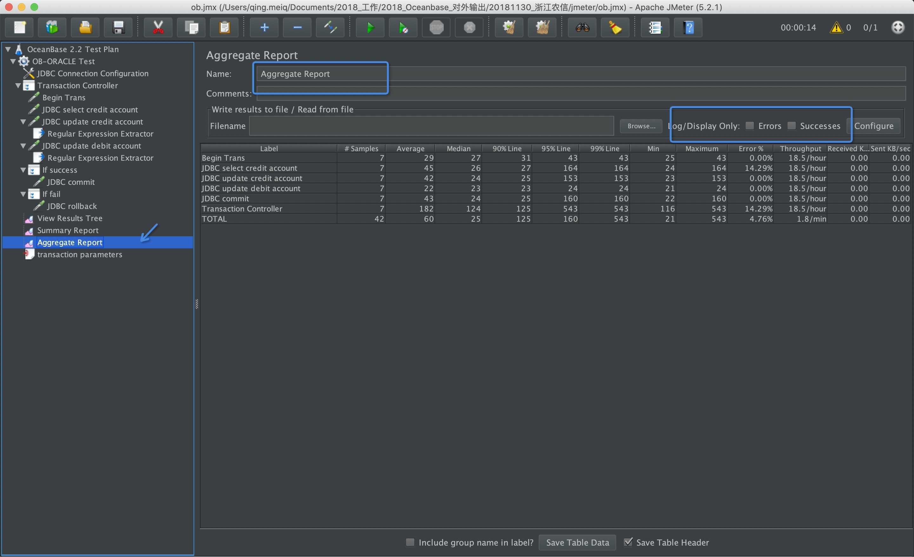
