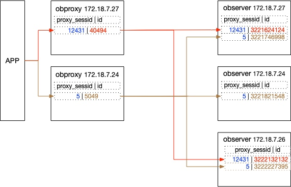

# 如何管理 OceanBase 数据库连接

由于执行计划跟连接方法也有关系，这里先介绍一下 OceanBase 数据库连接的原理。

连接 OceanBase 集群有两种方法：

+ 直连 OceanBase 集群节点的 2881 端口。任意一个 OBSERVER 节点，只要没有脱离集群（指掉线），都可以用来连接 OceanBase 集群。业务连接 OceanBase 集群不适合这个方法，因为节点比较多，且可能会变化。
+ 通过 OBPROXY 的 2883 端口连接 OceanBase 集群。OBPROXY 跟 OceanBase 集群保持联系，能感知集群节点状态变化。多个 OBPROXY 都可以用来连接 OceanBase 集群，OBPROXY 之间彼此独立工作，互不影响。

## OBPROXY 连接原理

OBPROXY 是个单进程程序，默认监听端口 2883 ，实现了 MySQL 连接协议。客户端跟 OBPROXY 建立连接后，访问 OceanBase 集群数据时，OBPROXY 会自动判断要访问的数据的主副本在哪个 OBSERVER 节点上，然后自动跟该 OBSERVER 建立一个长连接。通常我们把客户端跟 OBPROXY 建立的连接称为“前端连接”，把相应的 OBPROXY 跟后端 OBSERVER 节点之间的连接称之为“后端连接”。每个前端连接可能对应 1-N 个 后端连接。 N 是 OceanBase 租户所在的节点总数（包括备副本所在 OBSERVER 节点）。不同前端连接的后端连接是不复用的。



OBPROXY 前端连接数受 OBPROXY 参数 `max_connections` 和 `client_max_connections` 限制。

```sql
MySQL [(none)]> show proxyconfig like '%connection%';
+-----------------------------------------+-------+--------------------------------------------------------------------------------------------------------------------------------------------------------------------------------------------------------+-------------+---------------+
| name                                    | value | info                                                                                                                                                                                                   | need_reboot | visible_level |
+-----------------------------------------+-------+--------------------------------------------------------------------------------------------------------------------------------------------------------------------------------------------------------+-------------+---------------+
| max_connections                         | 60000 | max fd proxy could use                                                                                                                                                                                 | false       | SYS           |
| client_max_connections                  | 8192  | client max connections for one obproxy, [0, 65535]                                                                                                                                                     | false       | USER          |
| enable_client_connection_lru_disconnect | False | if client connections reach throttle, true is that new connection will be accepted, and eliminate lru client connection, false is that new connection will disconnect, and err packet will be returned | false       | SYS           |
+-----------------------------------------+-------+--------------------------------------------------------------------------------------------------------------------------------------------------------------------------------------------------------+-------------+---------------+
3 rows in set (0.004 sec)

MySQL [(none)]> alter proxyconfig set client_max_connections=20000;
Query OK, 0 rows affected (0.005 sec)
```

## 如何管理连接

### 直连 OBPROXY 管理连接

+ 查看并直接 KILL 前端连接

`show processlist` 只能查看当前客户端连接，`show proxysession` 只能查看当前 OBPROXY 的连接。

```sql
MySQL [(none)]> show processlist;
+---------+----------+------+---------------------+------------+-------------+-------------------+-------------------+-------+-------+
| Id      | Tenant   | User | Host                | db         | trans_count | svr_session_count | state             | tid   | pid   |
+---------+----------+------+---------------------+------------+-------------+-------------------+-------------------+-------+-------+
|       5 | proxysys | root | 172.20.249.50:32108 | NULL       |           0 |                 0 | MCS_ACTIVE_READER | 49646 | 49646 |
|  524299 | sys      | root | 172.20.249.50:32082 | oceanbase  |           0 |                 1 | MCS_ACTIVE_READER | 49651 | 49646 |
| 1048583 | obmysql  | root | 172.20.249.50:32120 | sysbenchdb |           0 |                 2 | MCS_ACTIVE_READER | 49652 | 49646 |
+---------+----------+------+---------------------+------------+-------------+-------------------+-------------------+-------+-------+
3 rows in set (0.007 sec)

MySQL [(none)]> show proxysession;
+--------------+---------+-------------+----------+------+---------------------+------------+-------------+-------------------+-------------------+-------+-------+
| proxy_sessid | Id      | Cluster     | Tenant   | User | Host                | db         | trans_count | svr_session_count | state             | tid   | pid   |
+--------------+---------+-------------+----------+------+---------------------+------------+-------------+-------------------+-------------------+-------+-------+
|            0 |       5 | obce-3zones | proxysys | root | 172.20.249.50:32108 | NULL       |           0 |                 0 | MCS_ACTIVE_READER | 49646 | 49646 |
|           15 |  524299 | obce-3zones | sys      | root | 172.20.249.50:32082 | oceanbase  |           0 |                 1 | MCS_ACTIVE_READER | 49651 | 49646 |
|           19 | 1048583 | obce-3zones | obmysql  | root | 172.20.249.50:32120 | sysbenchdb |           0 |                 2 | MCS_ACTIVE_READER | 49652 | 49646 |
+--------------+---------+-------------+----------+------+---------------------+------------+-------------+-------------------+-------------------+-------+-------+
3 rows in set (0.005 sec)

MySQL [(none)]> kill proxysession 1048583;
Query OK, 0 rows affected (0.009 sec)

MySQL [(none)]> show processlist;
+---------+----------+------+---------------------+------------+-------------+-------------------+-------------------+-------+-------+
| Id      | Tenant   | User | Host                | db         | trans_count | svr_session_count | state             | tid   | pid   |
+---------+----------+------+---------------------+------------+-------------+-------------------+-------------------+-------+-------+
|       5 | proxysys | root | 172.20.249.50:32108 | NULL       |           0 |                 0 | MCS_ACTIVE_READER | 49646 | 49646 |
|  524299 | sys      | root | 172.20.249.50:32082 | oceanbase  |           0 |                 1 | MCS_ACTIVE_READER | 49651 | 49646 |
| 1048584 | obmysql  | root | 172.20.249.50:32124 | sysbenchdb |           0 |                 2 | MCS_ACTIVE_READER | 49652 | 49646 |
+---------+----------+------+---------------------+------------+-------------+-------------------+-------------------+-------+-------+
3 rows in set (0.046 sec)

MySQL [(none)]> show proxysession;
+--------------+---------+-------------+----------+------+---------------------+------------+-------------+-------------------+-------------------+-------+-------+
| proxy_sessid | Id      | Cluster     | Tenant   | User | Host                | db         | trans_count | svr_session_count | state             | tid   | pid   |
+--------------+---------+-------------+----------+------+---------------------+------------+-------------+-------------------+-------------------+-------+-------+
|            0 |       5 | obce-3zones | proxysys | root | 172.20.249.50:32108 | NULL       |           0 |                 0 | MCS_ACTIVE_READER | 49646 | 49646 |
|           15 |  524299 | obce-3zones | sys      | root | 172.20.249.50:32082 | oceanbase  |           0 |                 1 | MCS_ACTIVE_READER | 49651 | 49646 |
|           20 | 1048584 | obce-3zones | obmysql  | root | 172.20.249.50:32124 | sysbenchdb |           0 |                 2 | MCS_ACTIVE_READER | 49652 | 49646 |
+--------------+---------+-------------+----------+------+---------------------+------------+-------------+-------------------+-------------------+-------+-------+
3 rows in set (0.045 sec)

MySQL [(none)]> kill 1048584;
Query OK, 0 rows affected (0.030 sec)

```

`show proxysession` 里的 ID 就是 `show processlist` 中的 ID ，可以使用 `kill [id]` 或  `kill proxysession [id]` 杀前端连接。当前端连接被杀后，对应的后端连接也一并中断掉了。

不支持 `kill query` 语法。

+ 查看并直接 KILL 后端连接

```sql
MySQL [(none)]> show processlist;
+---------+----------+------+---------------------+------------+-------------+-------------------+-------------------+-------+-------+
| Id      | Tenant   | User | Host                | db         | trans_count | svr_session_count | state             | tid   | pid   |
+---------+----------+------+---------------------+------------+-------------+-------------------+-------------------+-------+-------+
|       5 | proxysys | root | 172.20.249.50:32108 | NULL       |           0 |                 0 | MCS_ACTIVE_READER | 49646 | 49646 |
|  524299 | sys      | root | 172.20.249.50:32082 | oceanbase  |           0 |                 1 | MCS_ACTIVE_READER | 49651 | 49646 |
| 1048585 | obmysql  | root | 172.20.249.50:32130 | sysbenchdb |           0 |                 3 | MCS_ACTIVE_READER | 49652 | 49646 |
+---------+----------+------+---------------------+------------+-------------+-------------------+-------------------+-------+-------+
3 rows in set (0.074 sec)

MySQL [(none)]> show proxysession ;
+--------------+---------+-------------+----------+------+---------------------+------------+-------------+-------------------+-------------------+-------+-------+
| proxy_sessid | Id      | Cluster     | Tenant   | User | Host                | db         | trans_count | svr_session_count | state             | tid   | pid   |
+--------------+---------+-------------+----------+------+---------------------+------------+-------------+-------------------+-------------------+-------+-------+
|            0 |       5 | obce-3zones | proxysys | root | 172.20.249.50:32108 | NULL       |           0 |                 0 | MCS_ACTIVE_READER | 49646 | 49646 |
|           15 |  524299 | obce-3zones | sys      | root | 172.20.249.50:32082 | oceanbase  |           0 |                 1 | MCS_ACTIVE_READER | 49651 | 49646 |
|           21 | 1048585 | obce-3zones | obmysql  | root | 172.20.249.50:32130 | sysbenchdb |           0 |                 3 | MCS_ACTIVE_READER | 49652 | 49646 |
+--------------+---------+-------------+----------+------+---------------------+------------+-------------+-------------------+-------------------+-------+-------+
3 rows in set (0.200 sec)

MySQL [(none)]> show proxysession attribute 1048585 ;
+----------------------------------+---------------------+----------------+
| attribute_name                   | value               | info           |
+----------------------------------+---------------------+----------------+
| proxy_sessid                     | 21                  | cs common      |
| cs_id                            | 1048585             | cs common      |
| cluster                          | obce-3zones         | cs common      |
| tenant                           | obmysql             | cs common      |
| user                             | root                | cs common      |
| host_ip                          | 172.20.249.50       | cs common      |
| host_port                        | 32130               | cs common      |
| db                               | sysbenchdb          | cs common      |
| total_trans_cnt                  | 0                   | cs common      |
| svr_session_cnt                  | 3                   | cs common      |
| active                           | false               | cs common      |
| read_state                       | MCS_ACTIVE_READER   | cs common      |
| tid                              | 49652               | cs common      |
| pid                              | 49646               | cs common      |
| idc_name                         |                     | cs common      |
| modified_time                    | 0                   | cs stat        |
| reported_time                    | 0                   | cs stat        |
| hot_sys_var_version              | 1                   | cs var version |
| sys_var_version                  | 3                   | cs var version |
| user_var_version                 | 0                   | cs var version |
| last_insert_id_version           | 0                   | cs var version |
| db_name_version                  | 1                   | cs var version |
| server_ip                        | 172.20.249.52       | last used ss   |
| server_port                      | 2881                | last used ss   |
| server_sessid                    | 3221634194          | last used ss   |
| ss_id                            | 34                  | last used ss   |
| state                            | MSS_KA_CLIENT_SLAVE | last used ss   |
| transact_count                   | 2                   | last used ss   |
| server_trans_stat                | 0                   | last used ss   |
| hot_sys_var_version              | 1                   | last used ss   |
| sys_var_version                  | 3                   | last used ss   |
| user_var_version                 | 0                   | last used ss   |
| last_insert_id_version           | 0                   | last used ss   |
| db_name_version                  | 1                   | last used ss   |
| is_checksum_supported            | 1                   | last used ss   |
| is_safe_read_weak_supported      | 0                   | last used ss   |
| is_checksum_switch_supported     | 1                   | last used ss   |
| checksum_switch                  | 1                   | last used ss   |
| enable_extra_ok_packet_for_stats | 1                   | last used ss   |
| server_ip                        | 172.20.249.51       | ss pool [0]    |
| server_port                      | 2881                | ss pool [0]    |
| server_sessid                    | 3222242117          | ss pool [0]    |
| ss_id                            | 36                  | ss pool [0]    |
| state                            | MSS_KA_SHARED       | ss pool [0]    |
| transact_count                   | 2                   | ss pool [0]    |
| server_trans_stat                | 0                   | ss pool [0]    |
| hot_sys_var_version              | 1                   | ss pool [0]    |
| sys_var_version                  | 2                   | ss pool [0]    |
| user_var_version                 | 0                   | ss pool [0]    |
| last_insert_id_version           | 0                   | ss pool [0]    |
| db_name_version                  | 1                   | ss pool [0]    |
| is_checksum_supported            | 1                   | ss pool [0]    |
| is_safe_read_weak_supported      | 0                   | ss pool [0]    |
| is_checksum_switch_supported     | 1                   | ss pool [0]    |
| checksum_switch                  | 1                   | ss pool [0]    |
| enable_extra_ok_packet_for_stats | 1                   | ss pool [0]    |
| server_ip                        | 172.20.249.49       | ss pool [1]    |
| server_port                      | 2881                | ss pool [1]    |
| server_sessid                    | 3221895002          | ss pool [1]    |
| ss_id                            | 35                  | ss pool [1]    |
| state                            | MSS_KA_SHARED       | ss pool [1]    |
| transact_count                   | 1                   | ss pool [1]    |
| server_trans_stat                | 0                   | ss pool [1]    |
| hot_sys_var_version              | 1                   | ss pool [1]    |
| sys_var_version                  | 2                   | ss pool [1]    |
| user_var_version                 | 0                   | ss pool [1]    |
| last_insert_id_version           | 0                   | ss pool [1]    |
| db_name_version                  | 1                   | ss pool [1]    |
| is_checksum_supported            | 1                   | ss pool [1]    |
| is_safe_read_weak_supported      | 0                   | ss pool [1]    |
| is_checksum_switch_supported     | 1                   | ss pool [1]    |
| checksum_switch                  | 1                   | ss pool [1]    |
| enable_extra_ok_packet_for_stats | 1                   | ss pool [1]    |
+----------------------------------+---------------------+----------------+
73 rows in set (0.081 sec)

```

通过 `show proxysession attribute [id]` 可以查看前端连接对应的后端连接。

+ {`proxy_sessid`、`cs_id`、`host_ip`、`host_port`｝为前端连接元组。其中 `cs_id` 是 OBPROXY 内部标识的前端连接（客户端连接）的 ID 号，跟 `show processlist` 的 ID 列是一致的。
+ { `server_ip`, `server_port`, `server_sessid`,`ss_id` } 组成后端连接元组。 其中 `ss_id` 是 OBPROXY 内部标识的后端连接（OBPROXY 跟 OBSERVER 连接）的 ID 号。`server_sessid` 是 OBSERVER 上的客户端连接 ID 。

下面示例指定了前端连接标识和后端连接标识，可以针对性的杀后端连接。

```sql
MySQL [(none)]> kill proxysession 1048585 35;
Query OK, 0 rows affected (0.002 sec)

MySQL [(none)]> show proxysession attribute 1048585 ;
+----------------------------------+---------------------+----------------+
| attribute_name                   | value               | info           |
+----------------------------------+---------------------+----------------+
| proxy_sessid                     | 21                  | cs common      |
| cs_id                            | 1048585             | cs common      |
| cluster                          | obce-3zones         | cs common      |
| tenant                           | obmysql             | cs common      |
| user                             | root                | cs common      |
| host_ip                          | 172.20.249.50       | cs common      |
| host_port                        | 32130               | cs common      |
| db                               | sysbenchdb          | cs common      |
| total_trans_cnt                  | 0                   | cs common      |
| svr_session_cnt                  | 2                   | cs common      |
| active                           | false               | cs common      |
| read_state                       | MCS_ACTIVE_READER   | cs common      |
| tid                              | 49652               | cs common      |
| pid                              | 49646               | cs common      |
| idc_name                         |                     | cs common      |
| modified_time                    | 0                   | cs stat        |
| reported_time                    | 0                   | cs stat        |
| hot_sys_var_version              | 1                   | cs var version |
| sys_var_version                  | 3                   | cs var version |
| user_var_version                 | 0                   | cs var version |
| last_insert_id_version           | 0                   | cs var version |
| db_name_version                  | 1                   | cs var version |
| server_ip                        | 172.20.249.52       | last used ss   |
| server_port                      | 2881                | last used ss   |
| server_sessid                    | 3221634194          | last used ss   |
| ss_id                            | 34                  | last used ss   |
| state                            | MSS_KA_CLIENT_SLAVE | last used ss   |
| transact_count                   | 2                   | last used ss   |
| server_trans_stat                | 0                   | last used ss   |
| hot_sys_var_version              | 1                   | last used ss   |
| sys_var_version                  | 3                   | last used ss   |
| user_var_version                 | 0                   | last used ss   |
| last_insert_id_version           | 0                   | last used ss   |
| db_name_version                  | 1                   | last used ss   |
| is_checksum_supported            | 1                   | last used ss   |
| is_safe_read_weak_supported      | 0                   | last used ss   |
| is_checksum_switch_supported     | 1                   | last used ss   |
| checksum_switch                  | 1                   | last used ss   |
| enable_extra_ok_packet_for_stats | 1                   | last used ss   |
| server_ip                        | 172.20.249.51       | ss pool [0]    |
| server_port                      | 2881                | ss pool [0]    |
| server_sessid                    | 3222242117          | ss pool [0]    |
| ss_id                            | 36                  | ss pool [0]    |
| state                            | MSS_KA_SHARED       | ss pool [0]    |
| transact_count                   | 2                   | ss pool [0]    |
| server_trans_stat                | 0                   | ss pool [0]    |
| hot_sys_var_version              | 1                   | ss pool [0]    |
| sys_var_version                  | 2                   | ss pool [0]    |
| user_var_version                 | 0                   | ss pool [0]    |
| last_insert_id_version           | 0                   | ss pool [0]    |
| db_name_version                  | 1                   | ss pool [0]    |
| is_checksum_supported            | 1                   | ss pool [0]    |
| is_safe_read_weak_supported      | 0                   | ss pool [0]    |
| is_checksum_switch_supported     | 1                   | ss pool [0]    |
| checksum_switch                  | 1                   | ss pool [0]    |
| enable_extra_ok_packet_for_stats | 1                   | ss pool [0]    |
+----------------------------------+---------------------+----------------+
56 rows in set (0.026 sec)

```

### 通过 OBPROXY 连接 OceanBase 集群管理连接

+ 使用 OBPROXY 连接 OceanBase 集群

```bash
obclient -h172.20.249.52 -uroot@sys#obce-3zones -P2883 -p0EI5N08d -c -A oceanbase

```

在通过 OBPROXY 的连接里，`show processlist` 和 `show proxysession` 只能查看当前 OBPROXY 的客户端连接，`show proxysession` 可能看到其他 OceanBase 集群的连接（如果这个 OBPROXY 还可以为其他集群提供路由服务），`show full processlist` 能看到 OceanBase 集群的全部后端连接，包括通过其他 OBPROXY 连接过来的。

在这个连接里可以针对性的 KILL 当前 OBPROXY 的后端连接（不能 KILL 其他 OBPROXY 的后端连接），但是前端连接只能 kILL 自己，不能 KILL 其他连接。KILL 的时候支持 KILL CONNECTION 或 KILL QUERY 。

```sql
MySQL [oceanbase]> show proxysession;
+--------------+---------+-------------+----------+------+---------------------+------------+-------------+-------------------+-------------------+-------+-------+
| proxy_sessid | Id      | Cluster     | Tenant   | User | Host                | db         | trans_count | svr_session_count | state             | tid   | pid   |
+--------------+---------+-------------+----------+------+---------------------+------------+-------------+-------------------+-------------------+-------+-------+
|           23 |  524301 | obce-3zones | sys      | root | 172.20.249.50:32214 | oceanbase  |           0 |                 1 | MCS_ACTIVE_READER | 49651 | 49646 |
|           21 | 1048585 | obce-3zones | obmysql  | root | 172.20.249.50:32130 | sysbenchdb |           0 |                 3 | MCS_ACTIVE_READER | 49652 | 49646 |
|            0 |       6 | obce-3zones | proxysys | root | 172.20.249.50:32192 | NULL       |           0 |                 0 | MCS_ACTIVE_READER | 49646 | 49646 |
+--------------+---------+-------------+----------+------+---------------------+------------+-------------+-------------------+-------------------+-------+-------+
3 rows in set (0.001 sec)

MySQL [oceanbase]> show full processlist;
+------------+---------+---------+---------------------+------------+---------+------+--------+-----------------------+---------------+------+--------------+
| Id         | User    | Tenant  | Host                | db         | Command | Time | State  | Info                  | Ip            | Port | Proxy_sessid |
+------------+---------+---------+---------------------+------------+---------+------+--------+-----------------------+---------------+------+--------------+
| 3222242175 | root    | obmysql | 172.20.249.52:12714 | sysbenchdb | Sleep   |  204 | SLEEP  | NULL                  | 172.20.249.51 | 2881 |           21 |
| 3222242191 | root    | sys     | 172.20.249.52:12736 | oceanbase  | Query   |    0 | ACTIVE | show full processlist | 172.20.249.51 | 2881 |           23 |
| 3221895066 | root    | obmysql | 172.20.249.52:4454  | sysbenchdb | Sleep   |  200 | SLEEP  | NULL                  | 172.20.249.49 | 2881 |           21 |
| 3221611294 | proxyro | sys     | 172.20.249.52:55222 | oceanbase  | Sleep   |   13 | SLEEP  | NULL                  | 172.20.249.52 | 2881 |            3 |
| 3221634194 | root    | obmysql | 172.20.249.52:55346 | sysbenchdb | Sleep   |  219 | SLEEP  | NULL                  | 172.20.249.52 | 2881 |           21 |
+------------+---------+---------+---------------------+------------+---------+------+--------+-----------------------+---------------+------+--------------+
5 rows in set (0.026 sec)

MySQL [oceanbase]> kill 3222242191;
ERROR 1317 (70100): Query execution was interrupted
MySQL [oceanbase]> show full processlist;
ERROR 2013 (HY000): Lost connection to MySQL server during query
MySQL [oceanbase]> show full processlist;
ERROR 2006 (HY000): MySQL server has gone away
No connection. Trying to reconnect...
Connection id:    524302
Current database: oceanbase

+------------+---------+---------+---------------------+------------+---------+------+--------+-----------------------+---------------+------+--------------+
| Id         | User    | Tenant  | Host                | db         | Command | Time | State  | Info                  | Ip            | Port | Proxy_sessid |
+------------+---------+---------+---------------------+------------+---------+------+--------+-----------------------+---------------+------+--------------+
| 3221659683 | root    | sys     | 172.20.249.52:55448 | oceanbase  | Query   |    0 | ACTIVE | show full processlist | 172.20.249.52 | 2881 |           24 |
| 3221611294 | proxyro | sys     | 172.20.249.52:55222 | oceanbase  | Sleep   |    5 | SLEEP  | NULL                  | 172.20.249.52 | 2881 |            3 |
| 3221634194 | root    | obmysql | 172.20.249.52:55346 | sysbenchdb | Sleep   |  231 | SLEEP  | NULL                  | 172.20.249.52 | 2881 |           21 |
| 3221895066 | root    | obmysql | 172.20.249.52:4454  | sysbenchdb | Sleep   |  211 | SLEEP  | NULL                  | 172.20.249.49 | 2881 |           21 |
| 3222242175 | root    | obmysql | 172.20.249.52:12714 | sysbenchdb | Sleep   |  216 | SLEEP  | NULL                  | 172.20.249.51 | 2881 |           21 |
+------------+---------+---------+---------------------+------------+---------+------+--------+-----------------------+---------------+------+--------------+
5 rows in set (0.060 sec)

MySQL [oceanbase]> kill 3221634194;
ERROR 1094 (HY000): Unknown thread id: 3221634194
```

如果要 KILL 特定后端连接，得先通过后端 ID 找到 `proxysess_id` ，然后找到对应的前端连接 ID， 再通过命令 `show proxysession attribute [id]` 找到后端连接的 `ss_id` 。

```sql
MySQL [oceanbase]> show proxysession;
+--------------+---------+-------------+----------+------+---------------------+------------+-------------+-------------------+-------------------+-------+-------+
| proxy_sessid | Id      | Cluster     | Tenant   | User | Host                | db         | trans_count | svr_session_count | state             | tid   | pid   |
+--------------+---------+-------------+----------+------+---------------------+------------+-------------+-------------------+-------------------+-------+-------+
|           24 |  524302 | obce-3zones | sys      | root | 172.20.249.50:32218 | oceanbase  |           0 |                 1 | MCS_ACTIVE_READER | 49651 | 49646 |
|           21 | 1048585 | obce-3zones | obmysql  | root | 172.20.249.50:32130 | sysbenchdb |           0 |                 3 | MCS_ACTIVE_READER | 49652 | 49646 |
|            0 |       6 | obce-3zones | proxysys | root | 172.20.249.50:32192 | NULL       |           0 |                 0 | MCS_ACTIVE_READER | 49646 | 49646 |
+--------------+---------+-------------+----------+------+---------------------+------------+-------------+-------------------+-------------------+-------+-------+
3 rows in set (0.019 sec)

MySQL [oceanbase]> show proxysession attribute 1048585;
+----------------------------------+---------------------+----------------+
| attribute_name                   | value               | info           |
+----------------------------------+---------------------+----------------+
| proxy_sessid                     | 21                  | cs common      |
| cs_id                            | 1048585             | cs common      |
| cluster                          | obce-3zones         | cs common      |
| tenant                           | obmysql             | cs common      |
| user                             | root                | cs common      |
| host_ip                          | 172.20.249.50       | cs common      |
| host_port                        | 32130               | cs common      |
| db                               | sysbenchdb          | cs common      |
| total_trans_cnt                  | 0                   | cs common      |
| svr_session_cnt                  | 3                   | cs common      |
| active                           | false               | cs common      |
| read_state                       | MCS_ACTIVE_READER   | cs common      |
| tid                              | 49652               | cs common      |
| pid                              | 49646               | cs common      |
| idc_name                         |                     | cs common      |
| modified_time                    | 0                   | cs stat        |
| reported_time                    | 0                   | cs stat        |
| hot_sys_var_version              | 1                   | cs var version |
| sys_var_version                  | 3                   | cs var version |
| user_var_version                 | 0                   | cs var version |
| last_insert_id_version           | 0                   | cs var version |
| db_name_version                  | 1                   | cs var version |
| server_ip                        | 172.20.249.49       | last used ss   |
| server_port                      | 2881                | last used ss   |
| server_sessid                    | 3221895066          | last used ss   |
| ss_id                            | 38                  | last used ss   |
| state                            | MSS_KA_CLIENT_SLAVE | last used ss   |
| transact_count                   | 1                   | last used ss   |
| server_trans_stat                | 0                   | last used ss   |
| hot_sys_var_version              | 1                   | last used ss   |
| sys_var_version                  | 3                   | last used ss   |
| user_var_version                 | 0                   | last used ss   |
| last_insert_id_version           | 0                   | last used ss   |
| db_name_version                  | 1                   | last used ss   |
| is_checksum_supported            | 1                   | last used ss   |
| is_safe_read_weak_supported      | 0                   | last used ss   |
| is_checksum_switch_supported     | 1                   | last used ss   |
| checksum_switch                  | 1                   | last used ss   |
| enable_extra_ok_packet_for_stats | 1                   | last used ss   |
| server_ip                        | 172.20.249.51       | ss pool [0]    |
| server_port                      | 2881                | ss pool [0]    |
| server_sessid                    | 3222242175          | ss pool [0]    |
| ss_id                            | 37                  | ss pool [0]    |
| state                            | MSS_KA_SHARED       | ss pool [0]    |
| transact_count                   | 2                   | ss pool [0]    |
| server_trans_stat                | 0                   | ss pool [0]    |
| hot_sys_var_version              | 1                   | ss pool [0]    |
| sys_var_version                  | 3                   | ss pool [0]    |
| user_var_version                 | 0                   | ss pool [0]    |
| last_insert_id_version           | 0                   | ss pool [0]    |
| db_name_version                  | 1                   | ss pool [0]    |
| is_checksum_supported            | 1                   | ss pool [0]    |
| is_safe_read_weak_supported      | 0                   | ss pool [0]    |
| is_checksum_switch_supported     | 1                   | ss pool [0]    |
| checksum_switch                  | 1                   | ss pool [0]    |
| enable_extra_ok_packet_for_stats | 1                   | ss pool [0]    |
| server_ip                        | 172.20.249.52       | ss pool [1]    |
| server_port                      | 2881                | ss pool [1]    |
| server_sessid                    | 3221634194          | ss pool [1]    |
| ss_id                            | 34                  | ss pool [1]    |
| state                            | MSS_KA_SHARED       | ss pool [1]    |
| transact_count                   | 3                   | ss pool [1]    |
| server_trans_stat                | 0                   | ss pool [1]    |
| hot_sys_var_version              | 1                   | ss pool [1]    |
| sys_var_version                  | 3                   | ss pool [1]    |
| user_var_version                 | 0                   | ss pool [1]    |
| last_insert_id_version           | 0                   | ss pool [1]    |
| db_name_version                  | 1                   | ss pool [1]    |
| is_checksum_supported            | 1                   | ss pool [1]    |
| is_safe_read_weak_supported      | 0                   | ss pool [1]    |
| is_checksum_switch_supported     | 1                   | ss pool [1]    |
| checksum_switch                  | 1                   | ss pool [1]    |
| enable_extra_ok_packet_for_stats | 1                   | ss pool [1]    |
+----------------------------------+---------------------+----------------+
73 rows in set (0.001 sec)

MySQL [oceanbase]> kill proxysession 1048585 34 ;
Query OK, 0 rows affected (0.010 sec)

```

后端连接的被 kILL ，客户端时候感知不到的，再次查询的时候 OBPROXY 会自动建立新的后端连接。

### 直连 OBSERVER 管理连接

在 OBPROXY 的连接里查看后端连接的命令是 ：`show full processlist` ，里面的 ID 列就是 OBSERVER 里客户端连接 ID 。可以在 OBSERVER 内部直接用  KILL QUERY 或 KILL CONNECTION 。

```sql
obclient -h172.20.249.52 -uroot@sys#obce-3zones -P2883 -p0EI5N08d -c -A oceanbase

MySQL [oceanbase]> show full processlist;
+------------+---------+---------+---------------------+------------+---------+------+--------+-----------------------+---------------+------+--------------+
| Id         | User    | Tenant  | Host                | db         | Command | Time | State  | Info                  | Ip            | Port | Proxy_sessid |
+------------+---------+---------+---------------------+------------+---------+------+--------+-----------------------+---------------+------+--------------+
| 3221659683 | root    | sys     | 172.20.249.52:55448 | oceanbase  | Query   |    0 | ACTIVE | show full processlist | 172.20.249.52 | 2881 |           24 |
| 3221611294 | proxyro | sys     | 172.20.249.52:55222 | oceanbase  | Sleep   |   16 | SLEEP  | NULL                  | 172.20.249.52 | 2881 |            3 |
| 3221666993 | root    | obmysql | 127.0.0.1:45726     | sysbenchdb | Sleep   |    3 | SLEEP  | NULL                  | 172.20.249.52 | 2881 |         NULL |
| 3221663293 | root    | obmysql | 172.20.249.52:55458 | sysbenchdb | Sleep   |  281 | SLEEP  | NULL                  | 172.20.249.52 | 2881 |           21 |
| 3221895066 | root    | obmysql | 172.20.249.52:4454  | sysbenchdb | Sleep   |  291 | SLEEP  | NULL                  | 172.20.249.49 | 2881 |           21 |
| 3222242175 | root    | obmysql | 172.20.249.52:12714 | sysbenchdb | Sleep   |  285 | SLEEP  | NULL                  | 172.20.249.51 | 2881 |           21 |
+------------+---------+---------+---------------------+------------+---------+------+--------+-----------------------+---------------+------+--------------+
6 rows in set (0.010 sec)
```

说明：

+ `Id`：后端连接的客户端 ID 。整个 OceanBase 集群内部唯一。
+ `Host`：前端连接的客户端 `IP:PORT` ，发起数据库连接的客户端信息。
+ `Ip`：后端连接的服务端 IP。即 OBSERVER 的 IP 。
+ `Proxy_sessid` ：前端连接的 OBPROXY 内部ID，该 OBPROXY 内部唯一，不同 OBPROXY 的 `Proxy_sessid` 会重复。如果为 NULL ，表示是直连 OBSERVER 建立的连接。

以上同样的连接查看命令，到直连 OBSERVER 连接里查询，结果会有点不一样。

```sql
mysql -h127.1 -P2881 -uroot@obmysql -p123456 -c -A sysbenchdb

mysql> show processlist;
+------------+------+---------------------+------------+---------+------+--------+------------------+
| Id         | User | Host                | db         | Command | Time | State  | Info             |
+------------+------+---------------------+------------+---------+------+--------+------------------+
| 3222242175 | root | 172.20.249.52:12714 | sysbenchdb | Sleep   |  312 | SLEEP  | NULL             |
| 3221895066 | root | 172.20.249.52:4454  | sysbenchdb | Sleep   |  318 | SLEEP  | NULL             |
| 3221666993 | root | 127.0.0.1:45726     | sysbenchdb | Query   |    0 | ACTIVE | show processlist |
| 3221663293 | root | 172.20.249.52:55458 | sysbenchdb | Sleep   |  308 | SLEEP  | NULL             |
+------------+------+---------------------+------------+---------+------+--------+------------------+
4 rows in set (0.05 sec)
```

说明：

+ `Host`：客户端连接信息（`IP:PORT`）。通常就是 OBPROXY 地址 或者发起连接的客户端。

```sql
mysql> show full processlist;
+------------+------+---------+---------------------+------------+---------+------+--------+-----------------------+---------------+------+
| Id         | User | Tenant  | Host                | db         | Command | Time | State  | Info                  | Ip            | Port |
+------------+------+---------+---------------------+------------+---------+------+--------+-----------------------+---------------+------+
| 3221666993 | root | obmysql | 127.0.0.1:45726     | sysbenchdb | Query   |    0 | ACTIVE | show full processlist | 172.20.249.52 | 2881 |
| 3221663293 | root | obmysql | 172.20.249.52:55458 | sysbenchdb | Sleep   |  312 | SLEEP  | NULL                  | 172.20.249.52 | 2881 |
| 3221895066 | root | obmysql | 172.20.249.52:4454  | sysbenchdb | Sleep   |  321 | SLEEP  | NULL                  | 172.20.249.49 | 2881 |
| 3222242175 | root | obmysql | 172.20.249.52:12714 | sysbenchdb | Sleep   |  315 | SLEEP  | NULL                  | 172.20.249.51 | 2881 |
+------------+------+---------+---------------------+------------+---------+------+--------+-----------------------+---------------+------+
4 rows in set (0.00 sec)

mysql> show proxysession ;
ERROR 1064 (42000): You have an error in your SQL syntax; check the manual that corresponds to your OceanBase version for the right syntax to use near 'proxysession' at line 1
mysql>

```

说明：

+ `Host`：前端连接的客户端，也就是发起连接的客户端信息（`IP:PORT`）。通常就是 OBPROXY 地址或者发起连接的客户端。
+ `Ip`：后端连接的服务端地址，通常就是 OBSERVER 地址。
+ `Id`：后端连接的ID 标识，整个 OceanBase 集群内部唯一。可以直接 KILL QUERY 或 KILL CONNECTION 。

直连 OBSERVER 的连接里，不支持 OBPROXY 的管理命令。

```sql
mysql> kill 3221663293;
Query OK, 0 rows affected (0.02 sec)

mysql> kill 3221895066;
Query OK, 0 rows affected (0.14 sec)

mysql> kill 3222242175;
Query OK, 0 rows affected (0.02 sec)

```

跟前面一样，如果后端连接被 KILL 了，客户端重新查询的时候， OBPROXY 会自动跟 OBSERVER 建立后端连接。

## 视图 `__all_virtual_processlist`

视图 `__all_virtual_processlist` 能查看到 OceanBase 集群里所有连接，包括通过 OBPROXY 连接过来的后端连接以及直连集群 OBSERVER 节点的连接。

```sql
SELECT id, host, command, sql_id, time, state, info, svr_ip, proxy_sessid, user_client_ip, trans_id ,thread_id, trace_id  
FROM __all_virtual_processlist 
where 1=1 
;

输出：

+------------+---------------------+---------+----------------------------------+------+--------+----------------------------------------------------------------------------------------------------------------------------------------------------------------------+---------------+--------------+----------------+----------------------+-----------+-------------------------------+
| id         | host                | command | sql_id                           | time | state  | info                                                                                                                                                                 | svr_ip        | proxy_sessid | user_client_ip | trans_id             | thread_id | trace_id                      |
+------------+---------------------+---------+----------------------------------+------+--------+----------------------------------------------------------------------------------------------------------------------------------------------------------------------+---------------+--------------+----------------+----------------------+-----------+-------------------------------+
| 3222242518 | 172.20.249.52:19440 | Query   | 17115A49B6D58958854D9B2E58CB821A |    0 | ACTIVE | SELECT id, host, command, sql_id, time, state, info, svr_ip, proxy_sessid, user_client_ip, trans_id ,thread_id, trace_id
FROM __all_virtual_processlist
where 1=1 | 172.20.249.51 |           26 | 172.20.249.50  |                    0 |     19240 | YB42AC14F933-0005CCDFC90D9A46 |
| 3222242521 | 172.20.249.52:19442 | Sleep   |                                  |  458 | SLEEP  | NULL                                                                                                                                                                 | 172.20.249.51 |           27 | 192.168.0.6    |                    0 |         0 | NULL                          |
| 3222242532 | 172.20.249.49:48664 | Sleep   |                                  | 1167 | SLEEP  | NULL                                                                                                                                                                 | 172.20.249.51 |            8 | 172.20.249.49  |                    0 |         0 | NULL                          |
| 3221895453 | 172.20.249.52:11250 | Sleep   |                                  |   13 | SLEEP  | NULL                                                                                                                                                                 | 172.20.249.49 |           28 | 192.168.0.6    |                    0 |         0 | NULL                          |
| 3221895423 | 172.20.249.52:11218 | Sleep   |                                  | 1024 | SLEEP  | NULL                                                                                                                                                                 | 172.20.249.49 |           31 | 172.20.249.50  |                    0 |         0 | NULL                          |
| 3221611294 | 172.20.249.52:55222 | Sleep   |                                  |    9 | SLEEP  | NULL                                                                                                                                                                 | 172.20.249.52 |            3 | 172.20.249.52  | 15795690051229394980 |         0 | NULL                          |
| 3221591229 | 172.20.249.49:11510 | Sleep   |                                  | 1226 | SLEEP  | NULL                                                                                                                                                                 | 172.20.249.52 |            2 | 172.20.249.49  |                    0 |         0 | NULL                          |
| 3221594049 | 172.20.249.52:62192 | Sleep   |                                  |  998 | SLEEP  | NULL                                                                                                                                                                 | 172.20.249.52 |           31 | 172.20.249.50  | 13683594962028267401 |         0 | NULL                          |
| 3221583881 | 172.20.249.52:62154 | Sleep   |                                  |  384 | SLEEP  | NULL                                                                                                                                                                 | 172.20.249.52 |           28 | 192.168.0.6    |                    0 |         0 | NULL                          |
| 3221591227 | 172.20.249.49:11512 | Sleep   |                                  |    4 | SLEEP  | NULL                                                                                                                                                                 | 172.20.249.52 |            3 | 172.20.249.49  |   283711989801967624 |         0 | NULL                          |
| 3221603549 | 127.0.0.1:52488     | Sleep   |                                  |  324 | SLEEP  | NULL                                                                                                                                                                 | 172.20.249.52 |         NULL | 127.0.0.1      |                    0 |         0 | NULL                          |
+------------+---------------------+---------+----------------------------------+------+--------+----------------------------------------------------------------------------------------------------------------------------------------------------------------------+---------------+--------------+----------------+----------------------+-----------+-------------------------------+
11 rows in set (0.011 sec)

```

这个视图的结果跟命令 `show full processlist` 的结果基本一致。这里再说明一下。

+ `proxy_sessid` ：如果为 NULL ，表示直连 OBSERVER 的连接；如果不为 NULL 表示通过 OBPROXY 建立的连接。
+ `host` ：是连接的客户端。通常是 OBPROXY 地址，如果是直连的连接，就是发起连接的那个实际客户端地址。
+ `svr_ip` ：是连接的服务端。通常是 OBSERVER 地址。
+ `user_client_ip` ：是连接的实际客户端地址，即发起连接的客户端地址。
+ `state`：后端连接的状态，通常状态是 SLEEP 。如果连接正在执行 SQL，状态是 ACTIVE 。
+ `time` ： 后端连接当前状态持续时间，单位秒。如果状态发生变化，就重新计时。
+ `info` ： 连接正在执行的 SQL 。如果 SQL 很快，很难捕捉到。
+ `sql_id` ：连接正在执行的 SQL 的 SQLID ，可以根据这个 SQLID 去查执行计划。
+ `trans_id` : 连接的事务的 TRANS_ID ，这个不准确，供参考。如果连接开启了事务，这个是真正的事务 ID 。如果事务提交了后，在开启新事务之前，连接的这个 TRANS_ID 不一定会变化。
+ `trace_id` : 是连接用的 TRACE_ID，可以在 OBSERVER 的运行日志中根据这个 TRACE_ID 追踪相关日志。

## 分析连接的事务超时问题

事务有两个超时时间，分别通过参数 `ob_trx_idle_timeout` 和 `ob_trx_timeout` 控制。前者是事务空闲超时，后者是事务未提交超时。
为了研究这两个参数的影响， 下面示例故意把两个参数的值差异拉大。

### 事务空闲超时

客户端 1 查看空闲超时时间。事务空闲超时设置为 120 秒，事务未提交超时设置为 1000 秒。前者先超时。事务空闲实际超时时间会在一个范围内 [120 s, 120+10 s)  。

```sql
set global ob_trx_idle_timeout=120000000;
set global ob_trx_timeout=1000000000;

show global variables where variable_name in ('ob_trx_idle_timeout','ob_trx_timeout');
+---------------------+------------+
| Variable_name       | Value      |
+---------------------+------------+
| ob_trx_idle_timeout | 120000000  |
| ob_trx_timeout      | 1000000000 |
+---------------------+------------+
2 rows in set (0.040 sec)

```

客户端 2 新建连接开启事务。

```sql
MySQL [test]> begin; update t1 set c1=now() where id=3;
Query OK, 0 rows affected (0.002 sec)

Query OK, 1 row affected (0.023 sec)
Rows matched: 1  Changed: 1  Warnings: 0

MySQL [test]> select * from t1;
+----+---------------------+
| id | c1                  |
+----+---------------------+
|  1 | 2021-10-03 09:22:20 |
|  2 | 2021-09-29 21:16:05 |
|  3 | 2021-10-03 10:41:59 |
|  4 | 2021-09-29 21:16:06 |
|  5 | 2021-09-29 21:16:06 |
|  6 | 2021-09-29 21:16:18 |
|  7 | 2021-10-03 09:35:18 |
|  8 | 2021-09-29 21:16:19 |
+----+---------------------+
8 rows in set (0.029 sec)

```

客户端 2 停止操作一段时间。

客户端1 查看连接状态。

```sql
MySQL [oceanbase]> SELECT id, host, command, sql_id, time, state, info, svr_ip, proxy_sessid, user_client_ip, trans_id ,thread_id, trace_id   FROM __all_virtual_processlist  where 1=1 and id=3222242958 order by id;
+------------+---------------------+---------+--------+------+-------+------+---------------+--------------+----------------+---------------------+-----------+----------+
| id         | host                | command | sql_id | time | state | info | svr_ip        | proxy_sessid | user_client_ip | trans_id            | thread_id | trace_id |
+------------+---------------------+---------+--------+------+-------+------+---------------+--------------+----------------+---------------------+-----------+----------+
| 3222243128 | 172.20.249.52:19954 | Sleep   |        |  121 | SLEEP | NULL | 172.20.249.51 |           45 | 172.20.249.50  | 6678987957559799424 |         0 | NULL     |
+------------+---------------------+---------+--------+------+-------+------+---------------+--------------+----------------+---------------------+-----------+----------+
1 row in set (0.007 sec)

```

`time` 列是连接空闲时间。

观察客户端 2 连接。

```sql
MySQL [test]> select * from t1;
ERROR 6002 (25000): transaction needs rollback
MySQL [test]>
```

可见，OceanBase 3.1 版本后对于事务空闲超时的处理行为变为不中断连接，而是提示事务要回滚。此时不管使用 COMMIT 还是 ROLLBACK ，都可以清理事务状态。下面示例故意用 COMMIT，实际上使用 ROLLBACK 更符合用户习惯。

```sql
MySQL [test]> commit;
ERROR 6002 (40000): Transaction rollbacked
MySQL [test]> select * from t1;
+----+---------------------+
| id | c1                  |
+----+---------------------+
|  1 | 2021-10-03 09:22:20 |
|  2 | 2021-09-29 21:16:05 |
|  3 | 2021-09-29 21:16:05 |
|  4 | 2021-09-29 21:16:06 |
|  5 | 2021-09-29 21:16:06 |
|  6 | 2021-09-29 21:16:18 |
|  7 | 2021-10-03 09:35:18 |
|  8 | 2021-09-29 21:16:19 |
+----+---------------------+
8 rows in set (0.003 sec)

```

注意：不管是哪种超时，连接事务所持有的锁都会释放，只是事务的状态需要客户端主动清理一下。对于应用而言，就是需要捕捉事务超时报错，然后发起 ROLLBACK 。

### 事务未提交超时

客户端 1 查看空闲超时时间。事务空闲超时设置为 120 秒，事务未提交超时设置为 1000 秒。前者先超时。事务空闲实际超时时间会在一个范围内 [120 s, 120+10 s)  。

```sql
set global ob_trx_idle_timeout=1200000000;
set global ob_trx_timeout=100000000;

show variables where variable_name in ('ob_trx_idle_timeout','ob_trx_timeout');
+---------------------+------------+
| Variable_name       | Value      |
+---------------------+------------+
| ob_trx_idle_timeout | 120000000  |
| ob_trx_timeout      | 1000000000 |
+---------------------+------------+
2 rows in set (0.003 sec)

```

客户端 2 新建连接开启事务。

```sql
MySQL [test]> begin; update t1 set c1=now() where id=3;
Query OK, 0 rows affected (0.001 sec)

Query OK, 1 row affected (0.005 sec)
Rows matched: 1  Changed: 1  Warnings: 0

```

客户端 2 停止操作一段时间。

```sql
MySQL [test]> select * from t1;
ERROR 4012 (25000): Transaction is timeout
```

此时连接处于“事务超时状态”。需要用 COMMIT 或者 ROLLBACK 清除状态。通常用 ROLLBACK 更符合用户习惯。下面示例故意用  COMMIT ，但是事务修改早已经回滚掉了。

```sql
MySQL [test]> commit;
ERROR 4012 (25000): Transaction is timeout
MySQL [test]> select * from t1;
+----+---------------------+
| id | c1                  |
+----+---------------------+
|  1 | 2021-10-03 09:22:20 |
|  2 | 2021-09-29 21:16:05 |
|  3 | 2021-09-29 21:16:05 |
|  4 | 2021-09-29 21:16:06 |
|  5 | 2021-09-29 21:16:06 |
|  6 | 2021-09-29 21:16:18 |
|  7 | 2021-10-03 09:35:18 |
|  8 | 2021-09-29 21:16:19 |
+----+---------------------+
8 rows in set (0.014 sec)

```

注意：不管是哪种超时，连接事务所持有的锁都会释放，只是事务的状态需要客户端主动清理一下。对于应用而言，就是需要捕捉事务超时报错，然后发起 ROLLBACK 。
