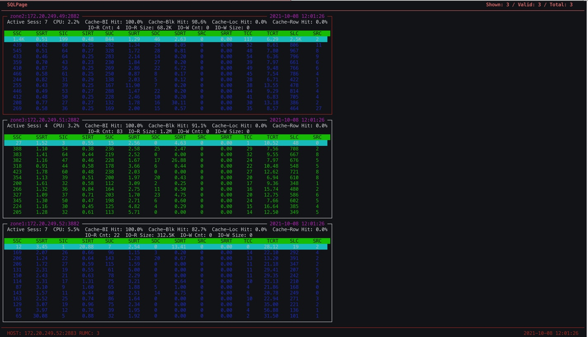

# 运维工具

## `dooba` 性能监控

`dooba` 是 OceanBase 内部的一个运维脚本，用 Python 语言开发，金支持 Python 2.7 。

## 使用方法

`dooba` 的原理是使用 `mysql` 命令连接到 OceanBase 的 SYS 租户里，实时展示租户 SQL 的 QPS（包括 `select`/`update`/`insert`/`delete`/`commit` ) 以及相应 SQL 的平均延时（RT）。同时还可以看各个节点的 SQL 的 QPS 以及 RT 等。
如果没有 `mysql` 客户端，需要安装一个。尽量安装版本 5.5/5.6/5.7 的 MySQL 客户端，因为早期的 OBPROXY （版本低于 2.0.0）可能不完全兼容 MySQL 8.0 的连接协议。

使用命令如下：

```bash
python dooba.py -h OBPROXY地址 -u root@sys#集群名 -P OBPROXY端口 -p密码

如：
python dooba.py -h 172.20.249.54 -u root@sys#obce-3zones -P 2883 -pxxxxxx

```

登录后常用的快捷键如下：

+ `c` : 选择租户。一般是观察业务租户的性能。
+ `1`：查看快捷键。这里没有提到的快捷键尽量别用，不保证功能正确。
+ `2`：查看租户性能概览。
+ `3`：查看租户各个节点的性能概览。如果节点很多会显示不全（除非屏幕非常大）。
+ `tab`：在各个 `widget` 之间跳转。
+ `d`：删除 `tab` 焦点所在的 `widget` 。
+ `R`：恢复当前界面所有的 `widget` 布局（包括被删除的）。

脚本 `dooba` 的源码可以直接编辑查看，工具中各个缩写对应的含义在源码里都能找到解释。

## 租户性能概览

主要是查看租户层面的 SQL 的 QPS、RT 以及内存、IO 等实时信息。

`dooba`的性能数据取自 SYS 租户的内部视图 `gv$sysstat` 。`dooba` 的监控信息的 SQL 都可以直接查看，可以参考它做类似的监控产品。

```sql
# 取 QPS 和 RT 信息
SELECT t1.con_id tenant_id,t2.zone, t1.svr_ip,t1.svr_port , t1.stat_id, t1.name, t1.value 
FROM gv$sysstat t1 JOIN  __all_server t2 ON (t1.svr_ip=t2.svr_ip and t1.svr_port=t2.svr_port) JOIN __all_resource_pool t3 ON (t1.con_id=t3.tenant_id) JOIN __all_unit_config t4 ON (t3.unit_config_id=t4.unit_config_id) 
WHERE  t1.con_id IN (1001) 
and stat_id in (10000,10004,10005,10006,30007,30008,30009,40000,40001,40002,40003,40004,40005,40006,40007,40008,40009,40010,40011,40012,40013,50000,50001,50002,50003,50004,50005,50006,50007,50008,50009,50010,50011,60000,60002,60003,60005,130000,130001,130002,130004)   
ORDER BY t1.con_id, t2.zone, t1.svr_ip, t1.svr_port; 

```

这个 SQL 取出所有节点的性能数据，汇总就是整个租户的 性能数据。


这个界面主要关注点：

+ `SQL COUNT` : QPS 信息。包括各类 SQL 的每秒执行次数。SQL 类型分别是 `select`、`insert`、`update`、`delete`、`replace`、`commit`、`rollback` 的。前四类 SQL 总数跟 `commit` 的比值大致可以推出事务的平均语句数。`rollback` 是回滚的信息，如果太高，很有可能是数据库有问题或者业务设计有问题。
+ `SQL RT`：SQL 每次平均执行耗时。包括各类 SQL 的每次平均执行耗时，单位是毫秒（`ms`）。SQL 类型分别是 `select`、`insert`、`update`、`delete`、`replace`、`commit` 。前四类可以看出 SQL 正常情况下的执行耗时水平。如果有大幅变动，可能是数据量突增、有 SQL 缺乏索引、或者有锁等待、CPU 瓶颈等等。具体分析还要结合 SQL 审计视图 `gv$sql_audit` 验证。`commit` 的平均执行耗时也可以反映事务的大小。OceanBase 的 `commit` 会同步事务所有的事务日志（`clog`）到多数派节点（包括自身），这个时间会反映在 `commit` 的耗时里。如果这个值突然增长很大，说明可能有突发的大事务。当节点网络性能下降时或者时间同步误差变大的时候，都可能导致 `commit` 耗时增长。
+ `RPC`：反馈网络信息。这个统计信息不是很准，待以后完善。暂时不用看。
+ `Memory`：这个是 `Memstore` 内存的实时监控。默认情况下，租户可用内存的一半用于 `Memstore` 的内存，用于存放业务写操作带来的变化的数据。OceanBase 的特色之一就是写只记录数据的变化部分，并且数据会尽可能的维持在内存里不落盘，直到增量内存利用率到达阈值（参数 `freeze_trigger_percentage` ）后触发转储或合并才将数据落盘并释放内存。转储是内存中增量数据直接写到磁盘暂存，合并是内存中增量数据跟磁盘中基线数据在内存中合并为最新的数据块（`sstable`）再写回到数据文件中。转储类似传统数据库的 `checkpoint` ，对租户性能影响很小并且可以调优，合并对租户性能稍大一些并且也是可以调优的。通常会建议尽量发起转储，等凌晨低峰期时再发起合并操作。合并可以定时触发，也可以手动触发。当转储次数（参数 `minor_freeze_times` ）用尽时也会自动触发合并。这个监控看的就是增量内存的变化量、累积量和增量内存使用水位。这个监控结果再结合视图 `gv$mem_store` 基本上可以定位所有的增量内存不足问题。当这个内存水位增长到 `freeze_trigger_percentage` 就会触发转储，当水位继续增长到租户限速阈值（租户参数 `writing_throttling_trigger_percentage` ）会触发租户写入限速，当水位增长到接近 100% 的时候，租户内存耗尽，业务写会大量报错（`Over tenant memory limit1`）。调优参数 `freeze_trigger_percentage` 和 转储内部并发数可以将租户的内存水位控制在一个合理的安全的范围内。
+ `IOPS`：这个是磁盘IO 的实时监控。`SESS` 是会话数供参考，量大的时候可能会不准。`IOR` 是读 IOPS ，`IOR-SZ` 是读 IO 吞吐量。当第一次读入数据或者数据不在内存中时就会有读物理 IO 。读物理 IO 如果非常高，会导致 SQL 的平均延时水平很高，说明内存不足，对 IO 依赖性变大。很可能导致 IO 触达瓶颈。`IOW`是写 IOPS，`IOW-SZ` 是写吞吐量。平时很少有写 IO ，因为 OceanBase 的写都在内存里。只有转储和合并的时候，能看到短暂的密集的写 IO 。

## 租户节点性能概览

 查看租户在各个节点的 SQL 的 QPS、RT 以及一些缓存命中率等。

```sql
# 取节点 CPU
SELECT t1.con_id tenant_id,t2.zone, t1.svr_ip,t1.svr_port , round(t1.value/(100*t4.max_cpu), 3) cpu_usage 
FROM gv$sysstat t1 JOIN  __all_server t2 ON (t1.svr_ip=t2.svr_ip and t1.svr_port=t2.svr_port) JOIN __all_resource_pool t3 ON (t1.con_id=t3.tenant_id) JOIN __all_unit_config t4 ON (t3.unit_config_id=t4.unit_config_id) 
WHERE  t1.con_id IN (1001) and t1.stat_id=140006  
ORDER BY t1.con_id, t2.zone, t1.svr_ip, t1.svr_port;

```



这个界面主要关注点：

+ 活跃会话数 ： 供参考，不是严格精准。
+ CPU 利用率：这个是 OceanBase 内部统计的各个节点的 CPU 利用率，不是 OS 里看到的 CPU 利用率（OceanBase 是单进程软件）。
+ 各个缓存的命中率：这里有 `Cache Block` 以及其 `Cache Block Index` 的缓存命中率。主要关注前者。理想情况是 99% 或者 100% 。当初次读入大量数据、或者内存有瓶颈的时候、或者合并后时，这个利用率会低于 99%，甚至低于 90%。 如果长期低于 80%，那说明内存瓶颈问题很严重。其他行缓存命中率通常不是问题。
+ 物理IO 读写：这个各个节点的物理 IO 信息，有很大参考意义。
+ SQL 的 QPS 以及 RT 信息：各个节点的 QPS 可以看出租户请求在各个节点的流量比例关系，相应的 RT 可以看出各个节点的性能状况。其中最后两个 `SLC` 和 `SRC` 表示是节点上的本地 SQL 和远程 SQL 执行次数信息。通常本地 SQL 的性能会比远程 SQL 性能好，所以这里要留意远程 SQL 的比例，如果比例很高，这个节点的 CPU利用率、SQL 的 RT 均值都会比较高。这个就需要分析原因。可能是租户 PRIMARY_ZONE 不适合打散或者表结构设计不合理，可以考虑使用表分组、调整 PRIMARY_ZONE 或 UNIT_NUM 等等。

## `ob_admin` 工具

`ob_admin` 是 OceanBase 内部开发和运维使用一个工具，用于处理一些疑难问题。这个工具不是标准产品，有很大使用风险。仅供对 OceanBase 原理非常熟悉的技术人员使用。

目前 `ob_admin` 可以用于两个场景：

+ 测试数据盘性能，生成 IO 配置文件。
+ 多数派故障时将单副本强制激活为主副本。

## `ob_error` 工具

`ob_error` 是随着OceanBase 一起开源的工具，代码路径：`https://github.com/oceanbase/oceanbase/tree/master/tools/ob_error` 。
主要用来查看 OceanBase 错误码含义，节省查文档时间。

```bash
[root@obce00 ~]# ./ob_error 4030

OceanBase:
        OceanBase Error Code: OB_TENANT_OUT_OF_MEM(-4030)
        Message: Over tenant memory limits
        Cause: Internal Error
        Solution: Contact OceanBase Support
[root@obce00 ~]# ./ob_error 4013

OceanBase:
        OceanBase Error Code: OB_ALLOCATE_MEMORY_FAILED(-4013)
        Message: No memory or reach tenant memory limit
        Cause: Internal Error
        Solution: Contact OceanBase Support

Oracle:
        Oracle Error Code: ORA-04013
        Message: number to CACHE must be less than one cycle
        Related OceanBase Error Code:
                OB_ERR_SEQ_CACHE_TOO_LARGE(-4328)
```

## `addr2line` 命令

Addr2line 工具（它是标准的 GNU Binutils 中的一部分）是一个可以将指令的地址和可执行映像转换成文件名、函数名和源代码行数的工具。
一般适用于 debug 版本或带有 symbol 信息的库。

 命令使用方法：`addr2line -pCfe $observer $symbol_addr`  。
 其中，`$observer` 是进程 `observer` 的目录，`$symbol_addr` 是进程运行日志中打印的十六进制字符串。

 示例如下：

```bash
[admin@obce01 oceanbase-ce]$ grep ERROR log/observer.log -A1
[2021-10-08 15:35:14.343634] ERROR easy_client_dispatch (easy_client.c:30) [90761][8][YB42AC14F934-0005CDD26B1C3D3A] [lt=0] [dc=0] easy_io_dispatch is failure: easy not started
 BACKTRACE:0x9124b6e 0x9060f71 0x9057dcf 0x905abd4 0x92ff0d5 0x9395b48 0x9395cf3 0x930a68e 0x4397e89 0x936beea 0x246f0a5 0x
 
 ```

输出结果如下，是函数的调用关系和参数值。这些反馈给 OceanBase 技术支持人员。

 ```bash
 [admin@obce01 oceanbase-ce]$ addr2line -pCfe bin/observer 0x9124b6e 0x9060f71 0x9057dcf 0x905abd4 0x92ff0d5 0x9395b48 0x9395cf3 0x930a68e 0x4397e89 0x936beea 0x246f0a5 0x
oceanbase::common::lbt() at ??:?
oceanbase::common::ObLogger::check_error_log(oceanbase::common::ObPLogItem&) at ??:?
oceanbase::common::ObLogger::async_log_message_kv(char const*, int, oceanbase::common::ObLogger::LogLocation const&, unsigned long, char const*, long) at ??:?
oceanbase::common::ObLogger::log_message_va(char const*, int, char const*, int, char const*, unsigned long, char const*, __va_list_tag*) at ??:?
oceanbase::common::easy_log_format_adaptor(int, char const*, int, char const*, unsigned long, char const*, ...) at ??:?
easy_client_dispatch at ??:?
easy_client_send at ??:?
oceanbase::rpc::frame::ObReqTransport::send_session(easy_session_t*) const at ??:?
int oceanbase::rpc::frame::ObReqTransport::send<oceanbase::obrpc::ObRpcPacket>(oceanbase::rpc::frame::ObReqTransport::Request<oceanbase::obrpc::ObRpcPacket> const&, oceanbase::rpc::frame::ObReqTransport::Result<oceanbase::obrpc::ObRpcPacket>&) const at ??:?
oceanbase::obrpc::ObRpcProxy::send_request(oceanbase::rpc::frame::ObReqTransport::Request<oceanbase::obrpc::ObRpcPacket> const&, oceanbase::rpc::frame::ObReqTransport::Result<oceanbase::obrpc::ObRpcPacket>&) const at ??:?
int oceanbase::obrpc::ObRpcProxy::rpc_call<oceanbase::obrpc::ObFetchAliveServerArg, oceanbase::obrpc::ObFetchAliveServerResult>(oceanbase::obrpc::ObRpcPacketCode, oceanbase::obrpc::ObFetchAliveServerArg const&, oceanbase::obrpc::ObFetchAliveServerResult&, oceanbase::obrpc::Handle*, oceanbase::obrpc::ObRpcOpts const&) at ??:?
?? ??:0
[admin@obce01 oceanbase-ce]$
 ```
