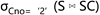

# 第1章 数据库管理系统概述

## 1.1 课程简介

随着信息时代的发展，数据的重要性日益凸显，它是各级政府机构、科研部门、企事业单位的宝贵财富和资源，因此数据库系统的建设对于这些组织的生存和发展至关重要。作为数据库系统的核心和基础，数据库管理系统（Data Base Management System，DBMS）得到了越来越广泛的应用。DBMS帮助用户实现对共享数据的高效组织、存储、管理和存取，经过数十年的研究发展，已经成为继操作系统之后最复杂的系统软件。

对于DBMS的学习一般可分为两个阶段：

第一个阶段是学习DBMS的使用，包括如何运用数据库语言创建、访问和管理数据库，如何利用DBMS设计开发数据库应用程序。在这个阶段，学习者只需掌握DBMS提供的功能，并不需要了解DBMS本身的工作原理。

第二个阶段是学习DBMS的内部结构和实现机制。通过学习DBMS的实现技术，学习者对数据库系统的工作原理会有更深入的理解，这有助于学习者分析数据库系统在复杂应用环境中可能出现的各种性能问题，设计开发出更高效的数据库应用程序，并为其从事数据库管理软件和工具的开发及改进工作打下基础。

在本教程中，我们从DBMS开发者的视角，讨论实现一个关系型DBMS需要考虑的一些关键问题，比如：数据库在存储介质上是如何组织和存储的？一条SQL语句是如何被正确地解析执行的？有哪些结构和方法可以用来快速定位数据库中的记录，提高存取效率？多用户共享数据库时，如何在避免并发错误的同时提高并发度？发生故障时，如何保证数据库能够恢复到正确的状态？在此基础上，学习者可以尝试自己从零开始开发一个简单的DBMS，并逐渐完善、增强它的功能，在这个过程中掌握各种计算机专业知识在DBMS这样的复杂系统软件设计中的应用，提高自己的系统综合能力。

作为学习本课程的前提条件，我们假设学习者已经具备了一定的计算机学科背景知识，包括关系代数、关系数据库语言SQL、数据结构、算法，以及操作系统及编译的相关知识。

## 1.2 数据库管理系统的组成


<center>图1-1 DBMS内部结构图</center>

DBMS允许用户创建数据库并对数据库中的数据进行查询和修改，同时提供故障时的数据恢复功能和多用户同时访问时的并发控制功能。图1-1是一个DBMS的内部结构示意图。其中单线框表示系统模块，双线框表示内存中的数据结构，实线表示控制流+数据流，虚线表示数据流。该图反映了DBMS的几大主要功能的处理流程，即数据定义、数据操纵和事务管理，这些功能均依赖底层的存储管理及缓冲区管理组件提供对磁盘中数据的访问支持。以下我们分别对这几个功能进行简要说明。

### 1.2.1 存储及缓冲区管理

数据库中的数据通常驻留在磁盘中，当系统需要对数据进行操作时，要先将其从磁盘读入内存。

存储管理器的任务是控制数据在磁盘上的放置和数据在磁盘与内存之间的交换。很多DBMS依赖底层操作系统的文件系统来管理磁盘中的数据，也有一些DBMS为了提高效率，直接控制数据在磁盘设备中的存储和访问。存储管理器登记了数据在磁盘上所处的位置，将上层模块提出的逻辑层面的页面访问请求映射为物理层面的磁盘访问命令。

缓冲区管理器将内存空间划分为与页面同等大小的帧，来缓存从磁盘读入的页面，并保证这些页面在内存和磁盘上的副本的一致性。DBMS中所有需要从磁盘获取信息的上层模块都需要与缓冲区管理器交互，通过缓冲区读写数据。这些信息包括以下类型：

- 数据：数据库自身的内容。
- 元数据：描述数据库的结构及其约束的数据库模式。
- 日志记录：记录事务对数据库所做修改的信息，用于保证数据库的一致性和持久性。
- 统计信息：DBMS收集和存储的关于表、索引等数据库对象的大小、 取值分布等信息，用于查询优化。
- 索引：支持对数据进行高效存取的数据结构。

### 1.2.2 DDL命令的处理

DDL是指数据定义语言，这类命令一般由DBA等有特殊权限的用户执行，用于定义或修改数据库的模式，比如创建或者删除表、索引等。关于数据库模式的描述信息称为元数据。元数据与普通数据一样，也是以表（称为系统表）的形式存在的。DDL命令由DDL处理器解析其语义，然后调用记录管理器及索引管理器对相应的元数据进行修改。

### 1.2.3 DML命令的处理

DML是指数据操纵语言，这类命令一般由普通用户或应用程序执行。DML又可分为对数据库的修改操作（增、删、改）和对数据库的查询操作。

对DML命令的处理中最重要的部分是查询处理。查询处理的过程分为以下几步：

- 查询分析及检查：先对查询语句的文本进行语法分析，将其转换为语法树，然后进行查询检查（例如，检查查询中所提到的关系是否确实存在），并将语法树中的某些结构转换成内部形式，形成查询树。查询树表示了一个关系代数表达式，即要在关系上执行的一系列操作。
- 查询优化：查询优化器利用元数据和关于数据的统计信息来确定哪个操作序列可能是最快的，将最初的查询树等价转换为最高效的操作序列。
- 查询执行：执行引擎负责查询计划的执行，它通过完成查询计划中的各个操作，得到最终的执行结果。在执行过程中，它需要与DBMS中很多其他组件进行交互。例如，调用记录管理器和索引管理器获取需要的数据，调用并发控制组件对缓冲区中的某条记录加锁以避免并发错误，或者调用日志组件登记对数据库所做的修改。

### 1.2.4 事务处理

事务是一组数据库操作，这组操作要么都做，要么都不做，不可分割。一个事务中包含哪些操作是由用户定义的，可以包含多个数据库操作，也可以只包含单个数据库操作。对事务的处理由事务管理器负责，它包括并发控制组件和日志及恢复组件，目的是保证事务的ACID特性，即原子性、一致性、隔离性和持久性。

事务管理器接收来自用户或应用程序的事务命令，从而得知什么时候事务开始、什么时候事务结束、以及事务的参数设置（例如事务的隔离级），然后在事务运行过程中执行下列任务：

- 登记日志：为了保证一致性和持久性，事务对于数据库的每一个修改都在磁盘上记录日志，以保证不管在什么时候发生故障，日志及恢复组件都能根据日志将数据库恢复到某个一致的状态。日志一开始被写到缓冲区中，然后会在适当的时机从日志缓冲区写回到磁盘中。
- 并发控制：事务的执行从表面上看必须是孤立的，但是在大多数系统中，实际上有许多事务在同时执行。因此，并发控制组件必须保证多个事务的各个动作以一种适当的顺序执行，从而使得最终的结果与这些事务串行执行的结果相同。常见的并发控制方式是封锁机制，通过加锁来防止两个事务以可能造成不良后果的方式存取同一数据。

## 1.3 关系模型和SQL

本教程讨论的关系型DBMS是以关系模型为理论基础的。另一方面，SQL作为一种关系数据库标准语言，得到了几乎所有商用关系DBMS的广泛支持。要实现一个关系DBMS，我们需要考虑如何在系统中支持符合关系模型定义的数据结构、数据操作和数据约束，同时支持用户通过SQL命令来访问系统。本节将简单回顾关系模型和SQL中的一些重要概念，并讨论二者的关系。

### 1.3.1关系模型

1970年，E.F.Codd在他的论文《A Relation Model of Data for Large Shared Data Banks》中首次提出关系模型。关系模型相对于层次模型和网状模型的优势在于：它提供了一种只使用自然结构来描述数据的方法，而不需要为了方便机器表示而附加任何额外的结构。这样就为更高级的数据语言提供了基础，这种语言使得程序能够独立于数据的机器表示及组织方式，具有更好的数据独立性。

#### 1.3.1.1关系

关系模型采用的数据结构称为关系。在关系模型中，数据库中的全部数据及数据间的联系都用关系来表示。关系是一个无序的元组集合，每个元组由一组属性值构成，表示一个实体。一个有n个属性的关系称为n元关系。由于关系中的元组是无序的，因此DBMS可以采用任何它希望的方式存储它们，以便进行优化。

#### 1.3.1.2 主键和外键

主键和外键反映了关系模型的实体完整性约束和参照完整性约束。

主键可唯一地标识关系中的一个元组，以确保没有任何两个元组是完全一样的。如果用户没有定义主键，有些DBMS会自动创建内部主键。

外键指定一个关系中的属性在取值时必须与另一个关系中的某个元组相对应，不能随意取值。

#### 1.3.1.3 关系代数

关系代数是关系模型定义的一组运算符，用于检索和操作关系中的元组。每个运算符接受一个或多个关系作为输入，并输出一个新的关系。为了表示查询，可以将这些运算符连接在一起以创建更复杂的运算，称为关系代数表达式。

常见的关系代数运算符包括：

- **选择（selection）**：选择运算是从关系R中选取满足给定条件的元组构成结果关系，记作σF(R)。
- **投影（Projection）** ：投影运算是从关系R中选取若干属性列A构成结果关系，记作 ΠA(R)。
- **并（ Union ）** ：两个关系R和S的并是由属于R或属于S的元组构成的集合，记为 R∪S。
- **交（ Intersection）** ：两个关系R和S的交是由既属于R又属于S的元组构成的集合，记为 R ∩ S。
- **差（Difference ）** ：两个关系R和S的差是由属于R但不属于S的元组构成的集合，记为 R－S。
- **笛卡尔积（ Cartesian Product）** ：两个关系R和S的笛卡尔积是由这两个关系中元组拼接而成的所有可能的元组的集合，记为R×S。
- **自然连接（Natural Join）** ：两个关系R和S的自然连接是由这两个关系中在共同属性上取值相等的元组拼接而成的所有可能的元组的集合，记为R⋈S。

关系代数可以被视为一种过程化语言，因为一个关系代数表达式指定了查询的具体计算步骤。例如，  指定的计算步骤是先计算关系S和SC的自然连接，然后选择，而  指定的计算步骤则是先选择后连接。这两个表达式其实是等价的，它们的计算结果相同，但是计算速度却不同，后者明显更快。如果像这样由用户来指定查询的计算步骤，性能优化的压力就会落在用户身上，因为他们必须考虑如何写出更高效的查询表达式。所以更好的方法是DBMS提供一种非过程化语言，用户只指定需要什么数据，而不指定如何找到它。这正是SQL的成功之处。

### 1.3.2 SQL

SQL 是关系数据库的标准语言，它是1974 年由Boyce和Chamberlin提出的，最初叫 Seque（Structured English Query Language）, 并在IBM公司研发的关系数据库管理系统原型System R上实现，后改名为SQL（Structured Query Language）。SQL是一种通用的、功能极强的关系数据库语言，其功能不仅仅是查询，而是包括数据库模式创建、数据库数据的插入与修改、数据库安全性完整性定义与控制等一系列功能。但是，数据查询仍然是SQL中最重要、也最具特色的功能。

关系模型中的关系在SQL中被映射为表或视图。其中，表是指数据实际存储在数据库中的关系，视图是指不实际存储数据，但是需要时可以由实际存储的关系构造出来的关系。

需要指出的是，关系模型中的关系和SQL中的表和视图在概念上存在一些差异。前者是基于集合（set）的，即关系中的元组是不允许重复的；而后者是基于包（bag）的，允许表、视图或结果集中出现重复的元组。

SQL的查询通过SELECT语句来表达，它的基本语法如下：

```sql
   SELECT <列名或表达式序列>
   FROM <表名或视图名序列>
   [WHERE <行条件表达式>]
   [GROUP BY <列名序列>
   [HAVING <组条件表达式>] ]  
   [ORDER BY <排序列名>[ASC|DESC] [,...]]
```

以上语法成分中，只有SELECT和FROM子句是必不可少的。此外，SQL还提供了一个强大的特性，允许在WHERE、FROM或HAVING子句中嵌入子查询。子查询也是一个SELECT语句，在上述的WHERE、FROM或HAVING子句中可以使用子查询的返回结果来进行计算，这也是SQL之所以称为&quot;结构化&quot;查询语言的原因。

对于一条典型的查询语句，其结果可以这样计算：

1. 读取FROM子句中基本表及视图的数据，并执行笛卡尔积操作；
2. 选取其中满足WHERE子句中条件表达式的元组；
3. 按GROUP BY子句中指定列的值分组；
4. 提取满足HAVING子句中组条件表达式的那些分组；
5. 按SELECT子句投影出结果关系；
6. 按ORDER BY子句对结果关系进行排序。

以上计算过程可以被看作是对一系列关系代数运算的执行。实际上一个SELECT语句在DBMS中就是被解析为一个关系代数表达式，再由执行引擎来对其进行计算的。但是对于同一条SELECT语句，可能存在多个等价的关系代数表达式。例如，对于以下语句：


```sql
SELECT 姓名
FROM 学生, 选课
WHERE 学生.学号=选课.学号 AND 课号=2 ;
```


存在多个等价的关系代数表达式：

1. ​    Π<sub>姓名</sub>(σ<sub>学生.学号=选课.学号 ∧ 课号=2 </sub>(学生×选课))
2. ​    Π<sub>姓名</sub>(σ<sub>课号=2</sub> (学生⋈选课))
3. ​    Π<sub>姓名</sub>(学生⋈σ<sub>课号=2</sub> (选课)

这三个表达式的计算代价差异巨大，而DBMS的一个重要任务就是通过查询优化处理找到其中代价最小的那一个。SQL采用的这种非过程化语言形式，既简化了用户的表达，又为DBMS优化查询语句的执行性能提供了巨大的灵活性。
