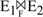
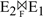
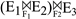
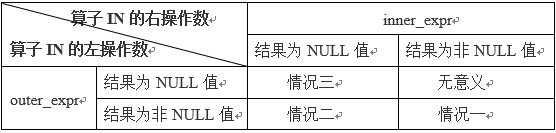
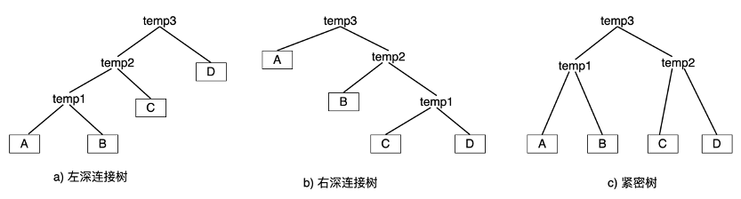

# 第5章 查询优化

## 5.1 查询优化概述

查询优化即求解给定查询语句的高效执行计划的过程。它既是关系数据库管理系统实现的关键技术，又是关系系统的优点所在。由DBMS进行查询优化的好处在于：查询优化的优点不仅在于用户不必考虑如何最好的表达查询以获得较高的效率，而且在于系统可以比用户程序的&quot;优化&quot;做得更好。

查询计划，从形式上看是一颗二叉树，树叶是每个单表对象，两个树叶的父节点是一个连接操作符连接后的中间结果（另外还有一些其他节点如排序等也可以作为中间结果），这个结果是一个临时关系，这样直至根节点。

从一个查询计划看，涉及的主要&quot;关系节点&quot;包括：

- 单表节点：考虑单表的获取方式（全表扫描，或索引获取，或索引定位再I/O到数据块获取数据）。这是一个物理存储到内存解析成逻辑字段的过程。
- 两表节点：考虑两表以何种方式连接，代价有多大，连接路径有哪些等。表示内存中的元组如何进行元组间的连接。此时，元组通常已经存在于内存中。这是一个完整用户语义的逻辑操作，但只是局部操作，只涉及两个具体的关系。完成用户全部语义，需要配合多表的连接顺序的操作。
- 多表中间节点：考虑多表连接顺序如何构成代价最少的&quot;执行计划&quot;。决定连接执行的顺序。

查询优化的总目标是选择有效的策略，求得给定关系表达式的值，使得查询代价较小。因为查询优化的搜索空间有时非常大，实际系统选择的策略不一定是最优的，而是较优的。

查询优化主要包括逻辑优化和物理优化。其中，逻辑优化又可包含语法级查询优化、基于规则的优化等；而物理优化主要指基于代价的优化。语法级优化是基于语法的等价转换；基于规则的优化（如依据关系代数的规则或依据经验的规则等）具有操作简单且能快速确定执行方式的优点，但这种方法只是排除了一部分不好的可能；基于代价的优化是在查询计划生成过程中，计算每条存取路径进行量化比较，从而得到开销最小的情况，但如果组合情况多则开销的判断时间就很多。查询优化器的实现，多是这两种优化策略的组合使用。

## 5.2 逻辑优化

查询优化器在逻辑优化阶段主要解决的问题是：如何找出SQL语句的等价变换形式，使SQL执行更高效。

### 5.2.1代数优化

代数优化是基于关系代数等价变换规则的优化方法。

代数优化策略是通过对关系代数表达式的等价变换来提高查询效率。所谓关系代数表达式的等价是指用相同的关系代替两个表达式中相应的关系所得到的结果是相同的。两个关系表达式E1和E2是等价的。

#### 5.2.1.1 关系代数表达式等价变换规则

常用的关系代数等价变换规则如下：

1. **连接、笛卡尔积的交换律**

设E1和E2为关系代数表达式，F为连接运算条件，则有：

​												E1×E2 ≡ E2×E1

​												E1⋈E2 ≡ E2⋈E1

​												 ≡ 

对于连接和笛卡尔积运算，可以交换前后位置，其结果不变。例如，两表连接算法中有嵌套循环连接算法，对外表和内表有要求，外表尽可能小则有利于做&quot;基于块的嵌套循环连接&quot;，所以通过交换律可以将元组少的表作为外表。

1. **连接、笛卡尔积结合律**

设E1、E2、E3为关系代数表达式，F1、F2为连接运算条件。则有：

​												(E1×E2)×E3 ≡ E1×(E2×E3)

​												(E1⋈E2)⋈E3 ≡ E1⋈(E2⋈E3)

​												 ≡ 

对于连接、笛卡尔积运算，如果新的结合有利于减少中间关系的大小，则可以优先处理。

1. **投影的串接定律**

设E为关系代数表达式，A<sub>i</sub>（i=1,2,3,…,n），B<sub>j</sub>（j=1,2,3,…,m）是属性名，且{A<sub>1</sub>,A<sub>2</sub>,…,A<sub>n</sub>}为{B<sub>1</sub>,B<sub>2</sub>,…,B<sub>m</sub>}的子集。则有：

​												∏<sub>A<sub>1</sub></sub>,<sub>A<sub>2</sub></sub><sub>,…,A<sub>n</sub></sub>(∏<sub>B<sub>1</sub>,B<sub>2</sub>,…,B<sub>m</sub></sub>(E)) ≡ ∏<sub>A<sub>1</sub></sub>,<sub>A<sub>2</sub></sub><sub>,…,A<sub>n</sub></sub> (E)

在同一个关系上，只需做一次投影运算，且一次投影时选择多列同时完成。所以许多数据库优化引擎会为一个关系收集齐该关系上的所有列，即目标列和WHERE、GROUP BY等子句中涉及到的所有该关系的列。

1. **选择的串接律**

设E为关系代数表达式，F<sub>1</sub>、F<sub>2</sub>为选择条件。则有：

​												σ<sub>F<sub>1</sub></sub>(σ<sub>F<sub>2</sub></sub>(E)) ≡ σ<sub>F<sub>1</sub></sub>∧<sub>F<sub>2</sub></sub>(E)

此变换规则对于优化的意义在于：选择条件可以合并，使得一次选择运算就可检查全部条件，而不必多次过滤元组，所以可以把同层的合取条件收集在一起，统一进行判断。

1. **选择和投影的交换律**

设E为关系代数表达式，F为选择条件，A<sub>i</sub>（i=1,2,3,…,n）是属性名。选择条件F只涉及属性A<sub>1</sub>,A<sub>2</sub>,…,A<sub>n</sub>。则有：

​													σ<sub>F</sub>(∏<sub>A<sub>1</sub></sub>,<sub>A<sub>2</sub></sub><sub>,…,A<sub>n</sub></sub> (E)) ≡∏<sub>A<sub>1</sub></sub>,<sub>A<sub>2</sub></sub><sub>,…,A<sub>n</sub></sub>(σ<sub>F</sub>(E))

此变换规则对于优化的意义在于：先投影后选择可以改为先选择后投影，这对于以行为单位来存储关系的主流数据库而言，很有优化意义。按照这种存储方式，系统总是先获取元组，然后才能解析得到其中的列。

设E为关系代数表达式，F为选择条件，Ai（i=1,2,3…,n）是属性名，选择条件F中有不属于A<sub>1</sub>,A<sub>2</sub>,…,A<sub>n</sub>的属性B<sub>1</sub>,B<sub>2</sub>,…,B<sub>n</sub>。则有：

​										∏<sub>A<sub>1</sub></sub>,<sub>A<sub>2</sub></sub><sub>,…,A<sub>n</sub></sub>(σ<sub>F</sub>(E)) ≡ ∏<sub>A<sub>1</sub></sub>,<sub>A<sub>2</sub></sub><sub>,…,A<sub>n</sub></sub>(σ<sub>F</sub>(∏<sub>A<sub>1</sub></sub>,<sub>A<sub>2</sub></sub><sub>,…,A<sub>n</sub></sub>,B<sub>1</sub>,B<sub>2</sub>,…,B<sub>m</sub>(E)))

此变换规则对于优化的意义在于：先选择后投影可以改为先做带有选择条件中的列的投影，然后选择，最后再完成最外层的投影。这样内层的选择和投影可以同时进行，不会增加过多的计算开销，但能减小中间结果集的规模。

1. **选择与笛卡尔积的交换律**

设E<sub>1</sub>、E<sub>2</sub>为关系代数表达式，F为选择条件，F中涉及的属性都是E<sub>1</sub>中的属性，则有：

​										σ<sub>F</sub>(E<sub>1</sub>×E<sub>2</sub>) ≡ <sub>σF</sub>(E<sub>1</sub>)×E<sub>2</sub>

如果F=F<sub>1</sub>∧F<sub>2</sub>，且F<sub>1</sub>只涉及E<sub>1</sub>中的属性，F<sub>2</sub>只涉及E<sub>2</sub>中的属性，则有：

​										σ<sub>F</sub>(E<sub>1</sub>×E<sub>2</sub>) ≡ σ<sub>F<sub>1</sub></sub>(E<sub>1</sub>)×σ<sub>F<sub>2</sub></sub>(E<sub>2</sub>)

此变换规则对于优化的意义在于：条件下推到相关的关系上，先做选择后做笛卡尔积运算，这样可以减小中间结果的大小。

1. **选择与并的分配律**

如果E<sub>1</sub>和E<sub>2</sub>有相同的属性名，且E= E<sub>1</sub>∪E<sub>2</sub>，则有：

​										σ<sub>F</sub>(E<sub>1</sub>∪E<sub>2</sub>) ≡ σ<sub>F</sub>(E<sub>1</sub>) ∪σ<sub>F</sub> (E<sub>2</sub>)

此变换规则对于优化的意义在于：条件下推到相关的关系上，先选择后做并运算，可以减小每个关系输出结果的大小。

1. **选择与差的分配律**

如果E<sub>1­</sub>和E<sub>2</sub>有相同的属性名，则：

​										σ<sub>F</sub>(E<sub>1</sub>－E<sub>2</sub>) ≡ σ<sub>F</sub>(E<sub>1</sub>)－σ<sub>F</sub>(E<sub>2</sub>)

此变换规则对于优化的意义在于：条件下推到相关的关系上，先选择后做差运算，可以减小每个关系输出结果的大小。

1. **投影与笛卡尔积的交换律**

设<sub>A<sub>1</sub></sub>,<sub>A<sub>2</sub></sub><sub>,…,A<sub>n</sub></sub>是E<sub>1</sub>的属性，<sub>B<sub>1</sub>,B<sub>2</sub>,…,B<sub>m</sub></sub>是E<sub>2</sub>的属性，则有：

​										∏<sub>A<sub>1</sub></sub>,<sub>A<sub>2</sub></sub><sub>,…,A<sub>n</sub></sub>,<sub>B<sub>1</sub>,B<sub>2</sub>,…,B<sub>m</sub></sub>(E<sub>1</sub>×E<sub>2</sub>) ≡ ∏<sub>A<sub>1</sub></sub>,<sub>A<sub>2</sub></sub><sub>,…,A<sub>n</sub></sub>(E<sub>1</sub>)×∏<sub>B<sub>1</sub>,B<sub>2</sub>,…,B<sub>m</sub></sub>(E<sub>2</sub>)

此变换规则对于优化的意义在于：先投影后做笛卡尔积，可减少做笛卡尔积前每个元组的长度，使得计算后得到的新元组的长度也变短。

1. **投影与并的交换律**

如果E<sub>1</sub>和E<sub>2</sub>有相同的属性名，则有：

​										∏<sub>A<sub>1</sub></sub>,<sub>A<sub>2</sub></sub><sub>,…,A<sub>n</sub></sub> (E<sub>1</sub>∪E<sub>2</sub>) ≡ ∏<sub>A<sub>1</sub></sub>,<sub>A<sub>2</sub></sub><sub>,…,A<sub>n</sub></sub> (E<sub>1</sub>)∪∏<sub>A<sub>1</sub></sub>,<sub>A<sub>2</sub></sub><sub>,…,A<sub>n</sub></sub> (E<sub>2</sub>)

此变换规则对于优化的意义在于：先投影后做并运算，可减少做并运算前每个元组的长度。

#### 5.2.1.2 针对不同运算符的优化规则

针对不同运算符的优化规则如表5-1~5-3所示。

<center>表5-1 运算符主导的优化</center>

<table>
	<tr>
	    <th width="10%">运算符</th>
	    <th width="15%">子类型</th>
	    <th width="35%">根据特点可得到的优化规则</th>  
        <th width="50%">可优化的原因</th>
	</tr >
	<tr >
	    <td rowspan="7">选择</td>
	    <td>对同一个表的同样选择条件，作一次即可。</td>
	    <td>单行文本输入框</td>
        <td>幂等性：多次应用同一个选择有同样效果；
交换性：应用选择的次序在最终结果中没有影响
选择可有效减少在它的操作数中的元组数的运算（元组个数减少）。</td>
	</tr>
	<tr>
	    <td rowspan="2">分解有复杂条件的选择</td>
	    <td>合取，合并多个选择为更少的需要求值的选择，多个等式则可以合并①。</td>
        <td>合取的选择等价于针对这些单独条件的一系列选择。</td>
	</tr>
	<tr>
	    <td>析取，分解它们使得其成员选择可以被移动或单独优化②。</td>
	    <td>析取的选择等价于选择的并集。</td>
	</tr>
	<tr>
	    <td rowspan="2">选择和笛卡尔积</td>
	    <td>尽可能先做选择。</td>
        <td>运算关系分别有N和M行，先做积运算将包含N×M行。先做选择运算减少N和M，则可避免不满足条件的元组参与积运算，节约时间同时减少结果集的大小。</td>
	</tr>
	<tr><td>尽可能下推选择。</td>
	    <td>如果积运算后面没有跟随选择运算，可以尝试使用其它规则从表达式树更高层下推选择。</td>
	</tr>
	<tr>
	    <td>选择和集合运算</td>
	    <td>选择下推到的集合运算中，如表5-2中的3种情况。</td>
        <td>选择在差集、交集和并集算子上满足分配律。</td>
	</tr>
	<tr>
	    <td>选择和投影</td>
	    <td>在投影之前进行选择。</td>
        <td>如果选择条件中引用的列是投影中的列的子集，则选择与投影满足交换性。</td>
	</tr>
	<tr>
	    <td rowspan="2">投影</td>
	    <td>基本投影性质</td>
        <td>尽可能先做投影</td>
        <td>投影是幂等的；投影可以减少元组大小。</td>
	</tr>
	<tr>
	    <td >投影和集合运算</td>
	    <td>投影下推到集合的运算中，如表5-3中的情况。</td>
        <td>投影在差集、交集和并集算子上满足分配律。</td>
	</tr>
</table>


1. 如WHERE A.a=B.b AND B.b=C.c可以合并为={A.a,B.b,C.c}而不是两个等式={A.a,B.b}和={B.b,C.c}。
1. 如WHERE A.a=3 OR A.b\&gt;8,如果A.a、A.b列上分别有索引，也许SELECT \* FROM A WHERE A.a=3 UNION SELECT \* FROM A WHERE A.b>8可以分别利用各自的索引提高查询效率。

表5-2 选择下推到集合的运算

<table>
	<tr>
	    <th width="25%" rowspan="2">初始式</th>
	    <th width="75%" colspan="3"><center>优化后的等价表达式</center></th>
	</tr >
    <tr>
        <th width="25%">等价表达式一</th>
        <th width="25%">等价表达式二</th>
        <th width="25%">等价表达式三</th>
    </tr>
	<tr >
	    <td>σ<sub>A</sub>(R－S)</td>
	    <td>σ<sub>A</sub>(R)－σ<sub>A</sub>(S)</td>
	    <td>σ<sub>A</sub>(R)－S</td>
        <td></td>
	</tr>
    <tr >
	    <td>σ<sub>A</sub>(R∪S)</td>
	    <td>σ<sub>A</sub>(R)∪σ<sub>A</sub>(S)</td>
	    <td></td>
        <td></td>
	</tr>
    <tr >
	    <td>σ<sub>A</sub>(R∩S)</td>
	    <td>σ<sub>A</sub>(R)∩σ<sub>A</sub> (S)</td>
	    <td>σ<sub>A</sub>(R)∩S</td>
        <td>R∩σ<sub>A</sub>(S)</td>
	</tr>
</table>

表5-3 投影下推到集合的运算

| **初始式** | **优化后的等价表达式** |
| --- | --- |
| ∏A<sub>1</sub>,A<sub>2</sub>,…,A<sub>n</sub>(R－S) | ∏A<sub>1</sub>,A<sub>2</sub>,…,A<sub>n</sub>(R)－ ∏A<sub>1</sub>,A<sub>2</sub>,…,A<sub>n</sub>(S) |
| ∏A<sub>1</sub>,A<sub>2</sub>,…,A<sub>n</sub>(R∪S) | ∏A<sub>1</sub>,A<sub>2</sub>,…,A<sub>n</sub>(R) ∪∏A<sub>1</sub>,A<sub>2</sub>,…,A<sub>n</sub>(S) |
| ∏A<sub>1</sub>,A<sub>2</sub>,…,A<sub>n</sub>(R∩S) | ∏A<sub>1</sub>,A<sub>2</sub>,…,A<sub>n</sub>(R) ∩∏A<sub>1</sub>,A<sub>2</sub>,…,A<sub>n</sub>(S) |

#### 5.2.1.3 查询树启发式规则

包括：

1. 选择运算应尽可能先做。
2. 把投影运算和选择运算同时进行。如有若干投影和选择运算，并且它们都对同一个关系操作，则可以在扫描次关系的同时完成所有这些运算以避免重复扫描关系。
3. 把投影同其前或后的双目运算结合起来，没有必要为了去掉某些字段而扫描一遍关系。
4. 把某些选择同在它前面要执行的笛卡尔积结合起来称为一个连接运算。连接（特别是等值连接）运算比笛卡尔积性能高很多。
5. 找出公共子表达式，将其计算结果缓存起来，避免重复计算。

### 5.2.2 语法级查询优化

语法级优化要解决的主要问题是找出SQL语句的等价变换形式，使得SQL执行更高效，包括：

- 子句局部优化。如等价谓词重写、where和having条件简化等。
- 关联优化。如子查询优化、连接消除、视图重写等。
- 形式变化优化。如嵌套连接消除等。

以下介绍几种常见的优化方法。

#### 5.2.2.1 子查询优化

早期的查询优化器对子查询都采用嵌套执行的方式，即对父查询中的每一行都执行一次子查询，这样效率很低，因此对其进行优化很有必要。例如，将子查询转为连接操作之后，有如下好处：

- 子查询不用多次执行；
- 优化器可以根据统计信息来选择不同的连接方法和不同的连接顺序；
- 子查询中的连接条件、过滤条件分别变成了父查询的连接条件和过滤条件，优化器可以对这些条件进行下推，以提高执行效率。

1. **常见子查询优化技术**

**(1)**  **子查询合并**

在语义等价条件下，多个子查询可以合并成一个子查询，这样多次表扫描，多次连接减少为单次表扫描和单次连接。例如：

```sql
SELECT *
FROM t1
WHERE a1<10 AND (
EXISTS (SELECT a2 FROM t2 WHERE t2.a2<5 AND t2.b2=1) OR
EXISTS (SELECT a2 FROM t2 WHERE t2.a2<5 AND t2.b2=2)
);
```

可优化为：

```sql
SELECT *
FROM t1
WHERE a1<10 AND (
EXISTS (SELECT a2 FROM t2 WHERE t2.a2<5 AND (t2.b2=1 OR t2.b2=2)
);
```

此例中，两个EXISTS子查询合并为一个子查询，查询条件也进行了合并。

**(2)**  **子查询展开**

子查询展开又称子查询反嵌套，子查询上拉。实质是把某些子查询重写为等价的多表连接操作。带来好处是，有关的访问路径、连接方法和连接顺序可能被有效使用，使得查询语句的层次尽可能地减少。常见的IN / ANY / SOME / ALL / EXISTS依据情况转为半连接（SEMI JOIN）。例如：

```sql
SELECT *
FROM t1, (SELECT * FROM t2 WHERE t2.a2>10) v_t2
WHERE t1.a1<10 AND v_t2.a2<20;
```

可优化为：

```sql
SELECT *
FROM t1, t2
WHERE t1.a1<10 AND t2.a2<20 AND t2.a2>10;
```

此例中，原本的子查询变为了t1、t2表的连接操作，相当于把t2表从子查询中上拉了一层。

子查询展开是一种最常用的子查询优化技术，如果子查询是只包含选择、投影、连接操作的简单语句，没有聚集函数或者group子句，则可以上拉，前提是上拉后的结果不能带来多余元组，需遵循以下规则：

- 如果上层查询结果没有重复（select包含主键），则可以展开子查询，并且展开后的查询的select子句前应加上distinct标志；
- 如果上层查询的select语句中有distinct标志，则可以直接子查询展开；
- 如果内层查询结果没有重复元组，则可以展开。

子查询展开的具体步骤如下：

1. 将子查询和上层查询的from子句连接为同一个from子句，并且修改相应的运行参数；
2. 将子查询的谓词符号进行相应修改（如IN修改为=ANY）；
3. 将子查询的where条件作为一个整体与上层查询的where条件进行合并，并用and连接，从而保证新生成的谓词与原谓词的语义相同，成为一个整体。

**(3)**  **聚集子查询消除**

这种方法将聚集子查询的计算上推，使得子查询只需计算一次，并与父查询的部分或全表做左外连接。例如：

```sql
SELECT *
FROM t1
WHERE t1.a1 > (SELECT avg(t2.a2) FROM t2);
```

可优化为：

```sql
SELECT t1.*
FROM t1, (SELECT avg(t2.a2) FROM t2) as tm(avg_a2) )
WHERE t1.a1 ? tm.avg_a2;
```

**(4)**  **其他**

此外还有利用窗口函数消除子查询、子查询推进等技术，本文不再细述。

1. **针对不同类型子查询的优化方法**

**(1) IN类型子查询**

IN类型有３种格式：

格式一：

```sql
outer_expr [not] in (select inner_expr from ... where subquery_where)
```

格式二：

```sql
outer_expr = any (select inner_expr from ... where subquery_where)
```

格式三：

```sql
(oe_1, ..., oe_N) [not] in (select ie_1, ..., ie_N from ... where subquery_where)
```

对于in类型子查询的优化，如表5-4所示。

<center>表5-4 IN类型子查询优化的几种情况</center>



情况一：outer\_expr和inner\_expr均为非NULL值。

优化后的表达式为：

```sql
exists (select 1 from ... where subquery_where and outer_expr=inner_expr)
```

子查询优化需要满足2个条件：

- outer\_expr和inner\_expr不能为NULL；

- 不需要从结果为FALSE的子查询中区分NULL。

情况二：outer\_expr是非空值。

优化后的表达式为：

```sql
exists (select 1 from ... where subquery_where and
(outer_expr=inner_expr or inner_expr IS NULL);
```

情况三：outer\_expr为空值。

则原表达式等价为：

```sql
NULL in (select inner_expr FROM ... where subquery_where)
```

当outer\_expr为空时，如果子查询结果为：

- NULL，select语句产生任意行数据；
- FALSE，select语句不产生数据。

对上面的等价形式，还有2点需说明：

- 谓词IN等价于=ANY。如：以下2条SQL语句是等价的。

```sql
select col1 from t1 where col1 =ANY (select col1 from t2);
select col1 from t1 where col1 IN (select col1 from t2);
```

- 带有IN谓词的子查询，如果满足上述3种情况，可做等价变换，把外层条件下推到子查询中，变形为EXISTS类型的逻辑表达式判断。而EXISTS子查询可以被半连接算法实现优化。

**(2) ALL/ANY/SOME类型子查询**

ALL/ANY/SOME子查询格式如下：

```sql
outer_expr operator ALL (subquery)
outer_expr operator ANY (subquery)
outer_expr operator SOME (subquery)
```

其中，operator是操作符，可以是>、>=、=、<、<=中任何一个。其中，

- =ANY与IN含义相同，可采用IN子查询优化方法；
- SOME与ANY含义相同；
- NOT IN 与 <>ALL含义相同；

如果子查询中没有group by子句，也没有聚集函数，则以下表达式可以使用聚集函数MAX/MIN做等价转换：

- `val>=ALL (select ...)` 等价变换为：`val>= (select MAX...)`
- `val<=ALL (select ...)` 等价变换为：`val<= (select MAX...)`
- `val>=ANY (select ...)` 等价变换为：`val>= (select MIN...)`
- `val>=ANY (select ...)` 等价变换为：`val>= (select MAX...)`

**(3) EXISTS类型子查询**

存在谓词子查询格式为：[NOT] EXISTS (subquery)

需要注意几点：

- EXISTS(subquery)值为TRUE/FALSE，不关心subquery返回的内容。
- EXISTS(subquery)自身有&quot;半连接&quot;的语义，部分DBMS用半连接来实现它；NOT EXISTS通常会被标识为&quot;反半连接&quot;处理。
- IN(subquery)等子查询可以被转换为EXISTS(subquery)格式。

所谓半连接（Semi Join），是一种特殊的连接类型。如果用&quot;t1.x semi= t2.y&quot;来表示表T1和表T2做半连接，则其含义是：只要在表T2中找到一条记录满足t1.x=t2.y，则马上停止搜索表T2，并直接返回表T1中满足条件t1.x=t2.y的记录，因此半连接的执行效率高于普通的内连接。

#### 5.2.2.2 等价谓词重写

等价谓词重写包括：LIKE规则、BETWEEN-AND规则、IN转换OR规则、IN转换ANY规则、OR转换ANY规则、ALL/ANY转换集函数规则、NOT规则等，相关原理比较简单，有兴趣的同学可以自行查找相关查询重写规则。

#### 5.2.2.3 条件化简

WHERE、HAVING和ON条件由许多表达式组成，而这些表达式在某些时候彼此间存在一定的联系。利用等式和不等式性质，可将WHERE、HAVING和ON条件简化，但不同数据库的实现可能不完全相同。

将WHERE、HAVING和ON条件简化的方式通常包括如下几个：

1. 去除表达式中冗余的括号：以减少语法分析时产生的AND和OR树的层次；

2. 常量传递：对不同关系可使用条件分离后有效实施&quot;选择下推&quot;，从而减小中间关系的规模。如：

   `col1=col2 AND col2=3` 可化简为：`col1=3 AND col2=3`

   操作符=、<、>、<=、>=、<>、LIKE中的任何一个，在`col1<操作符>col2`条件中都会发生常量传递

3. 消除死码。化简条件，将不必要的条件去除。如：

   `WHERE (0>1 AND s1=5)`, `0>1`使得`AND`为恒假，去除即可。

4. 表达式变换。化简条件（如反转关系操作符的操作数顺序），从而改变某些表的访问路径。如：-a=3可化简为a=-3，若a上有索引，则可利用。
5. 不等式变换。化简条件，将不必要的重复条件去除。如：

   `a>10 AND b=6 AND a>2` 可化简为：`a>10 AND b=6`。

6. 布尔表达式变换。包括：

- 谓词传递闭包。如：`a>b AND b>2`可推导出`a>2`，减少a、b比较元组数。
- 任何一个布尔表达式都能被转换为一个等价的合取范式。一个合取项为假，则整个表达式为假。

## 5.3 物理优化

代数优化改变查询语句中操作的次序和组合，但不涉及底层的存取路径。物理优化就是要选择高效合理的操作算法或存取路径，求得优化的查询计划，达到查询优化的目标。

查询优化器在物理优化阶段，主要解决的问题是：

- 从可选的单表扫描方式中，挑选什么样的单表扫描方式最优？
- 对于两表连接，如何连接最优？
- 对于多表连接，哪种连接顺序最优？
- 对于多表连接，是否需要对每种连接顺序都探索？如果不全部探索，如何找到一种最优组合？

选择的方法可以是：

1. 基于规则的启发式优化。
2. 基于代价估算的优化。
3. 两者结合的优化方法。常常先使用启发式规则选取若干个较优的候选方案，减少代价估算的工作量，然后分别计算这些候选方案的执行代价，较快地选出最终的优化方法。

启发式规则优化是定性的选择，比较粗糙，但是实现简单而且优化本身的代价较小，适合解释执行的系统。因为解释执行的系统，其优开销包含在查询总开销之中，在编译执行的系统中，一次编译优化，多次执行，查询优化和查询执行是分开的，因此，可以用精细复杂一些的基于代价的优化方法。

### 5.3.1 基于代价的优化

#### 5.3.1.1 查询代价估算

查询代价估算基于CPU代价和I/O代价，计算公式如下：

```
总代价 = I/O代价 + CPU代价
COST = P * a_page_cpu_time + W * T
```

其中：

P是计划运行时访问的页面数，a\_page\_cpu\_time是每个页面读取的时间开销，其乘积反映了I/O开销。

T为访问的元组数，如果是索引扫描，还要考虑索引读取的开销，反映了数据读取到内存的CPU开销。

W为权重因子，表明I/O到CPU的相关性，又称选择率（selectivity），用于表示在关系R中，满足条件“A <op> a”的元组数与R的所有元组数N的比值。

选择率在代价估算模型中占有重要地位，其精确程度直接影响最优计划的选取。选择率计算常用方法如下：

1. 无参数方法：使用ad hoc（点对点）数据结构或直方图维护属性值的分布，直方图最常用；
2. 参数法：使用具有一些自由统计参数（参数是预先估计出来的）的数学分布函数逼近真实分布；
3. 曲线拟合法：为克服参数法的不灵活性，用一般多项式来标准最小方差来逼近属性值的分布；
4. 抽样法：从数据库中抽取部分样本元组，针对这些样本进行查询，然后收集统计数据；
5. 综合法：将以上几种方法结合起来，如抽样法和直方图法结合。

由于其中I/O代价占比最大，通常以I/O代价为主来进行代价估算。

1. 全表扫描算法的代价估算公式

- 如果基本表大小为 B 块，全表扫描算法的代价 cost = B；
- 如果选择条件是&quot;码＝值&quot;，则平均搜索代价 cost = B/2。

​	2. 索引扫描算法的代价估算公式

- 如果选择条件为&quot;码=值&quot;，则采用该表的主索引，若为B+树，设索引层数为L，需要存取B+树中从根节点到叶节点L块，再加上基本表中该元组所在的那一块，cost=L+1。
- 如果选择条件涉及非码属性，若为B+树索引，选择条件是相等比较，S为索引选择基数（有S个元组满足条件），假设满足条件的元组保存在不同块上，则最坏情况下cost=L+S。
- l 若比较条件为>,>=,<,<=，假设有一半元组满足条件，则需要存取一半的叶节点，并通过索引访问一半的表存储块，cost=L+Y/2+B/2。若可以获得更准确的选择基数，可进一步修正Y/2与B/2。

​	3.嵌套循环连接算法的代价估算公式

- 嵌套循环连接算法的代价为：cost=B<sub>r</sub>+B<sub>r</sub>B<sub>s</sub>/(K-1), 且K<B(R)<B(S)，其中K表示缓冲区大小为K块；
- 若需要把中间结果写回磁盘，则代价为：cost=B<sub>r</sub>+B<sub>r</sub>B<sub>s</sub>/(K-1) +　(F<sub>rs</sub>\*N<sub>r</sub>\*N<sub>s</sub>)/M<sub>rs</sub>。F<sub>rs</sub>为连接选择率，表示连接结果数的比例，Mrs为块因子，表示每块中可以存放的结果元组数目。

​    4.排序合并连接算法的代价估算公式

- 如 果 连 接 表 已 经 按 照 连 接 属 性 排 好 序 ， 则    cost =B<sub>r</sub>+B<sub>s</sub>+(F<sub>rs</sub>\*N<sub>r</sub>\*N<sub>s</sub>)/M<sub>rs</sub>。
- 如果必须对文件排序，需要在代价函数中加上排序的代价对 于 包 含    B    个 块 的 文 件 排 序 的 代 价 大 约 是：cost =(2\*B)+(2\*B\*log2B)。

#### 5.3.1.2 基于代价的连接顺序选择

多表连接算法实现的是在查询路径生成的过程中，根据代价估算，从各种可能的候选路径中找出最优的路径。它需要解决两个问题：

- 多表连接的顺序
- 多表连接的搜索空间：N个表的连接可能有N！种连接组合，这可能构成一个巨大的搜索空间。如何将搜索空间限制在一个可接受的范围内，并高效生成查询执行计划将成为一个难点。

多表间的连接顺序表示了查询计划树的基本形态。在1990年，Schneder等人在研究查询树模型时提出了左深树，右深树和紧密树3种形态，如图5-1所示。



<center>图5-1 三种树的形态</center>

即使是同一种树的生成方式，也有细节需要考虑。如图5-1-a中{A,B}和{B,A}两种连接方式开销可能不同。比如最终连接结果{A,B,C}则需要验证比较6种连接方式，找出最优的一种作为下次和其他表连接的依据。

多表连接搜索最优查询树，有很多算法，如启发式、分枝界定计划枚举、贪心、动态规划、爬山法、System R优化方法等。其中，常用算法如下。

1. **动态规划**

   在数据库领域，动态规划算法主要解决多表连接的问题。它是自底向上进行的，即从叶子开始做第一层，然后开始对每层的关系做两两连接（如果满足内连接进行两两连接，不满足则不可对全部表进行两两连接），构造出上层，逐次递推到树根。以下介绍具体步骤：

   初始状态：构造第一层关系，即叶子结点，每个叶子对应一个单表，为每一个待连接的关系计算最优路径（单表的最优路径就是单表的最佳访问方式，通过评估不同的单表的数据扫描方式代价，找出代价最小的作为每个单表的局部最优路径）

   归纳：当第1层到第n-1层的关系已经生成，那么求解第n层的关系方法为：将第n-1层的关系与第一层中的每个关系连接，生成新的关系（对新关系的大小进行估算），放于第n层，且每一个新关系，均求解最优路径。每层路径的生成都是基于下层生成的最优路径，这满足最优化原理的要求。

   还有的改进算法，在生成第n层的时候，除了通过第n-1层和第一层连接外，还可以通过第n-2层和第二层连接...。

   PostgreSQL查询优化器求解多表连接时，采用了这种算法。

2. 启发式算法

   启发式算法是相对最优化算法提出的，是一个基于直观或者经验构造的算法，不能保证找到最好的查询计划。在数据库的查询优化器中，启发式一直贯穿于整个查询优化阶段，在逻辑查询优化阶段和物理查询优化阶段，都有一些启发式规则可用。PostgreSQL，MySQL，Oracle等数据库在实现查询优化器时，采用了启发式和其他方式相结合的方式。

   物理查询优化阶段常用启发式规则如下：

   - 关系R在列X上建立索引，且对R的选择操作发生在列X上，则采用索引扫描方式；
   - R连接S，其中一个关系上的连接列存在索引，则采用索引连接且此关系作为内表；
   - R连接S，其中一个关系上的连接列是排序的，则采用排序连接比hash连接好。

3. 贪心算法

   贪心算法最后得到的是局部最优解，不一定全局最优，其实现步骤如下：

   (1) 初始，算法选出的候选对象集合为空；

   (2) 根据选择函数，从剩余候选对象中选出最有可能构成解的对象；

   (3) 如果集合中加上该对象后不可行，那么该对象就被丢弃并不再考虑；

   (4) 如果集合中加上该对象后可行，就加到集合里；

   (5) 扩充集合，检查该集合是否构成解；

   (6) 如果贪心算法正确工作，那么找到的第一个解通常都是最优的，可以终止算法；

   (7) 继续执行第二步。

   MySQL查询优化器求解多表连接时采用了这种算法。

4. **System-R算法**

对自底向上的动态规划算法进行了改进，主要思想是把子树的查询计划的最优查询计划和次优查询计划保留，用于上层的查询计划生成，以便使得查询计划总体上最优。

<center>表5-5 多表连接常用算法比较</center>

| **算法名称** | **特点与适用范围**                                           | **缺点**                           |
| ------------ | ------------------------------------------------------------ | ---------------------------------- |
| 启发式算法   | 适用于任何范围，与其它算法结合，能有效提高整体效率           | 不知道得到的解是否最优             |
| 贪婪算法     | 非穷举类型的算法。适合解决较多关系的搜索                     | 得到局部最优解                     |
| 爬山法       | 适合查询中包含较多关系的搜索，基于贪婪算法                   | 随机性强，得到局部最优解           |
| 遗传算法     | 非穷举类型的算法。适合解决较多关系的搜索                     | 得到局部最优解                     |
| 动态规划算法 | 穷举类型的算法。适合查询中包含较少关系的搜索，可得到全局最优解 | 搜索空间随关系个数增长呈指数增长   |
| System R优化 | 基于自底向上的动态规划算法，为上层提供更多可能的备选路径，可得到全局最优解 | 搜索空间可能比动态规划算法更大一些 |

### 5.3.2 基于规则的优化

基于代价优化的一个缺点是优化本身的代价。因此，查询优化器使用启发式方法来减少优化代价。

- 选择操作的启发式规则：

1) 对于小关系，全表扫描；

2) 对于大关系：

(1) 若选择条件是主码，则可以选择主码索引，因为主码索引一般是被自动建立的；

(2) 若选择条件是非主属性的等职查询，并且选择列上有索引，如果选择比例较小（10%）可以使用索引扫描，否则全表扫描；

(3) 若选择条件是属性上的非等值查询或者范围查询，同上；

(4) 对于用and连接的合取选择条件，若有组合索引，优先用组合索引方法；如果某些属性上有一般索引，则用索引扫描，否则全表扫描；

(5) 对于用OR连接的析取选择条件，全表扫描。

- 连接操作的启发式规则

1) 若两个表都已经按连接属性排序，则选用排序-合并算法；

2) 若一个表在连接属性上有索引，则使用索引连接方法；

3) 若其中一个表较小，则选用hash join；

4) 最后可以使用嵌套循环，小表作为外表。

还有嵌套子查询优化、物化视图等多种优化手段，这里不再展开。

