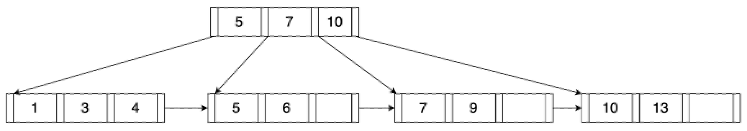
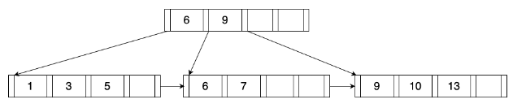
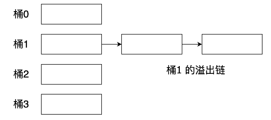
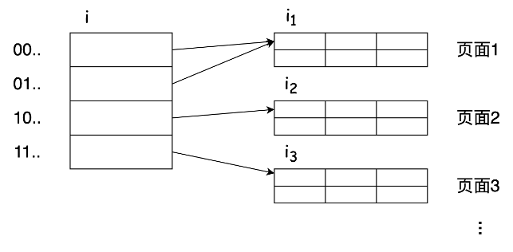
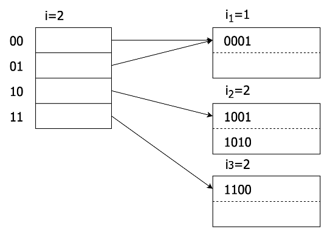
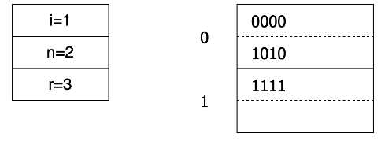
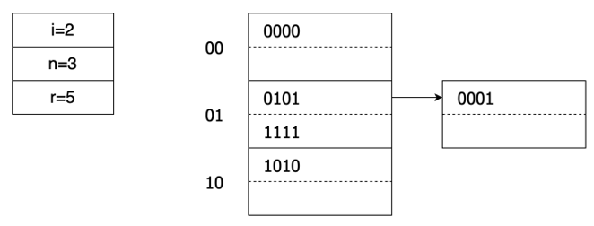

# 第3章 索引结构

## 3.1 索引结构概述

许多查询只涉及表中的少量记录。例如&quot;查找学号为&#39;U2021001&#39;的学生的专业&quot;，这个查询最多只涉及学生表中的一条记录。如果系统为了找到学号为&quot;U2021001&quot;的记录而读取整个学生表，这样的操作方式显然是低效的。理想情况下，系统应该能够直接定位到这条记录。为了支持这种访问方式，需要额外设计一些与表相关联的附加结构，我们称之为索引。

索引是这样的数据结构：它以一个或多个属性的值为输入，并能快速地定位具有该值的记录的位置。建立索引的属性（组）称为查找键（search key）。与表一样，索引结构同样存储在数据库文件中。例如，我们可以用一个数据文件来存储一个表，用一个索引文件来存储一个索引。一个数据文件可能拥有一个或多个索引文件。

由于索引是表的附加结构，当表的内容发生变化时，DBMS必须同步更新该表的索引，以确保索引的内容与表的内容一致。由此可见，索引虽然有助于提高查询性能，但是索引本身也会带来存储和维护开销，因此在一个数据库应用中，具体创建什么索引、以及创建多少索引，用户是需要权衡的。不过在查询的执行过程中，是否需要使用索引、以及使用哪些索引，则是由DBMS来决定的，用户并不能干涉。如何恰当地利用索引来提高查询的执行效率，是DBMS的重要工作。

数据库系统中存在不同类型的索引结构，这些索引结构之间没有绝对的优劣之分，只能说某种索引结构在某种特定的场景下是最合适的。评价一种索引结构一般参考以下指标：

- 查找类型：该索引结构能有效支持的查找类型，比如等值查找、范围查找等。
- 查找时间：使用该索引结构找到一个特定索引项（集）所需的时间。
- 插入时间：插入一个新的索引项所需的时间，包括找到插入这个新索引项的正确位置，以及更新索引结构所需的时间。
- 删除时间：删除一个索引项所需的时间，包括找到待删除项所需的时间， 以及更新索引结构所需的时间。
- 空间开销：索引结构所占用的存储空间。

在本教程中，我们将介绍数据库系统中最常用的索引结构： B+树和散列表。

## 3.2 B+树

### 3.2.1 B+树的结构

B+树是一种平衡排序树，树中根结点到叶结点的每条路径的长度相同，并且保持键的有序排列。在B+树中进行搜索、顺序访问、插入和删除的时间复杂度均为O(log(n))，它是在数据插入和删除的情况下仍能保持其执行效率的几种使用最广泛的索引结构之一，几乎所有现代DBMS都使用B+树。

B+树可以定义为具有以下性质的m路搜索树：

- 除非整棵树只有一个结点，否则根结点至少有两个子结点；
- 除根结点外的所有内结点至少是半满的，即有⌈m/2⌉到m个子结点；
- 所有叶结点的深度相等；
- 叶结点中键的数量必须大于等于 ⌈(m-1)/2⌉ 且小于等于 m-1 ；
- 每个有k个键的内结点都有k+1个非空子结点；
- 叶结点中包含所有查找键值。

图3-1 B+树示意图

B+树的示意图如图3-1所示。树中的每个结点中都包含一个键/值对数组，这个数组是按键排序的。键/值对中的键来自索引的查找键，值则根据结点类型而有不同含义。如果结点是内结点，则值是指向子结点的指针。如果结点是叶结点，则结点中的值可能是记录ID，比如对于数据库中的非聚集索引，B+树中存放的就是指向记录位置的指针；叶结点中的值也可能是记录数据，比如对于聚集索引， B+树中存放的就是记录的实际数据。

在树的最底层，叶结点间通过兄弟指针链接起来，形成一个按所有键值大小排序的链表，以便更高效地支持范围查找等顺序处理。

图3-1中的B+树，其m的取值为4。在具体实现中，将B+树索引存储到磁盘文件中时，通常用一个页面来存储一个结点，在页面能够容纳的前提下，应该把m的值取得尽可能大，从而使得树的高度尽可能小。

### 3.2.2 B+树的查找

1. 等值查找

假设有一棵B+树，如果想找出键值为K的记录，则需要执行从根结点到叶结点的递归查找，查找过程为：

1. 若当前结点为内结点，且结点中的键为**K1，K2，…，Kn**，则根据以下规则来决定下一步对此结点的哪一个子结点进行查找：

  1. 如果**K<K1**，则下一个结点为第1个子结点；
  2. 如果**Ki≤K<Ki+1**，则下一个结点为第i+1个子结点；
  3. 如果**K≥Kn**，则下一个结点为第n+1个子结点。

递归执行此查找过程，直到查找到叶结点；

1. 若当前结点为叶结点，在该结点的键值中查找，若第i个键值为K，则根据第i个值即可找到所需记录；否则查找失败。

1. 范围查找

如果想在B+树中找出在范围[a, b]之间的所有键值，先通过等值查找来查找键a，不论键a在B+树中是否存在，都会到达可能出现a的叶结点，然后在该叶结点中查找等于或大于a的那些键。只要在当前叶结点中不存在比b大的键，就根据兄弟指针找到下一个叶结点，继续查找[a, b]之间的所有键值。

上面的查找算法在查找范围只有上界或者只有下界时也有效：

1. 当查找范围为[a,+∞)时，先找到键a可能出现的叶结点，然后从该结点中第一个等于或大于a的键开始，一直到最后一个叶结点的最后一个键。
2. 当查找范围为(‐∞, b]时，则从B+树的第一个叶结点开始向后查找，直到遇到第一个超过b的键时停止查找。

### 3.2.3 B+树的插入

要向B+树中插入一个新索引项，必须遍历该树并使用内部结点来确定将键插入到哪个叶结点。在插入过程中，当结点太满时需要对其进行拆分，过程如下：

1. 找到正确的叶结点L；
2. 将新索引项按顺序插入到L中：

  1. 如果L有足够的空间，则执行插入操作，算法结束；
  2. 否则，将L平均拆分为L和L2两个结点，并复制L2的第一个键，将其插入到L的父结点中。

1. 如果父结点中有足够的空间，则执行插入操作，算法结束；否则拆分父结点，将该结点的中间键上移插入到其父结点，然后将剩余的索引项平均拆分为两个结点。递归执行此步骤直到算法结束。

(a) 插入10后

(b) 插入10后

(c) 插入2后

图3-2 B+树的插入过程示意图

图3-2是向一棵4路B+树分别插入键值10和2的过程。可以看到，插入键值10后，原B+树中最右的叶结点发生了分裂，新增叶结点的第一个键值10被复制并插入到父结点中。插入键值2后，最左的叶结点发生了分裂，新增叶结点的第一个键值3被复制并插入到父结点中，而且还进一步导致了父结点的分裂，其中间键值7被上移并插入到新增的根结点中。

### 3.2.4 B+树的删除

在删除过程中，如果因删除索引项导致结点小于半满状态，则必须合并结点。过程如下：

1. 找到待删除的索引项所在的叶结点L；
2. 从L中删除该索引项，删除后：

1. 如果L不低于半满状态，则算法结束；
2. 否则，通过向兄弟结点借索引项来满足约束条件，如果能成功借到，则算法结束；
3. 如果兄弟结点也没有多余的索引项可借，则合并L和兄弟结点，删除父结点中指向被合并子结点的索引项。递归执行以上删除操作，直至算法结束。

(a) 删除前

(b) 删除6后

(c) 删除1后

图3-3 B+树的删除过程示意图

图3-3是从一棵5路B+树中先后删除键值6和1的过程。可以看到，删除键值6时，原B+树中第二个叶结点中的项数已经无法满足最低要求，因此向左边的兄弟结点借了1项来达到约束条件。删除键值1时，最左的叶结点中项数无法满足最低要求，而且兄弟结点也没有多余的项可借，因此只能对最左的两个结点进行合并。

### 3.2.5 非唯一查找键

基于某个查找键来构建索引时，假如表中存在两条或者多条记录在查找键属性上拥有相同的值，那么该查找键称为非唯一查找键。

非唯一查找键的一个问题在于影响记录删除的效率。假设某个查找键值出现了很多次，当表中拥有该查找键值的某条记录被删除时，为了维护索引与表数据的一致性，删除操作需要在B+树中查看很多个索引项，才能从中找出和被删除记录相对应的那个索引项并删除它，这个过程可能需要遍历多个叶结点。

解决以上问题的方法有两种：

一种简单的解决方法是创建包含原始查找键和其他额外属性的复合查找键，确保该复合查找键对于所有记录是唯一的，这种方法通常被大多数数据库系统使用。这个额外属性也叫唯一化属性，它可以是记录ID，或者是在拥有相同查找键值的所有记录中取值唯一的任何其他属性。删除一条记录时，先计算该记录的复合查找键值，然后再用这个复合键值到索引中查找。因为复合查找键值是唯一的，所以不会影响记录删除的效率。在这种方法中，一个查找键值在记录中出现多少次，它在索引中就会被重复存储多少次。

另一种方法是，每个查找键值在B+树中只存储一次，并且为该查找键值维护一个记录指针的桶（或者列表）来解决非唯一问题。这种方法虽然没有存储冗余信息，但是索引维护和修改起来更加复杂。

## 3.3 散列表

散列表也叫哈希表，是一种常见的数据结构，它通过把键值映射到桶数组中的某个位置来加快查找记录的速度。散列表中包含两个关键元素：

- **散列函数** ：散列函数h以查找键（散列键）为参数并计算出一个介于0到B-1之间的整数。
- **桶数组** ：桶数组是一个编号从0到B-1、长度为B的数组，其中包含B个链表头，每个链表头对应一个桶，用于存储记录。

构造散列表时，如果一条记录的查找键为K，则将该记录链接到桶号为h(K)的桶中存储。

散列表在DBMS中被广泛运用，例如基于散列表来组织数据文件、基于散列表来构造索引文件、或者基于散列表进行连接运算等。当散列表的规模大到内存难以容纳时，或者出于数据持久化的目的，就需要将散列表存储在磁盘中。本教程主要讨论散列表在磁盘上的实现。

磁盘中的散列表与内存中的散列表存在一些区别。首先，桶数组是由页面组成，而不是由指向链表的指针组成；其次，散列到某个桶中的记录是存储在磁盘上的页面而非内存中。因此，磁盘上的散列表在设计时需要考虑访问磁盘的I/O代价以及表规模的扩展问题。

### 3.3.1 静态散列表

对于一个散列表，如果其桶数组的规模B（即桶的数量）一旦确定下来就不再允许改变，则称其为静态散列表。

#### 3.3.1.1散列函数

由于在设计时无法事先准确知道文件中将存储哪些搜索键值，因此我们希望选择一个具有下列特性的散列函数：

- 函数的输出是确定的。相同的搜索键值应该总是生成相同的散列值。
- 输出值的分布是随机且均匀的。散列函数应该表现为随机的，即散列值不应与搜索键的任何外部可见的排序相关，且不管搜索键值实际怎样分布，每个桶应分配到的记录数应该几乎相同。
- 易于计算。散列函数的执行时间不能太长，因为它需要执行很多次。

理想的散列函数是能将搜索键值均匀地分布到所有桶中，使每个桶含有相同数目的记录，但是这样的函数往往需要非常长的时间来进行计算。因此，散列函数需要在冲突率和快速执行之间进行权衡。目前最先进的散列函数是Facebook XXHash3。

#### 3.3.1.2散列表的插入

当一个查找键为K的新记录需要被插入时，先计算h(K)，找到桶号为h(K)的桶。如果桶内还有空间，我们就把该记录存放到此桶对应的页面中。如果该桶的页面中已经没有空间了，就增加一个新的溢出页，链接到该桶之后，并把新记录存入该页面。这种处理桶溢出问题的方式称为溢出链，如图3-4所示。

图3-4 散列表的溢出链

#### 3.3.1.3散列表的删除

删除查找键值为K的记录与插入操作的方式类似。先找到桶号为h(K)的桶，由于不同的查找键值可能被映射到同一个桶中，因此还需要在桶内搜索，查找键值为K的记录，继而将找到的记录删除。删除记录后，如果允许记录在页面中移动，还可以选择合并同一桶链上的页面来减少链的长度。但是合并页面也有一定的风险，如果交替地往一个桶中插入和删除记录，可能导致页面被反复地创建和删除。

#### 3.3.1.4散列表的效率

如果希望达到最好的查找效率，理想情况是散列表中有足够的桶，每个桶只由单个页面组成。如果是这样，那么查询一条记录就只需一次磁盘I/O，且记录的插入和删除也只需两次磁盘I/O。

为了减少桶溢出的可能性，桶的数量B可选为 (_n_/_f_)\*(1+_d_)，其中n是要存储的记录总数，f是一个桶中能存放的记录数，d表示避让因子，一般取值为0.2。这种做法会导致一定的浪费，平均每个桶有20%的空间是空的，好处则是减少了溢出的可能性。

但是，如果记录不断增长，而桶的数量固定不变，那么最终还是会出现很多桶都包含多个页面的情况。这种情况下，我们就需要在由多个页面构成的桶链中查找记录，每访问一个新的页面就增加一次磁盘I/O，这显然会严重影响散列表的查找效率。

### 3.3.2 动态散列表

静态散列表由于其桶的数量不能改变，因此当无法预知记录总数时，难以解决由于记录数不断增长而带来的性能问题。本节我们将讨论两种动态散列表，它们能够以不同的方式动态调整散列表的大小，既不需要重新构建整个表，又能保证每个桶大多只有一个页面，从而最大化读写效率。

#### 3.3.2.1 可扩展散列表

与静态散列表相比，可扩展散列表在结构上做了以下改变：

- 增加了一个间接层，用一个指向页面的指针数组（桶地址表）而非页面数组来表示桶数组。
- 指针数组能动态增长，且数组长度总是2的幂，因此数组每增长一次，桶的数量就翻倍。
- 并非每个桶都单独拥有一个页面。如果多个桶的记录只需一个页面就能放下，那么这些桶可能共享一个页面，即多个桶指针指向同一个页面。
- 散列函数h为每个键计算出一个长度为N的二进制序列，N的值足够大（比如32），但是在某一时刻，这个序列中只有前i位（i≤N）被使用，此时桶的数量为 2i个。

可扩展散列表的一般形式如图3-5所示。

图3-5 可扩展散列表结构示意图

向可扩展散列表中插入键值为K的记录的方法如下：

1. 计算h(K)，取出该二进制序列的前i位，并找到桶数组中编号与之相等的项，定位到该项对应的页面，假设该页面的编号为j；

2. 如果页面j中还有剩余空间，则将该记录插入该页面，操作结束；

3. 如果页面j已满，则需要分裂该页面：

   a)	如果i＝ij，说明在桶地址表中只有一个表项指向页面j，此时分裂该页，需要增加桶地址表的		大小，以容纳由于分裂而产生的两个桶指针。令i=i+1，使桶地址表的大小翻倍。桶地址表扩		展后，原表中的每个表项都被两个表项替代，且这两个表项都包含和原始表项一样的指针，		所以也应该有两个表项指向页面j。此时，分配一个新的页面n，并让第二个表项指向页面n。		将ij和in的值均置为当前的i值，并将原页面j中的各条记录重新散列，根据前i位来确定该记录		是放在页面j中还是页面n中，然后再次尝试插入新记录。极端情况下，新纪录要插入的页面		可能仍然是满的，说明原页面j中的所有记录在分裂后仍然被散列到了同一个页面中，此时需		要继续上述分裂过程，直至为新纪录找到可存放的空间。

   b)	如果i> ij，说明在桶地址表中有多个表项指向页面j，此时不需要扩大桶地址表就能分裂页面		j。分配一个新的页面n，将ij和in置为原ij加1后的值；调整桶地址表中原来指向页面j的表项，		其中一半仍指向页面j，另一半则指向新创建的页面n；重新散列页面j中的各条记录，将其分		配到页面j或页面n中，并再次尝试插入新记录。与上一种情况一样，插入仍有可能失败，此		时需继续进行页面分裂的处理。

以下是一个可扩展散列表的例子。图3-6(a)所示为一个小型的可扩展散列表，假设其散列函数h能产生4位二进制序列，即N=4。散列表只使用了1位，即i=1。此时桶数组只有2项，一个编号为0，一个编号为1，分别指向两个页面。第一页存放所有散列值以0开头的记录，第二页存放所有散列值以1开头的记录。每个页面上都标注了一个数字，表示由散列函数得到的二进制序列中的前几位用于判定记录在该页面中的成员资格。目前两个页面都只用了1位。

接下来向表中插人一个散列值为1010序列的记录。因为第一位是1，所以该记录应放入第二个页面，但第二页已经满了，因此需要分裂该页。而此时i2=i=l，因此先要将桶数组翻倍，令i=2，将数组的长度扩展为4。

扩展桶数组后，以0开头的两个项都指向存放散列值以0开头的记录的第一页，且该页上标注数字仍然为1, 说明该页中记录的成员资格只由其散列值的第一位判定。而原本存放散列值以1开头的记录的页面则需要分裂，把这个页面中以10开头和11开头的记录分别存放到两个页面中。在这两个页面上方标注的数字是2，表示该页面中记录的成员资格需要使用散列值的前两位来判定。改变后的散列表如图3-6(b)所示。

(a) 插入前

(b) 插入散列值为1010的记录后

图3-6 可扩展散列表举例

可扩展散列表的优点在于每个桶只有一个页面，所以如果桶地址表小到可以驻留在内存的话，查找一个记录最多只需要一次磁盘I/O。但是由于它是以桶数组翻倍的形式扩展的，所以也存在以下缺点：

- 随着i的增大，每次桶数组翻倍时需要做的工作将越来越多，而且这些工作还会阻塞对散列表的并发访问，影响插入和并发操作的效率。
- 随着i的增大，桶地址表会越来越大，可能无法全部驻留在内存，或者会挤占其他数据在内存中的空间，导致系统中的磁盘I/O操作增多。

#### 3.3.2.2 线性散列表

针对可扩展散列表存在的问题，下面介绍另一种动态散列表，称为线性散列表。相对于可扩展散列表，线性散列表中桶的增长较为缓慢，它有以下特点：

- 桶数n的大小，要能使所有桶中的实际记录总数与其能容纳的记录总数之间的比值保持在一个指定的阈值之下（如80%），如果超过该阈值，则增加一个新桶。
- 允许桶有溢出页，但是所有桶的平均溢出页数远小于1。
- 若当前的桶数为n，则桶数组项编号的二进制位数i=⌈ log2n⌉。

令一个线性散列表当前桶数为n，桶数组项编号的二进制位数为i，向线性散列表中插入键值为K的记录的方法如下：

1. 计算h(K)，取出该二进制序列右端的i位，假设为a1a2…ai，令a1a2…ai对应的二进制整数为m。如果m<n，说明编号为m的桶存在，将记录存入桶m中；如果n≤m<2i，说明编号为m的桶还不存在，则将记录存入编号为(m-2i-1)的桶中，即将a1a2…ai中的a1改为0时对应的桶。
2. 如果要插入的桶中没有空间，则创建一个溢出页，将其链到该桶上，并将记录就存入该溢出块中。
3. 插入记录后，计算 (当前实际记录总数r) / (n个桶能容纳的记录总数) 的值，并跟阈值相比，若超过阈值，则增加一个新桶到线性散列表中。注意，新增加的桶和之前发生插入的桶之间没有任何联系。如果新桶编号的二进制表示为la2a3…ai，则分裂桶号为0a2a3…ai的桶中的记录，根据这些记录的散列值的后i-1位分别散列到这两个桶中。

当n的值超过2i时，需要将i的值加1。理论上，对于现有的桶编号，要在它们的位序列前面增加一个0，来保证跟新的桶编号的位数一致，但是由于桶编号被解释成二进制整数，因此实际上它们只需要保持原样即可。

以下是一个线性散列表的例子。

图3-7(a)所示为一个桶数n=2 的线性散列表，桶编号所需要的二进制位数i = ⌈ log22⌉ = 1，表中的记录数r=3。图中两个桶的编号分别为0和1，每个桶包含一个页面，每个页面能存放两个记录。假设散列函数产生4位二进制序列，用记录散列值的末位来确定该记录所属的桶，所有散列值以0结尾的记录放入第一个桶，以1结尾的记录放入第二个桶。

在确定桶数n时，本例使用的阈值是85%，即桶的平均充满率不超过总容量的85%。

下面先插入散列值为0101的记录。因为0101以1结尾，所以记录应放入第二个桶。插入该记录后，两个桶中存放了四个记录，平均充满率为100%，超过了85%，因此需要增加一个新桶，即桶数n=3。i = ⌈log23⌉ = 2，即桶编号需要2位。新增的桶的编号为10。接着，分裂桶00（即原来的桶0），将散列值为0000 （末两位为00）的记录保留在桶00中，散列值为1010（末两位为10）的记录存入桶10中，改变后的散列表如图3-7(b)所示。

接下来再插入散列值为0001的记录。因为0001的末两位为01，所以应将该记录存入桶01中。不巧的是，该桶的页面已经装满，所以需要增加一个溢出页来提供存储空间。插入后，3个桶中有5条记录，平均充满率约83%，未超过85%，所以不需要创建新桶。改变后的散列表如图3-7(c)所示。

(a) 插入前

(b) 插入散列值为0101的记录后

(c) 插入散列值为0001的记录后

图3-7 线性散列表举例

