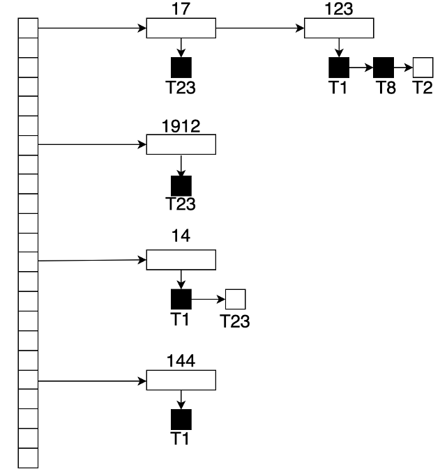
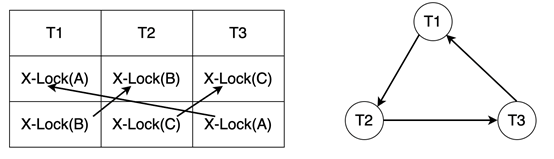

# 第6章 事务处理

## 6.1 事务概念

在数据库系统中，事务是指由一系列数据库操作组成的一个完整的逻辑过程。数据库提供了增、删、改、查等几种基础操作，用户可以灵活地组合这几种操作来实现复杂的语义。在很多场景下，用户希望一组操作可以做为一个整体一起生效，这就是事务的产生背景。

例如，一个银行转帐业务，在数据库中需要通过两个修改操作来实现：1. 从账户A扣除指定金额；2. 向账户B添加指定金额。这两个操作构成了一个完整的逻辑过程，不可拆分。如果第一个操作成功而第二个操作失败，说明转账没有成功。在这种情况下，对于银行来说，数据库中的账户数据是处于一种不正确的状态的，必须撤销掉第一个操作对数据库的修改，让账户数据恢复到转账前的状态。由此例可见，事务是数据库状态变更的基本单元，在事务将数据库从一个正确状态变更到另一个正确状态的过程中，数据库的那些中间状态，既不应该被其他事务看到或干扰，也不应该在事务结束后依然保留。

根据以上描述的事务概念，事务应具有四个特性，称为事务的ACID特性。它们分别是：

- **原子性** （Atomicity）：一个事务中的所有操作，要么全做，要么全不做。事务如果在执行过程中发生错误，该事务修改过的数据应该被恢复到事务开始前的状态，就像这个事务从来没有执行过一样。
- **一致性** （Consistency）：当数据库只包含成功事务提交的结果时，称数据库处于一致性状态。事务执行的结果必须使数据库从一个一致性状态变到另一个一致性状态。由此可见，一致性与原子性是密切相关的。
- **隔离性** （Isolation）：一个事务的执行不能被其他事务干扰。DBMS允许多个并发事务同时执行，隔离性可以防止多个事务并发执行时由于相互干扰而导致数据的不一致。
- **持久性** （Durability）：事务处理结束后，对数据的修改就是永久的，即便系统故障也不会丢失。

在SQL中，开始和结束事务的语句如下：

- BEGIN TRANSACTION：开始一个事务。除了用该语句显式地开始一个事务，DBMS也允许隐式的开始一个事务。隐式开始事务时无需执行任何语句，每当用户连接成功，即开始一个事务，前一个事务结束时，即自动开始下一个事务。
- COMMIT：提交一个事务。此语句表示事务正常结束，DBMS应永久保存该事务对数据库的修改。
- ROLLBACK：回滚一个事务。此语句表示事务异常结束，DBMS应撤销该事务对数据库的所有修改。需要注意的是，当事务发生故障时，即使用户没有显式执行ROLLBACK语句，DBMS也应自动回滚事务。

一个支持事务的DBMS必须能保证事务的ACID特性，这部分工作是由事务处理机制来负责的。事务处理机制又分为并发控制机制和故障恢复机制两部分，以下分别介绍。

## 6.2 并发控制

所谓并发操作，是指在多用户共享的数据库中，多个事务可能同时对同一数据进行操作。如果对这些操作不加控制，则可能导致数据的不一致问题。因此，为了保证事务的一致性和隔离性，DBMS需要对并发操作进行正确调度。这就是并发控制机制的任务。

### 6.2.1 并发错误

并发操作带来的数据不一致性包括丢失修改、读脏和不可重复读。

1. 丢失修改

   两个以上事务从数据库中读入同一数据并修改，其中一个事务（后提交的事务）的提交结果破坏了另一事务（先提交的事务）的提交结果，导致先提交的事务对数据库的修改被丢失。

2. 读脏

   事务读取了被其他事务修改且未提交的数据，即从数据库中读到了临时性数据。

3. 不可重复读

   一个事务读取数据后，该数据又被另一事务修改，导致前一事务无法再现前一次的读取结果。

   不可重复读又可分为两种情况：一种情况是第一次读到的数据的值在第二次读取时发生了变化；还有一种情况是事务第二次按相同条件读取数据时，返回结果中多了或者少了一些记录。后者又被称为幻读。

### 6.2.2 并发控制的正确性标准

并发控制机制的任务就是对并发事务进行正确的调度，但是什么样的调度才是正确的呢？我们需要一个正确性的判断标准。

#### 6.2.2.1 可串行化

串行调度是指多个事务依序串行执行，仅当一个事务的所有操作执行完后才执行另一个事务。这种调度方式下，不可能出现多个事务同时访问同一数据的问题，自然也就不可能出现并发错误。串行调度显然是正确的，但是串行调度无法充分利用系统资源，因此其效率显然也是用户难以接受的。

并发调度是指在数据库系统中同时执行多个事务。DBMS对多个并发事务进行调度时，可能产生多个不同的调度序列，从而得到不同的执行结果。如何判断某个调度是不是正确呢？如果这些并发事务的执行结果与它们按某一次序串行执行的结果相同，则认为该并发调度是正确的，我们称之为可串行化调度。

#### 6.2.2.2 冲突可串行化

可串行化是并发控制的正确性准则。但是按照可串行化的定义，如果想要判断一个并发调度是不是可串行化调度，需要知道这批事务所有可能的串行调度的结果，然后将该并发调度的结果与这些结果进行比较，这显然是难以实施的。因此，我们需要一种可操作的判断标准，即冲突可串行化。

冲突可串行化是可串行化的充分条件。如果一个并发调度是冲突可串行化的，那么它一定是可串行化的。在定义冲突可串行化之前，需要先了解什么是冲突操作。

冲突操作是指不同的事务对同一个数据的读写操作或写写操作。例如，事务1对数据A的读操作&quot;r1(A)&quot;与事务2对数据A的写操作&quot;w2(A)&quot;就是一对冲突操作。

我们规定，不同事务的冲突操作和同一事务的两个操作是不能交换的。因为如果改变冲突操作的次序，则最后的数据库状态会发生变化。按照这个规定，在保证一个并发调度中的冲突操作次序不变的情况下，如果通过交换两个事务的非冲突操作，能够得到一个串行调度，则称该并发调度是冲突可串行化的。

例如，对于以下两个并发调度序列：

SC1：r1(A) w1(B) r2(B) w1(C) w2(B)

SC2：r1(B) r2(A) w1(A) w2(B)

SC1就是冲突可串行化的，因为可以通过交换非冲突操作3和4得到一个串行调度序列。而SC2则是非冲突可串行化的，因为操作2和3是冲突操作，无法交换。

### 6.2.3 事务隔离级别

可串行化是一个很严格的正确性标准。在实际应用中，有时候可能会希望降低这个标准，通过牺牲一定的正确性，达到提高并发度的目的。为此，SQL标准将事务的隔离程度划分为四个等级，允许用户根据需要自己指定事务的隔离级。这四种隔离级包括读未提交（Read Uncommitted）、读提交（Read Committed）、可重复读（Repeatable Read）和可串行化（Serializable）。

1. 读未提交：在该隔离级别，事务可以看到其他未提交事务的执行结果，即允许读脏数据。
2. 读提交：这是大多数DBMS的默认隔离级别，它要求事务只能看见已提交事务所做的修改，因此可以避免读脏数据。但是由于在某个事务的执行期间，同一个数据可能被另一个事务修改并提交，所以该事务对该数据的两次读取可能会返回不同的值，即出现不可重复读错误。
3. 可重复读：在该隔离级别，同一事务多次读取同一数据时，总是会读到同样的值。不过理论上，该隔离级不能避免幻读，即使用相同条件多次读取时，满足读取条件的数据的数量可能有变化，比如多出一些满足条件的数据。
4. 可串行化：这是最高的隔离级别，能够避免所有并发错误。可串行化的概念前面已经介绍过，此处不再赘述。

## 6.3 封锁机制

### 6.3.1什么是封锁

封锁机制是一种常用的并发控制手段，它包括三个环节：第一个环节是申请加锁，即事务在操作前对它要使用的数据提出加锁请求；第二个环节是获得锁，即当条件满足时，系统允许事务对数据加锁，使事务获得数据的控制权；第三个环节是释放锁，即完成操作后事务放弃数据的控制权。为了达到并发控制的目的，在使用时事务应选择合适的锁，并遵从一定的封锁协议。

基本的封锁类型有两种：排它锁（Exclusive Locks，简称X锁）和共享锁（Share Locks，简称S锁）。

1. 排它锁

   排它锁也称为独占锁或写锁。一旦事务T对数据对象A加上了排它锁（X锁），则其他任何事务不能再对A加任何类型的锁，直到T释放A上的锁为止。

2. 共享锁

   共享锁又称读锁。如果事务T对数据对象A加上了共享锁（S锁），其他事务对A就只能加S锁而不能加X锁，直到事务T释放A上的S锁为止。

### 6.3.2 封锁协议

简单地对数据加X锁和S锁并不能保证数据库的一致性。在对数据对象加锁时，还需要约定一些规则，包括何时申请锁、申请什么类型的锁、何时释放锁等，这些规则称为封锁协议。不同的规则形成了各种不同的封锁协议。封锁协议分三级，它们对并发操作带来的丢失修改、读脏和不可重复读等并发错误，可以在不同程度上予以解决。

1. 一级封锁协议

   一级封锁协议是指事务T在修改数据之前必须先对其加X锁，直到事务结束才释放。

   一级封锁协议可有效地防止丢失修改，并能够保证事务T的可恢复性。但是，由于一级封锁没有要求对读数据进行加锁，所以不能防止读脏和不可重复读。遵循一级封锁协议的事务可以达到读未提交的事务隔离级。

2. 二级封锁协议

   二级封锁协议是指事务T在修改数据之前必须先加X锁，直到事务结束才释放X锁；在读取数据之前必须先加S锁，读完后即可释放S锁。

   二级封锁协议不但能够防止丢失修改，还可进一步防止读脏。遵循二级封锁协议的事务可以达到读提交的事务隔离级。

3. 三级封锁协议

   三级封锁协议是事务T在读取数据之前必须先对其加S锁，在修改数据之前必须先对其加X锁，直到事务结束后才释放所有锁。

   由于三级封锁协议强调即使事务读完数据A之后也不释放S锁，从而使得别的事务无法更改数据A，所以三级封锁协议不但能够防止丢失修改和读脏，而且能够防止不可重复读。遵循三级封锁协议的事务至少可以达到可重复读的事务隔离级，至于是否能到达可串行化级别，则取决于S锁的粒度。比如，如果只对要读取的记录加锁，则无法避免幻读问题；但如果是对整个表加锁，则幻读问题可以避免，代价是并发度的下降。

### 6.3.3 封锁的实现

锁管理器可以实现为一个进程或线程，它从事务接受请求消息并反馈结果消息。对于事务的加锁请求消息，锁管理器返回授予锁消息，或者要求事务回滚的消息（发生死锁时）；对于事务的解锁请求消息，只需返回一个确认消息，但可能触发锁管理器向正在等待该事务解锁的其他事务发送授予锁消息。

锁管理器使用以下数据结构：

- 为目前已加锁的每个数据对象维护一个链表，链表中的每个结点代表一个加锁请求，按请求到达的顺序排序。一个加锁请求包含的信息有：提出请求的事务ID，请求的锁的类型，以及该请求是否已被授予锁。
- 使用一个以数据对象ID为索引的散列表来查找数据对象（如果有的话），这个散列表叫做锁表。

图6-1是一个锁表的示例图，该表包含5个不同的数据对象14、17、123、144和1912的锁。锁表采用溢出链表示法，因此对于锁表的每一个表项都有一个数据对象的链表。每一个数据对象都有一个已授予锁或等待授予锁的事务请求列表，已授予锁的请求用深色阴影方块表示，等待授予锁的请求则用浅色阴影方块表示。 例如，事务T23在数据对象17和1912上已被授予锁，并且正在等待对数据对象14加锁。

图6-1 一个锁表的示例图

虽然图6-1没有标示出来，但对锁表还应当维护一个基于事务标识符的索引，这样它可以快速确定一个给定事务持有的锁的集合。

锁管理器这样处理请求：

- 当一条加锁请求消息到达时，如果锁表中存在相应数据对象的链表，则在该链表末尾增加一个请求；否则，新建一个仅包含该请求的链表。对于当前没有加锁的数据对象，总是满足事务对其的第一次加锁请求，但当事务向已被加锁的数据对象申请加锁时，只有当该请求与当前持有的锁相容、并且所有之前的请求都已授予锁的条件下，锁管理器才为该请求授予锁，否则，该请求只能等待。
- 当锁管理器收到一个事务的解锁消息时，它先找到对应的数据对象链表，删除其中该事务的请求，然后检查其后的请求，如果有，则看该请求能否被满足，如果能，锁管理器授权该请求，再按相同的方式处理后续的请求。
- 如果一个事务被中止，锁管理器首先删除该事务产生的正在等待加锁的所有请求；当系统采取适当动作撤销了该事务后，该中止事务持有的所有锁也将被释放。

这个算法保证了锁请求无饿死现象，因为在先接收到的请求正在等待加锁时，后来的请求不可能获得授权。

为了避免消息传递的开销，在许多DBMS中，事务通过直接更新锁表来实现封锁，而不是向锁管理器发送请求消息。事务加锁和解锁的操作逻辑与上述锁管理器的处理方法类似，但是有两个明显的区别：

- 由于多个事务可以同时访问锁表，因此必须确保对锁表的互斥访问。
- 如果因为锁冲突而不能立刻获得锁，加锁事务需要知道自己何时可以被授予锁，解锁事务需要标记出那些可以被授予锁的事务并通知它们。这个功能可以通过操作系统的信号量机制来实现。

### 6.3.4 死锁处理

封锁机制有可能导致死锁，DBMS必须妥善地解决死锁问题，才能保障系统的正常运行。

如果事务T1和T2都需要修改数据Rl和R2，并发执行时Tl封锁了数据R1，T2封锁了数据R2；然后T1又请求封锁R2，T2又请求封锁Rl；因T2已封锁了R2，故T1等待T2释放R2上的锁。同理，因T1已封锁了R1，故T2等待T1释放R1上的锁。由于Tl和T2都没有获得全部需要的数据，所以它们不会结束，只能继续等待。这种多事务交错等待的僵持局面称为死锁。

一般来讲，死锁是不可避免的。DBMS的并发控制子系统一旦检测到系统中存在死锁，就要设法解除。通常采用的方法是选择一个处理死锁代价最小的事务，将其中止，释放此事务持有的所有的锁，使其他事务得以继续运行下去。当然，被中止的事务已经执行的所有数据修改操作都必须被撤销。

数据库中解决死锁问题主要有两类方法：一类方法是允许发生死锁，然后采用一定手段定期诊断系统中有无死锁，若有则解除之，称为死锁检测；另一类方法是采用一定措施来预防死锁的发生，称为死锁预防。

#### 6.3.4.1 死锁检测

锁管理器通过waits-for图记录事务的等待关系，如图6-2所示。其中结点代表事务，有向边代表事务在等待另一个事务解锁。当waits-for图出现环路时，就说明出现了死锁。锁管理器会定时检测waits-for图，如果发现环路，则需要选择一个合适的事务中止它。

图6-2 waits-for图示例图

#### 6.3.4.2 死锁避免

当事务请求的锁与其他事务出现锁冲突时，系统为防止死锁，杀死其中一个事务。选择要杀死的事务时，一般持续越久的事务，保留的优先级越高。这种防患于未然的方法不需要waits-for图，但提高了事务被杀死的比率。

### 6.3.7 封锁粒度

封锁粒度是指封锁对象的大小。封锁对象可以是逻辑单元，也可以是物理单元。以关系数据库为例，封锁对象可以是属性值、属性值的集合、记录、表、直至整个数据库；也可以是一些物理单元，例如页（数据页或索引页）、块等。封锁粒度与系统的并发度及并发控制的开销密切相关。封锁的粒度越小，并发度越高，系统开销也越大；封锁的粒度越大，并发度越低，系统开销也越小。

如果一个DBMS能够同时支持多种封锁粒度供不同的事务选择，这种封锁方法称为多粒度封锁。选择封锁粒度时应该综合考虑封锁开销和并发度两个因素，选择适当的封锁粒度以求得最优的效果。通常，需要处理一个表中大量记录的事务可以以表为封锁粒度；需要处理多个表中大量记录的事务可以以数据库为封锁粒度；而对于只处理少量记录的事务，则以记录为封锁粒度比较合适。

## 6.4 故障恢复

故障恢复机制是在数据库发生故障时确保数据库一致性、事务原子性和持久性的技术。当崩溃发生时，内存中未提交到磁盘的所有数据都有丢失的风险。故障恢复的作用是防止崩溃后的信息丢失。

故障恢复机制包含两个部分:

- 为了确保DBMS能从故障中恢复，在正常事务处理过程中需要执行的操作，如登记日志、备份数据等。
- 发生故障后，将数据库恢复到原子性、一致性和持久性状态的操作。

### 6.4.1 故障分类

由于DBMS根据底层存储设备被划分为不同的组件，因此DBMS需要处理许多不同类型的故障。

1. 事务故障

   一个事务出现错误且必须中止，称其为事务故障。可能导致事务失败的两种错误是逻辑错误和内部状态错误。逻辑错误是指事务由于某些内部条件无法继续正常执行，如非法输入、找不到数据、溢出等；内部状态错误是指系统进入一种不良状态，使当前事务无法继续正常执行，如死锁。

2. 系统故障

   系统故障是指导致系统停止运转、需要重新启动的事件。系统故障可能由软件或硬件的问题引起。软件问题是指由于DBMS的实现问题（如未捕获的除零异常）导致系统不得不停止；硬件问题是指DBMS所在的计算机出现崩溃，如系统突然掉电、CPU故障等。发生系统故障时，内存中的数据会丢失，但外存数据不受影响。

3. 介质故障

   介质故障是指当物理存储损坏时发生的不可修复的故障，如磁盘损坏、磁头碰撞、强磁场干扰等。当存储介质失效时，DBMS必须通过备份版本进行恢复。

### 6.4.2 缓冲池管理策略

缓冲池管理策略是指，对于已提交和未提交的事务，它们在内存缓冲池中修改的数据页被写出到磁盘的时机。

对于已提交事务，存在两种策略：

- FORCE：事务提交时必须强制将其修改的数据页写盘；
- NOFORCE：允许在事务提交后延迟执行写盘操作。

对于未提交事务，也存在两种策略：

- STEAL：允许在事务提交前就将其修改的数据页写盘；
- NOSTEAL：不允许在事务提交前执行写盘操作。

对于恢复来说，FORCE+ NOSTEAL是最简单的策略，但是这种策略的一个缺点是要求内存能放下事务需要修改的所有数据，否则该事务将无法执行，因为DBMS不允许在事务提交之前将脏页写入磁盘。

从高效利用内存和降低磁盘I/O开销的角度出发，NOFORCE+ STEAL策略是最灵活的，这也是很多DBMS采用的策略。在这种策略下，一旦发生故障，恢复机制可能需要执行以下操作：

- UNDO：发生故障时，尚未完成的事务的结果可能已写入磁盘，为保证数据一致性，需要清除这些事务对数据库的修改。
- REDO：发生故障时，已完成事务提交的结果可能尚未写回到磁盘，故障使得这些事务对数据库的修改丢失，这也会使数据库处于不一致状态，因此应将这些事务已提交的结果重新写入磁盘。

为了保证在恢复时能够得到足够的信息进行UNDO和REDO，DBMS在事务正常执行期间需要登记事务对数据库所做的修改，这就是日志机制。

### 6.4.3 日志

#### 6.4.3.1 日志的原理

日志是由日志记录构成的文件，几乎所有DBMS都采用基于日志的恢复机制。它的基本思路是：DBMS在对磁盘页面进行修改之前，先将其对数据库所做的所有更改记录到磁盘上的日志文件中，日志文件包含足够的信息来执行必要的UNDO和REDO操作，以便在故障后恢复数据库。DBMS必须先将对数据库对象所做修改的日志记录写入日志文件，然后才能将该对象刷新到磁盘，这一过程称为WAL（Write Ahead Log）。WAL的执行过程如图6-3所示。事务开始后，所有对数据库的修改在发送到缓冲池之前都被记录在内存中的WAL缓冲区中。事务提交时，必须把WAL缓冲区刷新到磁盘。一旦WAL缓冲区被安全地写进磁盘，事务的修改结果就也可以写盘了。

图6-3 WAL过程示意图

日志文件中应该记录以下信息：

- l 事务开始时，向日志中写入一条该事务的开始记录<START T>。
- l 事务结束时，向日志中写入一条该事务的结束记录，结束记录包括两类：正常结束记录<COMMIT T>，和异常结束记录<ABORT T>。
- 事务对每个数据对象的修改操作对应一条日志记录，其中包含以下信息:
  - 事务ID
  - 对象ID
  - 修改前的值（用于UNDO）
  - 修改后的值（用于REDO）

将日志记录从日志缓冲区写入磁盘的时机有这样几个：

- 接收到提交事务的命令后，在返回提交成功的消息之前，DBMS必须将该事务的所有日志记录写入磁盘。系统可以使用&quot;组提交&quot;的方式来批处理多个事务的提交，以降低I/O开销。
- 日志缓冲区空间不足的时候，需要将缓冲区中的日子记录写入磁盘。
- 在将一个脏数据页写入磁盘之前，与更新该页有关的所有日志记录都必须先被写入磁盘。

需要注意的是，登记日志时必须严格按事务的操作顺序记录，并且写到磁盘中的日志记录顺序必须与写入日志缓冲区的顺序完全一致。

#### 6.4.3.2 日志的类型

根据实现时采用的恢复方法的不同，日志中记录的内容也不一样，分为以下几类。

1. 物理日志：物理日志中记录的是事务对数据库中特定位置的字节级更改。例如，日志中记录的是事务对指定数据页中从指定位置开始的若干字节的修改。
2. 逻辑日志：逻辑日志中记录的是事务执行的逻辑操作。例如，日志中记录的是事务执行的UPDATE、DELETE和INSERT语句。与物理日志相比，逻辑日志需要写的数据更少，因为每条日志记录可以在多个页面上更新多个元组。然而，当系统中存在并发事务时，通过逻辑日志实现恢复很困难。
3. 混合日志：日志中记录的是事务对指定页面中指定槽号内元组的更改，而不是对页中指定偏移位置的更改。

### 6.4.4 恢复算法

#### 6.4.4.1 事务故障的恢复

事务故障是指事务在运行至正常终止点前被终止，这时恢复子系统应利用日志文件UNDO此事务己对数据库进行的修改。事务故障的恢复应由DBMS自动完成，对用户完全透明。恢复步骤如下：

1. 反向扫描日志文件，查找该事务的更新日志记录。
2. 对该事务的更新操作执行逆操作， 即将日志记录中 &quot;更新前的值&quot; 写入数据库。如果记录中是插入操作，则逆操作相当于做删除操作：若记录中是删除操作，则逆操作相当于做插入操作；若是修改操作，则逆操作相当于用修改前的值代替修改后的值。
3. 继续反向扫描日志文件，查找该事务的其他更新日志记录并做相同处理，直至读到此事务的开始标记。

#### 6.4.4.2 系统故障的恢复

系统故障导致数据库处于不一致状态的原因，一方面是未提交事务对数据库的更新已经被写入数据库，另一方面则是已提交事务对数据库的更新没有被完全写入数据库。因此对于系统故障的恢复操作，就是要UNDO故障发生时未提交的事务，REDO已提交的事务。系统故障也是由DBMS在重启时自动完成，对用户完全透明。恢复步骤如下：

1. 正向扫描日志文件，通过事务开始记录和COMMIT记录找出在故障发生前已提交的事务集合和未提交的事务集合。已提交的事务既有开始记录也有COMMIT记录，未提交的事务则只有开始记录，没有相应的COMMIT记录。将已提交的事务加入重做队列（REDO-LIST），未提交的事务加入撤销队列（UNDO-LIST）。
2. 反向扫描日志文件，对UNDO-LIST中的各个事务进行UNDO处理。
3. 正向扫描日志文件，对REDO-LIST中的各个事务进行REDO处理。

#### 6.4.4.3 介质故障的恢复

发生介质故障后，磁盘上的物理数据和日志文件被破坏，这是最严重的一种故障，恢复方法是重装数据库，然后重做已完成的事务。介质故障的恢复需要用户人工介入，由DBA装入最新的数据库备份及日志文件备份，然后执行系统提供的恢复命令。

DBA装入相关备份文件后，系统执行的恢复过程与系统故障的恢复过程类似，也是通过扫描日志文件构造REDO-LIST和UNDO-LIST，然后对REDO-LIST和UNDO-LIST中的事务分别进行REDO和UNDO处理，这样就可以将数据库恢复到最近一次备份时的一致性状态。

### 6.4.5 检查点

以上讨论的基于日志的恢复算法存在两个问题：1. 构造REDO-LIST和UNDO-LIST需要搜索整个日志文件，耗费大量的时间；2.处理REDO-LIST时，很多事务的修改实际上已经写入了磁盘，但是仍然不得不进行REDO处理，浪费大量时间。为了解决上述问题，提高恢复效率，很多DBMS都采用了检查点技术，通过周期性地对日志做检查点来避免故障恢复时检查整个日志。

检查点技术的基本思路是：在日志文件中增加一类记录——检查点记录，并增加一个文件——重新开始文件。恢复子系统周期性地执行以下操作：

1. 将日志缓冲区中的日志记录全部写入磁盘中的日志文件；
2. 在日志文件中写入一个检查点记录；
3. 将数据缓冲区中的数据写入磁盘；
4. 将检查点记录在日志文件中的地址写入重新开始文件。

其中，检查点记录中包含以下信息：

- 检查点时刻，当前所有正在执行的事务清单
- 清单中每个事务最近一个日志记录的地址

图6-4 带检查点的日志文件和重新开始文件

由检查点时刻系统执行的操作可知，如果一个事务在一个检查点之前已经提交了，那么它对数据库所做的修改一定都被写入了磁盘，因此在进行恢复处理时，就没有必要再对该事务执行REDO操作了。

增加了检查点之后，基于日志的恢复步骤如下：

1. 从重新开始文件中找到最后一个检查点记录在日志文件中的地址，根据该地址在日志文件中找到最后一个检查点记录。
2. 由该检查点记录得到检查点时刻正在执行的事务清单ACTIVE-LIST。初始化两个事务队列UNDO-LIST和REDO-LIST，令UNDO-LIST = ACTIVE-LIST，令REDO队列为空。
3. 从检查点开始正向扫描日志文件直到日志文件结束，如有新开始的事务，则将其放入UNDO-LIST，如有提交的事务，则将其从UNDO-LIST队列移到REDO-LIST队列。
4. 对UNDO-LIST和REDO-LIST中的每个事务，分别执行UNDO和REDO操作。

