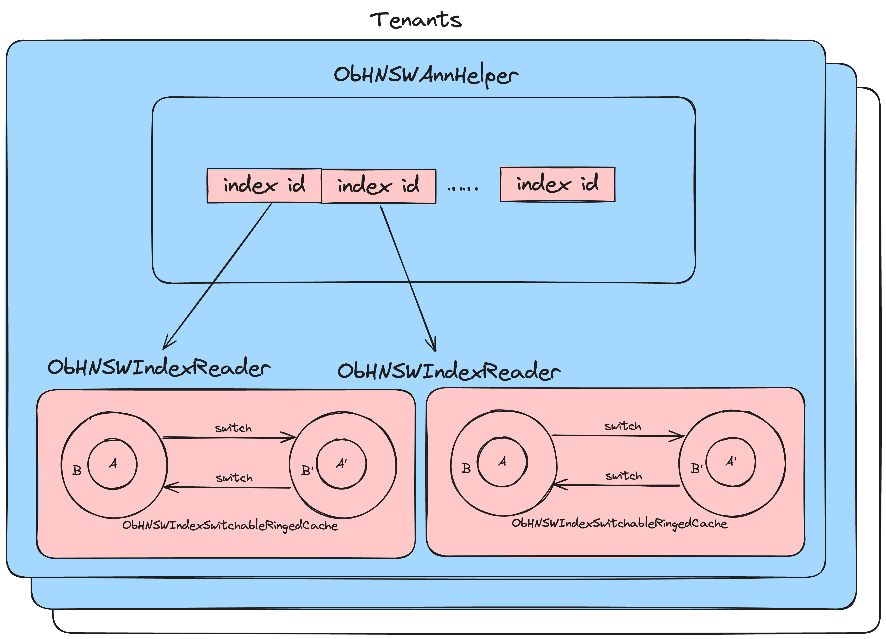

# 向量数据库设计文档
## 导言
向量数据库相关概念参考[OceanBase Vector Support](https://yuque.antfin-inc.com/xiaochu.yh/doc/obvector?view=doc_embed&inner=KUewj)。

向量数据库需求分析参考[向量检索需求分析](https://yuque.antfin-inc.com/ob/sr0nh6/ylbd3tlpabgigivw?view=doc_embed)。

IVFPQ 作为融合了倒排索引和乘积量化的向量索引结构，相比起 IVFFlat 有多种优势，包括减少存储空间、加快搜索速度等。本项目旨在当前 OceanBase 的IVFFlat向量版本基础上，实现 IVFPQ 索引算法的支持，以提供更丰富的向量索引类型。

### [乘积量化 (PQ)](https://www.pinecone.io/learn/series/faiss/product-quantization/)

1. 将一个大的高维向量划分为大小相等的块，创建子向量。
2. 确定每个子向量的最近 K 均值质心，将其称为再现或重建值。
3. 将这些再现值替换为代表质心的唯一 ID。

#### 索引
比如原始向量[1, 2, 3, 4]，它离一级量化聚类中心向量[1.1, 1.9, 3.1, 4.2]最近，这样原始向量[1, 2, 3, 4]与这个一级量化聚类中心向量[1.1, 1.9, 3.1, 4.2]的残差等于[-0.1, 0.1, -0.1, -0.2]，假定残差训练分2段，且其中[-0.1, 0.1]与第0段的细聚类中心向量[-0.07, 0.15]最近邻，[-0.1, -0.2]与第1段的细聚类中心向量[-0.13, -0.17]最近邻，那么原始向量[1, 2, 3, 4]就被量化为：

- 它在一级量化聚类中心向量[1.1, 1.9, 3.1, 4.2]的倒排链中，假定倒排链id = 10
- 它的残差的乘积量化，分别是[-0.07, 0.15]、[-0.13, -0.17]两个分段细聚类中心，假定两个细聚类中心id分别是15、25
- 那么原始向量[1, 2, 3, 4]，被归到"粗聚类[10][1525]"的向量集合中。IVFPQ索引不再存储[1, 2, 3, 4]的原始向量，而是存：倒排链id(10)、所属的两个分段细聚类id(15、25)

#### 查询
如向量 [0.9, 2.1, 3.05, 3.95] (假定它确实是原始向量[1, 2, 3, 4]的近邻)，以下是查询步骤：

- 它和全部一级量化聚类中心向量做暴搜比较，找到了最近邻的一级量化聚类中心向量[1.1, 1.9, 3.1, 4.2]，残差 = [-0.2, 0.2,  -0.05, -0.25]
- 对残差分段，第0段是[-0.2, 0.2]，第1段是[-0.05, -0.25]
- 第0段残差[-0.2, 0.2]，和第0段各个细聚类中心暴搜比较，得出最近邻的是[-0.07, 0.15]
- 第1段残差[-0.05, -0.25]，和第1段各个细聚类中心暴搜比较，得出最近邻的是[-0.13, -0.17]
- 那么待查询向量[0.9, 2.1, 3.05, 3.95], 与"以[1.1, 1.9, 3.1, 4.2]为一级量化结果，且第0分段残差细聚类中心是[-0.07, 0.15]，第1分段残差细聚类中心是[-0.13, -0.17]"代表的原始向量，distance = dist([0.9, 2.1, 3.05, 3.95], [1.1, 1.9, 3.1, 4.2]) + dist([-0.2, 0.2], [-0.07, 0.15]) + dist([-0.05, -0.25], [-0.13, -0.17])，即：待查询向量与粗聚类中心距离 + sum 各分段(dist(待查询向量与粗聚类中心残差分段，分段对应的最近邻细聚类中心向量))。

## 总体设计
### 设计影响到的模块
- DDL
- DAS
- 单机存储
- SQL

### 数据类型和语法
我们直接使用类似字符类型的方式来存储向量类型（vector）的数据，向量支持的数据类型为**单精度浮点数**，整个向量存储在一个单精度浮点数数组（float*）中，持久化时直接强制转换为字符数组（char*）进行存储。

`Vector`类型的最大长度为`VARCHAR` 类型有效最大长度，即262144 字节。因此向量最大维度为262144 / 4 = 65535 字节。

`Vector`类型支持的基本操作语法如下：
```sql
# 建表，创建一个三维向量
CREATE TABLE items (id int PRIMARY KEY, embedding vector(3));

# 插入向量
INSERT INTO items (embedding) VALUES ('[1,2,3]'), ('[4,5,6]');

# 删除向量
DELETE FROM items WHERE id = 1;

# 向量相似度计算
select l2_distance(embedding, '[1,2,3]') from item; # 欧式距离（L2 distance）
select inner_product(embedding, '[1,2,3]') from item; # 内积（inner product），返回负内积
select cosine_distance(embedding, '[1,2,3]') from item; # 余弦距离（cosine distance）

# 计算最近邻，使用L2 distance
SELECT * FROM items ORDER BY l2_distance(embedding, '[3,1,2]') LIMIT 5;
# 计算最近邻，使用inner product
SELECT * FROM items ORDER BY inner_product(embedding, '[3,1,2]') LIMIT 5;
# 计算最近邻，使用cosine distance
SELECT * FROM items ORDER BY cosine_distance(embedding, '[3,1,2]') LIMIT 5;
```

### 创建向量索引
向量索引支持三种索引算法：IVFFlat、IVFPQ和HNSW，两种算法的概念这里不再赘述。

向量索引的构建流程直接复用现有的DDL索引构建流程，IVFPQ向量索引的构建流程直接复用现有的DDL索引关于IVFFlat构建流程，主要修改点有两个：

1. 索引表schema创建过程
2. 索引表数据补全过程

基于不同的向量索引算法，索引表的schema也不同，具体的设计在后续章节展开。

DDL索引构建任务可以分为如下图所示几个阶段：


其中`REDEFINITION`过程会创建一个`ObIndexSSTableBuildTask`，用于使用主表数据来填充索引表数据。对于向量索引，我们根据IVFPQ向量索引算法，修改`ObIndexSSTableBuildTask`任务的数据补全逻辑，以完成向量索引的数据填充。具体的改造设计将在后续章节展开。

创建向量索引的语法如下：
```sql
# 创建HNSW索引，L2 distance作为索引排序标准
CREATE INDEX idx1 on items (embedding vector_l2_ops) WITH (type = hnsw);

# 创建IVFFlat索引，cosine distance作为索引排序标准
CREATE INDEX idx2 on items (embedding vector_cosine_ops) WITH (type = ivfflat, lists = 10);

# 创建IVFPQ索引，cosine distance作为索引排序标准
CREATE VECTOR INDEX idx1 on items (embedding vector_ip_ops) WITH (type = ivfpq, lists = 10, seg = 2);
```
### 向量检索

这里的向量检索指的是是向量的近似最邻近搜索，即ANN查询：
- 在没有向量索引的情况下，向量检索采用的是暴力搜索的方式，即Flat Search。
- 在有向量索引的情况下，查询语句需要完全满足如下特定语法才能够使用向量索引：

```sql
# ORDER BY + LIMIT，且无其他查询条件
SELECT xx FROM xx ORDER BY l2_distance(xx, '[1,2,3,7,8,9]') LIMIT k;
SELECT xx FROM xx ORDER BY l2_distance('[1,2,3,7,8,9]', xx) LIMIT k;

# 特殊情况，分区表允许且只允许使用分区键pk进行过滤
SELECT xx FROM xx WHERE pk = xx ORDER BY l2_distance('[1,2,3,7,8,9]', xx) LIMIT k;
```
只支持顺序排序，即按相似度从大到小排序，不支持逆序排序。

由于目前未考虑多种向量索引的代价估计手段，在同时存在HNSW、IVFFlat和IVFPQ索引的情况下，ANN查询选择哪个索引的行为是未定义的。

### 向量索引更新
我们允许IVFFlat和IVFPQ索引进行增量数据插入。在IVFFlat和IVFPQ索引构建完成后，任意新数据的插入都会依赖原索引的聚簇中心和PQ分段组成。新数据将通过原聚簇中心列表和新向量，被归纳到已有的最近聚簇中心。

对IVFFlat和IVFPQ索引而言，删除和插入操作不改变原索引所建立的聚簇中心列表。因此，如果增量数据变更（INSERT/DELETE）过多，会导致真实聚簇中心发生偏移，需要手动的定期索引完全重建来纠偏。

向量数据的更新（UPDATE）是未定义的行为。

## 详细设计
IVFPQ向量索引基于原IVFFlat向量索引的设计进行重构，抽离出了多个IVF子模块，IVFFlat向量索引和IVFPQ向量索引基于各自特征来继承实现，以支持相关流程的复用。

### 创建向量索引
#### 向量索引创建语法
在向量索引创建语法中，我们通过`WITH (type = xxx)`关键字来区分不同的向量索引算法。同时，我们允许为任意向量索引指定一个不可变的索引排序标准，共支持以下三种

1. `vector_l2_ops`：欧式距离；
2. `vector_cosine_ops`：余弦距离；
3. `vector_ip_ops`：内积

规定向量索引不支持多列索引，索引列必须是向量列。

#### ivfflat索引创建语法
IVFFlat索引允许在创建索引时指定聚簇中心数量，使用`WITH (lists = xx)`语法，用例如下：

```sql
# 创建IVFFlat索引，L2 distance作为索引排序标准
CREATE INDEX idx1 on items (embedding L2) USING IVFFLAT WITH (lists = 10);
```

在不显式指定的情况下，`lists`默认值为128。特殊情况下，当数据量小于`lists`数量时，`lists`值会被动修改为数据条数。
我们为IVFFlat索引创建新增若干租户级配置项：

| **配置项名称** | **配置项取值** | **配置项含义** |
| --- | --- | --- |
| vector_ivfflat_elkan | True/False，默认值True | 是否使用elkan kmeans算法 |
| vector_ivfflat_iters_count | [1,200000]，默认值200 | Kmeans最大迭代次数 |
| vector_ivfflat_sample_count | [0,18446744073709551615]，默认值10000 | 数据采样样本数量 |


#### ivfflat索引构建
IVFFlat向量索引分为两个部分，一个是聚簇中心的列表，另一个是倒排索引表，记录了每个聚簇中心所分配到的向量。我们不妨将第一个表称为辅助表，第二个表称为索引表，整个索引结构如下图所示：


辅助表和索引表我们都以普通索引的命名方式来命名，即`__idx_主表id_索引名`的组合。但特殊之处在于，辅助表我们认为是索引表的索引表（相当于一个二级索引），因此它的`data_table_id`我们设置为索引表的`table_id`。

假设数据主表的`table_id`是500001，在向量列建一个名为`ivfflat_idx`的IVFFlat索引，索引表的表名为`__idx_500001_ivfflat_idx`，`table_id`为500002，`data_table_id`为500001；那么辅助表的表名就为`__idx_500002_ivfflat_idx`，`data_table_id`为500002。

**对于分区表来说，我们将每个分区看作一个集合，每个分区都会进行独立的KMeans过程，形成独立的聚簇分类，即每个主表分区对应一个辅助表分区和一个索引表分区，这三个对应分区的数据关系与上图保持一致。**

##### 辅助表
辅助表存储经过Kmeans过程后得到的聚簇中心。每个聚簇中心有一个唯一的序号，这一列固定列名为`center_idx`，`column_id`设置为主表最大的`column_id + 1`，因此**本期向量表不支持加列操作**。聚簇中心是计算得到的中心向量，列名和列id都保持主表中向量列（即索引列）的列名与列id。另外为支持分区表，辅助表的schema中会冗余主表的rowkey列，由于冗余的rowkey列内容并不被查询依赖，填充数据时填入随机值即可。

我们以如下主表schema为例，其中c4是向量索引列：

| **column_name** | **column_id** | **rowkey_position** |
| --- | --- | --- |
| c1 | 16 | 1 |
| c2 | 17 | 2 |
| c3 | 18 | 0 |
| **c4** | 19 | 0 |

对应的辅助表schema为：

| **column_name** | **column_id** | **rowkey_position** | **index_position** |
| --- | --- | --- | --- |
| center_idx | 20 | 1 | 0 |
| c1 | 16 | 2 | 0 |
| c2 | 17 | 3 | 0 |
| c4 | 19 | 0 | 1 |

##### 索引表
索引表存储每个聚簇中心所分配到的向量，相比于普通索引，我们可以认为向量索引表额外增加了一个`center_idx`列，以形成一个倒排索引的结构。实际上，由于辅助表冗余了rowkey列，**索引表和辅助表的schema是完全相同的**。

同样以上述主表为例，对应的索引表schema为：

| **column_name** | **column_id** | **rowkey_position** | **index_position** |
| --- | --- | --- | --- |
| center_idx | 20 | 1 | 0 |
| c1 | 16 | 2 | 0 |
| c2 | 17 | 3 | 0 |
| c4 | 19 | 0 | 1 |

此外，为了记录向量索引的特定属性，我们为table schema增加两列：

1. `vector_ivf_lists`：表示创建索引时指定的聚簇中心数量
2. `vector_distance_func`：表示建向量索引时指定的距离（相似度）算法

##### 数据采样
为减少Kmeans算法执行过程的开销，我们需要在一定程度上降低进行Kmeans过程的数据量，因此我们采用和PGVector相同的方式，通过蓄水池抽样（Reservoir Sampling）从全部数据集中选取K个样本，以这K个样本来完成Kmeans算法。采样数据会缓存到Sample Cache，后续构建索引时对于样本集的访问直接通过cache，无需再进行inner sql查询。

采样过程会执行一次主表全表扫描的inner sql。采样样本数 K 我们选取租户级配置项`vector_ivfflat_sample_count`以及`50 * lists`两个值中的最大值。

当采样由于内存不足失败或`vector_ivfflat_sample_count`被设置为0（表示不使用采样）时，Kmeans过程将会使用全表的数据来进行，并且会回退到使用inner sql来进行全表扫描。

##### 构建流程

构建流程首先采用如下状态机进行推进：

1. PREPARE_CENTERS
   1. 随机选取样本中的某行数据，作为第一个初始聚簇中心
   2. 对于Elkan KMeans算法，初始化辅助数据结构内存空间
2. INIT_CENTERS
   1. 如果数据总量小于lists数，调整lists数为数据总量，直接将当前所有向量作为聚簇中心，跳过RUNNING_KMEANS阶段
   2. 对于Elkan KMeans算法，使用Kmeans++算法选取剩余的初始聚簇中心
   3. 对于非Elkan KMeans算法，每次选取离当前所有聚簇中心最远的数据点作为下一个初始聚簇中心，直到得到所有的初始聚簇中心
3. RUNNING_KMEANS
   1. 对于Elkan KMeans算法，使用Elkan KMeans算法进行迭代，直到达到最大迭代次数或没有中心点的变化时完成收敛
   2. 对于非Elkan KMeans算法，使用普通KMeans算法进行迭代，直到达到最大迭代次数或所有中心点的变化量都小于某阈值时完成收敛
4. FINISH
   1. 完成迭代流程，得到聚簇中心列表

当上述状态机执行结束后，我们可以得到聚簇中心的列表，接着我们通过两条inner sql来完成数据的补全：

1. 第一条`INSERT INTO`用于插入所有聚簇中心到辅助表，其中主表的冗余rowkey列会填充固定且随机的值
2. 第二条`INSERT INTO`用于插入索引数据到索引表。我们需要使用额外的inner sql来访问主表的每一行数据，然后通过聚簇中心列表计算得到距离当前行向量索引列最近的聚簇中心的`center_idx`。

##### 分区索引构建
在分区场景会对每一个分区构建一个独立的ivfflat索引结构，即每个分区的聚簇中心仅通过该分区的基表数据计算得出，所以只支持局部索引构建。在ObIndexSSTableBuildTask对象处理ivfflat局部索引创建的任务时，执行一条特殊的inner SQL：

```plsql
insert /*+parallel(<parallelism>)*/ into `<database_name>`.`<index_table_name>` select <column_name_lists> from `<database_name>`.`<data_table_name>`
```

- parallelism：与普通索引构建时计算的并行度相同；
- database_name：数据库名；
- index_table_name：ivfflat索引的一级索引表；
- column_name_lists：分区建+基表主键列（分区键从基表继承，ivfflat的一级、二级索引表与基表分区行为一致）；
- data_table_name：基表表名；

类似于普通索引构建时的insert into select语句的执行流程，ivfflat索引构建时，以上SQL也会被特殊处理。但不同的是普通索引最终会直接通过sstable基线数据同步来实现索引构建，而ivfflat索引构建时执行的insert into select是一个真正的、但是执行计划发生变化的插入语句，架设基表的创建语句如下：
```plsql
create table t1 (p1 int, v1 vector(3), gh int, primary key(p1, gh)) partition by KEY(gh) partitions 100;
```
则构建ivfflat分区索引时的执行计划为：
```plsql
+------------------------------------------------------------------------+
| Query Plan                                                             |
+------------------------------------------------------------------------+
| =============================================================          |
| |ID|OPERATOR                 |NAME    |EST.ROWS|EST.TIME(us)|          |
| -------------------------------------------------------------          |
| |0 |PX COORDINATOR           |        |5       |218         |          |
| |1 |└─EXCHANGE OUT DISTR     |:EX10000|5       |216         |          |
| |2 |  └─PX PARTITION ITERATOR|        |5       |211         |          |
| |3 |    └─TABLE FULL SCAN    |t1      |5       |211         |          |
| =============================================================          |
| Outputs & filters:                                                     |
| -------------------------------------                                  |
|   0 - output(nil), filter(nil), rowset=16                              |
|   1 - output(nil), filter(nil), rowset=16                              |
|       dop=1                                                            |
|   2 - output(nil), filter(nil), rowset=16                              |
|       force partition granule                                          |
|   3 - output(nil), filter(nil), rowset=16                              |
|       access(nil), partitions(p[0-99])                                 |
|       is_index_back=false, is_global_index=false,                      |
|       range_key([t1.p1], [t1.gh]), range(MIN,MIN ; MAX,MAX)always true |
+------------------------------------------------------------------------+
```
 将其与普通的insert into select执行计划对比：
```plsql
+-----------------------------------------------------------------------------------------------------------------------------------------+
| Query Plan                                                                                                                              |
+-----------------------------------------------------------------------------------------------------------------------------------------+
| ====================================================================                                                                    |
| |ID|OPERATOR                 |NAME           |EST.ROWS|EST.TIME(us)|                                                                    |
| --------------------------------------------------------------------                                                                    |
| |0 |PX COORDINATOR           |               |4       |247         |                                                                    |
| |1 |└─EXCHANGE OUT DISTR     |:EX10000       |4       |245         |                                                                    |
| |2 |  └─PX PARTITION ITERATOR|               |4       |243         |                                                                    |
| |3 |    └─INSERT             |               |4       |243         |                                                                    |
| |4 |      └─SUBPLAN SCAN     |ANONYMOUS_VIEW1|4       |211         |                                                                    |
| |5 |        └─TABLE FULL SCAN|t2             |4       |211         |                                                                    |
| ====================================================================                                                                    |
| Outputs & filters:                                                                                                                      |
| -------------------------------------                                                                                                   |
|   0 - output(nil), filter(nil), rowset=16                                                                                               |
|   1 - output(nil), filter(nil), rowset=16                                                                                               |
|       dop=1                                                                                                                             |
|   2 - output(nil), filter(nil), rowset=16                                                                                               |
|       partition wise, force partition granule                                                                                           |
|   3 - output(nil), filter(nil)                                                                                                          |
|       columns([{t3: ({t3: (t3.p1, t3.gh)})}]), partitions(p[0-99]),                                                                     |
|       column_values([column_conv(INT,PS:(11,0),NOT NULL,ANONYMOUS_VIEW1.p1)], [column_conv(INT,PS:(11,0),NOT NULL,ANONYMOUS_VIEW1.gh)]) |
|   4 - output([ANONYMOUS_VIEW1.p1], [ANONYMOUS_VIEW1.gh]), filter(nil), rowset=16                                                        |
|       access([ANONYMOUS_VIEW1.p1], [ANONYMOUS_VIEW1.gh])                                                                                |
|   5 - output([t2.p1], [t2.gh]), filter(nil), rowset=16                                                                                  |
|       access([t2.p1], [t2.gh]), partitions(p[0-99])                                                                                     |
|       is_index_back=false, is_global_index=false,                                                                                       |
|       range_key([t2.p1], [t2.gh]), range(MIN,MIN ; MAX,MAX)always true                                                                  |
+-----------------------------------------------------------------------------------------------------------------------------------------+
```
可以看到ivfflat索引构建的计划并不包含INSERT算子和SUBPLAN SCAN，插入ivfflat索引的操作被下推到了TABLE SCAN算子中，修改方案：

- 对于insert into select语句，Resolver检查发现insert into对象表是select子查询的对象表的ivfflat索引时，设置特殊解析模式使能标志—— `IS_BUILD_VECTOR_INDEX_STMT`;
- 当 `IS_BUILD_VECTOR_INDEX_STMT` 使能时跳过对于insert into对象表列与select子查询列是否相等的检查（必然不相等，因为insert into对象表包含聚簇中心id列）；
- 修改Optimizer：
   - 生成Access Path阶段，不实际生成subquery的访问方式；
   - 生成逻辑计划时，不实际生成INSERT算子；
- 修改执行阶段ObTableScanOp，将上述ivfflat索引构建流程封装到ObIvfflatIndexBuildHelper，在创建DAS op时实例化ObIvfflatIndexBuildHelper帮助创建索引；
   - ObIvfflatIndexBuildHelper通过GRANULE ITERATOR来获得分区划分的任务粒度，在分区向量索引中会强制走partition粒度而不是block粒度；

**局限：**

**由于下推到TABLE SCAN中的ivfflat索引插入操作目前的实现方案是inner SQL，导致各个分区的索引构建并不具有原子性，即存在部分分区成功构建而部分分区失败的情况，需要改进为DAS Op。**

#### ivfpq索引创建语法
IVFPQ索引允许在创建索引时指定聚簇中心数量，也支持指定向量量化分段数量，使用`WITH (lists = xx, seg = xxx)`语法，用例如下：

```sql
# 创建IVFPQ索引，L2 distance作为索引排序标准
CREATE VECTOR INDEX idx1 on items (embedding vector_l2_ops) WITH (type = ivfpq, lists = 10, seg = 2);
```

在不显式指定的情况下，`lists`默认值为128，`seg`默认值为1（不分段）。特殊情况下，当数据量小于`lists`数量时，`lists`值会被动修改为数据条数。

**注意：**

**分段数需要能够整除向量维度，否则行为未定义。**

我们为IVFPQ索引创建新增若干租户级配置项：

| **配置项名称** | **配置项取值** | **配置项含义** |
| --- | --- | --- |
| vector_ivfpq_elkan | True/False，默认值True | 是否使用elkan kmeans算法 |
| vector_ivfpq_iters_count | [1,200000]，默认值200 | Kmeans最大迭代次数 |
| vector_ivfpq_sample_count | [0,18446744073709551615]，默认值10000 | 数据采样样本数量 |


#### ivfpq索引构建

IVFPQ向量索引分为三个部分，一个是IVF聚簇中心的列表，另一个是PQ分段聚簇中心的列表，还有一个是倒排索引表，记录了每个IVF聚簇中心所分配到的向量被量化降维后的值。我们不妨将第一个表称为辅助表，第二个表称为第二辅助表，第三个表称为索引表，整个索引结构如下图所示：


两个辅助表和索引表我们都以普通索引的命名方式来命名，即`__idx_主表id_索引名`的组合。但特殊之处在于，辅助表我们认为是索引表的索引表（相当于一个二级索引），因此它的`data_table_id`我们设置为索引表的`table_id`，而第二辅助表我们认为是辅助表的索引表（相当于一个三级索引），因此它的`data_table_id`我们设置为辅助表的`table_id`：

例如，假设数据主表的`table_id`是500001，在向量列建一个名为`ivfpq_idx`的IVFPQ索引，索引表的表名为`__idx_500001_ivfpq_idx`，`table_id`为500002，`data_table_id`为500001；那么辅助表的表名就为`__idx_500002_ivfpq_idx`，`data_table_id`为500002；第二辅助表的表名就为`__idx_500003_ivfpq_idx`，`data_table_id`为500003。

**同IVFFlat，对于分区表来说，我们将每个分区看作一个集合，每个分区都会进行独立的KMeans过程，形成独立的聚簇分类，即每个主表分区对应一个第二辅助表分区、一个辅助表分区和一个索引表分区，这三个对应分区的数据关系与上图保持一致。**

##### 辅助表
同IVFFlat

##### 第二辅助表
第二辅助表存储对向量经过分段后对每段残差Kmeans过程后得到的聚簇中心，其存储向量维度为分段向量的维度。对于每段向量而言，其使用唯一的序号标记，这一列固定列名为`seg_idx`，其`column_id`设置为主表最大的`column_id + 2`。而每段的每个聚簇中心有一个对于该段唯一的序号，这一列固定列名为`center_idx`，其`column_id`设置为主表最大的`column_id + 1`，因此**本期向量表不支持加列操作**。聚簇中心是计算得到的该段的中心向量，列名和列id都保持主表中向量列（即索引列）的列名与列id。另外为支持分区表，第二辅助表的schema中会冗余主表的rowkey列，由于冗余的rowkey列内容并不被查询依赖，填充数据时填入随机值即可。

我们以如下主表schema为例，其中c4是向量索引列：

| **column_name** | **column_id** | **rowkey_position** |
| --- | --- | --- |
| c1 | 16 | 1 |
| c2 | 17 | 2 |
| c3 | 18 | 0 |
| **c4** | 19 | 0 |

对应的辅助表schema为：

| **column_name** | **column_id** | **rowkey_position** | **index_position** |
| --- | --- | --- | --- |
| center_idx | 20 | 1 | 0 |
| seg_idx | 21 | 2 | 0 |
| c1 | 16 | 3 | 0 |
| c2 | 17 | 4 | 0 |
| c4 | 19 | 0 | 1 |

##### 索引表
索引表存储每个聚簇中心所分配到的PQ索引向量，其存储向量维度等于分段数。相比于普通索引，我们可以认为向量索引表额外增加了一个`center_idx`列，以形成一个倒排索引的结构。实际上，由于辅助表冗余了rowkey列，**如果不考虑向量维度设置，索引表和辅助表的schema是完全相同的**。

同样以上述主表为例，对应的索引表schema为：

| **column_name** | **column_id** | **rowkey_position** | **index_position** |
| --- | --- | --- | --- |
| center_idx | 20 | 1 | 0 |
| c1 | 16 | 2 | 0 |
| c2 | 17 | 3 | 0 |
| c4 | 19 | 0 | 1 |

此外，为了记录向量索引的特定属性，我们为table schema增加三列：
1. `vector_ivf_lists`：表示创建索引时指定的聚簇中心数量
2. `vector_distance_func`：表示建向量索引时指定的距离（相似度）算法
3. `vector_pq_seg`：创建索引时指定的分段数

##### 数据采样
同IVFFlat。

##### 构建流程
我们将原用于IVFFlat的构建流程进行重构，抽离出一个子模块，其专门在样本中运行KMEANS算法得到聚簇中心。同时，我们将原采样数据缓存Sample Cache进行重构，抽离出一个基本的内存读写子模块，其专门用于存放PQ分段后的残差向量，用于PQ聚簇中心的计算。

###### Kmeans聚簇模块
和IVFFlat索引构建流程相同。

###### 整体IVFPQ索引构建流程


1. IVF_CENTERS
   1. 同IVFFlat索引构建流程，完成Kmeans聚簇模块迭代流程，得到原始向量聚簇中心
2. PQ_PREPARE_CENTERS
   1. 从缓存中读取原始向量样本缓存，计算其最临近的聚簇中心
   2. 将原始向量减去其最临近的聚簇中心，得到残差向量，并进行分段
   3. 对于每个分段，初始化一个KMeans聚簇模块，存入分段后的缓存
3. PQ_KMEANS
   1. 对于每个分段，使用KMeans聚簇模块计算PQ分段的聚簇中心
4. COMPLETE
   1. 完成每个分段KMeans聚簇模块的迭代流程，得到聚簇中心列表

接着我们通过三条inner sql来完成数据的补全：

1. 第一条`INSERT INTO`用于插入所有原始向量聚簇中心到辅助表，其中主表的冗余rowkey列会填充固定且随机的值
2. 第而条`INSERT INTO`用于插入所有分段的所有向量聚簇中心到第二辅助表，其中主表的冗余rowkey列会填充固定且随机的值
3. 第二条`INSERT INTO`用于插入索引数据到索引表。我们需要使用额外的inner sql来访问主表的每一行数据，然后通过原始向量聚簇中心列表计算得到距离当前行原始向量索引列最近的聚簇中心的`center_idx`，并计算残差，通过PQ分段后的向量聚簇中心列表计算得到距离当前行当前分段向量索引列最近的聚簇中心id，存储于新的PQ索引向量代表分段中。

##### 分区索引构建
同IVFFlat。

#### hnsw索引创建语法
HNSW索引创建语法和IVFFlat类似，但建索引语句中没有额外可指定的参数。

我们为HNSW索引创建新增若干租户级配置项：

| **配置项名称** | **配置项取值** | **配置项含义** |
| --- | --- | --- |
| vector_hnsw_m | [1,200000]，默认值16 | 每个向量的最大连接度 |
| vector_hnsw_ef_construction | [1,200000]，默认值200 | 每个向量备选邻居的搜索规模 |

#### hnsw索引构建
hnsw索引信息分为元数据信息和向量邻居信息两个部分，两个部分分别使用不同的数据库表进行维护：

1. 新增__all_vector_hnsw_index系统表来维护每一个hnsw索引表的元数据信息；
2. hnsw索引表本身则用于记录每个向量数据的邻居向量信息；

下面详细描述两个表的模式定义：

##### 新增hnsw索引表元信息系统表——__all_vector_hnsw_index
```shell
rowkey_columns = [
  ('vector_index_table_id', 'int'),
  ('rowkey_id', 'int'),
],

normal_columns = [
  ('vector_distance_type', 'int'),
  ######### HNSW meta #############
  ('hnsw_dim', 'int'),
  ('hnsw_m', 'int'),
  ('hnsw_ef_construction', 'int'),
  ('hnsw_entry_level', 'int'),
  ('rowkey_value', 'varchar:OB_OLD_MAX_VARCHAR_LENGTH'),
],
```
__all_vector_hnsw_index是一个租户级别的系统表，考虑到基表rowkey可能是多列复合的，为了将同一个租户下的所有hnsw索引表元数据都存储在这个系统表中，这里采用扁平化存储方式：

- **vector_index_table_id：**hnsw索引表的table id；
- **rowkey_id：**基表的rowkey id；
- **vector_distance_type：**记录hnsw索引表使用的向量距离函数；
- **hnsw_dim：**记录向量数据的维度；
- **hnsw_m：**记录构建hnsw索引使用的最大连接度，第0层为2*m，其他层次为m；
- **hnsw_ef_construction：**在hnsw索引构建或者插入新向量时使用的最大向量搜索数量；
- **hnsw_entry_level：**hnsw索引的搜索入口向量（entry point）所在的层级；
- **rowkey_value：**基表中主键rowkey id的列值；

##### hnsw索引表schema定义


如上图所示，hnsw需要维护每个向量数据在各个层级的邻居向量，考虑到OceanBase大宽表的性能问题，设计上使用扁平化方式进行存储，即hnsw索引表中的每一行仅记录一对向量的邻居关系：

```shell
{
    rowkey_columns = [
        ('base_pk1', 类型由基表确定) # 向量行在基表中的主键
        ('base_pk2', 类型由基表确定)
        ……
        ('base_pkN', 类型由基表确定)
        ('level', int), # 向量的level
        ('ref_pk1', 类型由基表确定) # 邻居向量的主键
        ('ref_pk2', 类型由基表确定)
        ……
        ('ref_pkN', 类型由基表确定)
    ]
    
    normal_columns = [
        ('data', vector(x)) # 向量数据
        ('flag', int) # 状态标记
        ('distance', double) # 向量距离其邻居的距离
    ]
} # for m or 2*m times
```

- **主键：**向量A的主键 + hnsw索引结构所在level + 向量B的主键：表述了A -> B的邻居关系（**注意：有向**）；
- **data列：**具体的列名依赖于基表的向量列名，为了避免列名重复，在基表向量列名前加"_"前缀以作区别，例如基表的向量列名为"c1"，在hnsw中列名为"_c1"；
- **flag列：**
   - 0：表示此向量在该层尚无邻居，但是为了被新插入的向量所感知，需要设置此标记；
   - 1：表示这是一条有效邻居记录；
   - 2：表示该邻居关系已被删除；
- **distance列：**向量与其邻居之间的距离；

##### 构建流程
hnsw索引构建过程中依赖的各个结构组件图：


ObHNSWIndexBuilder是实现hnsw索引构建的核心数据结构，ObIndexSSTableBuildTask在识别到需要创建hnsw索引时通过实例化这个结构来最终完成索引构建，分为以下几个部分：

1. **HNSW Meta Data：**记录了需要构建的hnsw索引表的元数据，包括索引名、索引表table_id、当前最高的层级、向量距离函数以及包含在__all_vector_hnsw_index列中的相关信息，在完成索引构建后这些元信息会写入__all_vector_hnsw_index系统表；
2. **allocator：**用于为Constant Value Pool分配内存，该常量池用于保存向量数据及其基表主键的列值。由于向量邻居关系使用扁平方式存储在索引表中，如果对每一对向量邻接关系都存储完整的向量数据及其主键值会带来比较大的开销，所以借助一个常量池共享相同的数值以节省内存开销，池内内存分为4个区域，用于配合后面描述的缓存机制实现内存回收；（注意：仅仅zone内共享，跨zone不共享，因为释放时机不同）
3. **ObHNSWIndexSwitchableRingedCache：**针对hnsw索引对于entry point周边的访问频次高于外围的特点，设计了一套缓存机制。首先，缓存由两个同构的RingedCache组成，RingedCache将距离entry point较近的向量始终常驻在内存中（称为Ring A），而将距离超过一定值的向量放置于定期淘汰的内存中（称为Ring B）。进一步地，考虑到hnsw索引构建过程中会出现entry point的变动，故设置了第二个RingedCache，在发生变动的时候，实现迁移动作；除此之外，ObHNSWIndexSwitchableRingedCache实现批量预取缓存，会将一个未命中向量的各层级邻居关系一次性读取出来缓存，减少与OceanBase存储层的交互次数。

在ObHNSWIndexSwitchableRingedCache并不直接按照OceanBase的行格式对向量数据进行缓存，而是转化为ObHNSWElement数据结构进行存储，ObHNSWElement会整合一个向量在各个层级的所有邻居向量数据，具体结构示意图如下：


- **ObHNSWElement:**
   - skip_cnt_：本向量距离当前entry point的估计跳数；
   - cache_epoch_：记录当前ObHNSWElement是在ObHNSWIndexSwitchableRingedCache的那个代际创建的。引入代际的概念是为了解决如下问题：当Ring B的向量被淘汰后，因为ObHNSWElement记录的是指向邻居的指针（见下面对ObHNSWNeighbor的介绍），可能出现悬挂指针问题。引入代际之后，从某个ObHNSWElement访问其邻居会首先将ObHNSWNeighbor的cache_epoch_与目前淘汰的最大代际比较，如果小，那么意味着有访问悬挂指针的风险，cache会判断为未命中，进一步从OceanBase memtable甚至sstable中获取向量记录行；
   - vector_ptr__  _&  pk_ptr__ _: 指向 Constant Value Pool，分别指向向量数据以及基表主键地址；
- **ObHNSWLevelNeighbor：**记录某一层次上的ObHNSWNeighbor数组，n_nb_为数组有效长度。目前ObHNSWNeighbor数组最大长度固定100，便于实现且缓解内存频繁分配；
- **ObHNSWNeighbor：**
   - NeighborStatus：enum，实现批量淘汰的关键状态字段，包含ADDED和ORIGINAL两个状态。ORIGINAL表示此向量及其各层邻居的数据“已经写入索引表”（注意：事务并未提交，准确讲应该是写入memtable但是尚未提交），ADDED表示此向量及其邻居向量信息是新增或者发生修改（更新或者删除）。在淘汰时根据这个状态判断是否需要执行写入操作；
   - skip_cnt_&cache_epoch_：快速访问路径，减少一次寻址访问；并且cache_epoch_必须保存在此处，避免访问悬挂指针；
   - flag_：即hnsw索引表中的flag列。

### 向量检索
#### 向量检索语法
能够使用向量索引优化的向量近似最邻近搜索（下面简称为ANN）语法格式如下：

```plsql
select XXXX from <table> [where XXX] order by <vector_column> <distance_op>(<vector_expr>) limit <K expr>
```
所需要满足的条件：

1. 只有一个基表，不支持表连接操作；
2. 包含order by …… limit ……语句结构；
3. order by 必须升序；
4. order by后面是一个vector distance表达式，且引用基表的向量列；
5. 该向量列上建有向量索引；

不满足以上条件之一，都无法使用向量索引作为Access Path，走原有的基表扫描TopK查询流程。而满足以上条件的，将强制走ANN计划（目前未考虑ANN查询代价的建模）。另外，在满足上述条件条件的情况下，如果select语句包含可选的where筛选子句，目前的行为是先进行ANN查询再进行筛选。（即“后过滤”）

#### 非分区ANN计划生成

生成基于向量索引的ANN计划对于不同的向量索引来说是具有共性的，主要的区别在于执行阶段逻辑。现有的计划生成并不直接支持生成ANN计划，需要针对以下问题进行修改：

1. 在未做改造的情况下，虽然在create access paths构造出了基表ACCESS以及索引表ACCESS两种访问路径，但是在compute path relationship阶段代价估计被当做全表扫描的回表操作，不敌直接基表全表扫描;
   - 为了解决这一问题，在构造IndexInfoEntry的时候需要为向量索引设置合适的interesting_order，以使得在compute path relationship阶段得到UNCOMPARABLE的裁定。
2. 为了检查在存在有order by子句时，是否能够使用索引表来创建access path，在ObJoinOrder::fill_index_info_entry->ObJoinOrder::get_access_path_ordering->ObLogPlan::get_rowkey_exprs过程会获得索引表的rowkey，普通的索引表index info和rowkey info使用相同的column集合，但是在向量索引下并非如此，需要修正这个函数；
3. ObJoinOrder::get_index_scan_direction->ObJoinOrder::get_direction_in_order_by：在该函数中会将order by中的表达式与索引表rowkey表达式进行比较，匹配则会在access path的比较过程中考虑索引表查询的访问路径。但是在ANN查询中order by之后的表达式是一个T_OP_VECTOR_L2_DISTANCE（以及其他一些向量距离运算符）类型的ObOpRawExpr，而rowkey表达式是T_REF_COLUMN的ObColumnRefRawExpr，不匹配；
   1. 判断ObOpRawExpr的param expr中是否有且只有一个T_REF_COLUMN的表达式；
   2. 取出该表达式与索引表的rowkey表达式比较;
4. ObSelectLogPlan::generate_raw_plan_for_plain_select分为两步：
   1. generate_plan_tree：计算出access plan，对每一个access plan都生成一个逻辑算子树；
   2. allocate_plan_top：分配出Count/Group By/SubPlanFilter/Window Sort/Distinct/Order By/Limit/Late Materialization/Select Into等算子；
      - 对于走向量索引的ANN查询来说不需要生成这些顶层算子

#### 分区ANN查询计划生成
##### 无filter或非分区键filter的查询计划
以ivfpq索引为例，分区ANN设计的查询计划如下所示：


```plsql
+--------------------------------------------------------------------------------------------------------------------------------------+
| Query Plan                                                                                                                           |
+--------------------------------------------------------------------------------------------------------------------------------------+
| =======================================================================                                                              |
| |ID|OPERATOR                     |NAME          |EST.ROWS|EST.TIME(us)|                                                              |
| -----------------------------------------------------------------------                                                              |
| |0 |LIMIT                        |              |1       |43          |                                                              |
| |1 |└─PX COORDINATOR MERGE SORT  |              |1       |43          |                                                              |
| |2 |  └─EXCHANGE OUT DISTR       |:EX10000      |1       |43          |                                                              |
| |3 |    └─TOP-N SORT             |              |1       |43          |                                                              |
| |4 |      └─PX PARTITION ITERATOR|              |5       |43          |                                                              |
| |5 |        └─TABLE FULL SCAN    |t1(vidx_v1_t1)|5       |43          |                                                              |
| =======================================================================                                                              |
+--------------------------------------------------------------------------------------------------------------------------------------+
```
不同于非分区表的情况，分区表向量最邻近查询在算子层面与不使用向量索引的Top-K查询无异，主要区别有在于在分区情况。下面自底层算子向上分析一下各个算子在分区ANN查询中的主要功能：

1. **TABLE FULL SCAN：** 对应的物理算子为ObTableScanOp，每种向量索引会实现不同的具体查询逻辑，但是共同点是在分区情况下会从上一级算子获取分区信息，进行分区级别的扫描；另外，由于每个DFO内部的并行线程任务划分，一个ObTableScanOp会被用于多个分区的向量索引扫描，需要对每种向量索引的处理算子实现rescan操作。**由于在IVFPQ中索引表中存储的是PQ向量索引，而后续需要进行TOP-N SORT操作，所以这里需要使用inner sql根据row key查找data table中的原始向量**；
2. **PX PARTITION ITERATOR：** 负责将分区的信息下发给TABLE FULL SCAN；
3. **TOP-N SORT：** 由于DFO1中各个工作线程得到的是多个子分区的TOP-N，为了便于在DFO2中进行merge sort操作，需要将各个DFO内并行任务的结果根据向量距离整合为一个升序结果集；
4. **EXCHANGE OUT DISTR：** 发送子结果到COORDINATOR；
5. **PX COORDINATOR MERGE SORT：** 将多个子任务的升序结果集进行归并排序；
6. **LIMIT：** 取出Top-K；

##### 分区键等值filter的查询计划
当分区键作为等值filter条件出现在向量最邻近查询中时，会采用更为高效的单分区ANN查询计划，例如：
```plsql
explain select * from t1 where gh=1  order by v1 <-> '[0,0,0]' limit 1;
+-------------------------------------------------------------------------------------------------+
| Query Plan                                                                                      |
+-------------------------------------------------------------------------------------------------+
| =========================================================                                       |
| |ID|OPERATOR       |NAME          |EST.ROWS|EST.TIME(us)|                                       |
| ---------------------------------------------------------                                       |
| |0 |TABLE FULL SCAN|t1(vidx_v1_t1)|1       |3           |                                       |
| =========================================================                                       |
+-------------------------------------------------------------------------------------------------+
```
需要注意的是目前在这种情况下尚未忽略parallel hint的影响，即在添加parallel hint之后，生成的执行计划将与无filter或者非分区键filter查询一致。

#### ANN计划执行
改进ANN计划生成后查询计划的比较如下：

```plsql
TOP K计划：
+------------------------------------------------------------------------------------------------------------------------------+
| Query Plan                                                                                                                   |
+------------------------------------------------------------------------------------------------------------------------------+
| =================================================                                                                            |
| |ID|OPERATOR         |NAME|EST.ROWS|EST.TIME(us)|                                                                            |
| -------------------------------------------------                                                                            |
| |0 |TOP-N SORT       |    |2       |3           |                                                                            |
| |1 |└─TABLE FULL SCAN|item|20      |3           |                                                                            |
| =================================================                                                                            |
| Outputs & filters:                                                                                                           |
| -------------------------------------                                                                                        |
|   0 - output([item.c1], [item.c2]), filter(nil), rowset=256                                                                  |
|       sort_keys([(T_OP_VECTOR_L2_DISTANCE, item.c1, cast('[3,1,2]', (-1, -1))), ASC]), topn(2)                               |
|   1 - output([item.c2], [item.c1], [(T_OP_VECTOR_L2_DISTANCE, item.c1, cast('[3,1,2]', (-1, -1)))]), filter(nil), rowset=256 |
|       access([item.c2], [item.c1]), partitions(p0)                                                                           |
|       is_index_back=false, is_global_index=false,                                                                            |
|       range_key([item.c2]), range(MIN ; MAX)always true                                                                      |
+------------------------------------------------------------------------------------------------------------------------------+

ANN 计划：
+-------------------------------------------------------------------------------------------------------+
| Query Plan                                                                                            |
+-------------------------------------------------------------------------------------------------------+
| ======================================================                                                |
| |ID|OPERATOR       |NAME       |EST.ROWS|EST.TIME(us)|                                                |
| ------------------------------------------------------                                                |
| |0 |TABLE FULL SCAN|item(vidx1)|381     |13          |                                                |
| ======================================================                                                |
| Outputs & filters:                                                                                    |
| -------------------------------------                                                                 |
|   0 - output([item.c1], [item.c2]), filter(nil), rowset=256                                           |
|       access([item.c2], [item.c1]), partitions(p0)                                                    |
|       is_index_back=false, is_global_index=false,                                                     |
|       range_key([item.c2], [item.level], [item.ref_pk0]), range(MIN,MIN,MIN ; MAX,MAX,MAX)always true |
+-------------------------------------------------------------------------------------------------------+
```

对于不同的向量索引，最终都是将向量索引查询逻辑下压到ObTableScanOp中进行，故需要对ObTableScanOp算子的初始化过程进行修改，以兼容不同的向量索引逻辑：
- **物理算子ObTableScanOp改造：** 在逻辑算子ObLogTableScan中新增is_vector_index_表示采用向量索引查询、vector_ann_k_expr记录limit子句中的K表达式ObRawExpr，为了在ObTableScanOp中走向量查找流程，需要在ObOpSpec中设置这些字段。
- **ObTableScanOp向量索引回表查询改造：** 复用普通表的回表操作，构造LookUpIter的Das迭代器，向量索引查询操作需要将结果封装为一个ObNewRowIterator，并根据回表情况将投影列交给LookUpIter迭代器实现对基表的回表查找。

#### ivfflat索引检索
对于使用IVFFlat索引进行的向量检索而言，除了主表和索引表外，还会额外涉及到一张辅助表，因此查询的逻辑在原有基础上多了一层，即：
我们需要先遍历辅助表，通过查询向量找到与之最接近的n个聚簇中心，然后再通过过滤这n个聚簇中心的`center_idx`，在索引表中找到与之最接近的K个数据向量，最后根据是否回表，从主表或索引表得到查询列的结果。
其中，在辅助表中得到n个聚簇中心的n，通常被称为IVFFlat查询的probes，我们为该参数增加一个系统变量`vector_ivfflat_probes`以及支持特殊的查询HINT（`probes`）：
```sql
# 系统变量
set @@vector_ivfflat_probes=2;

# 查询HINT
select */*+probes(2) */ from items order by embedding <-> '[3,1,2]' limit 5;
```
由于辅助表的引入，为了使整个查询流程都使用存储层的数据访问机制，IVFFlat查询流程需要对优化器、CG、执行器、DAS进行一些额外的特殊改动。
另外，我们设计了辅助表数据的缓存功能，大部分场景下辅助表数据可以直接通过缓存得到。**因此还存在另一种可行方案，即辅助表的非缓存访问不直接通过存储层完成，而是间接使用inner sql来完成**。

这里介绍辅助表直接通过存储层访问而读取数据的改造方案。

##### 优化器改动
1. 新增表达式数组`extra_access_exprs`，存储`center_idx`和向量索引列两列，用来作为辅助表的投影列和索引表额外的访问列
2. 当查询路径是IVFFlat索引时，为`related_table_ids`增加辅助表的`table_id`，以形成辅助表和索引表之间的table以及tablet关联关系

##### CG改动
1. 为辅助表的访问新增`ObDASScanCtDef`和`ObDASTableLocMeta`
2. 辅助表对应的`access_exprs`为`extra_access_exprs`，索引表的`access_exprs`新增`extra_access_exprs`

##### DAS层改动


我们为辅助表和索引表的访问设计了新的`ObNewRowIterator`（`ObIvfflatAnnScanOp`），其内部包含两个`ObTableScanIterator`，分别用来访问索引表和辅助表。在非回表场景，`ObDASScanOp`的`result_`将是一个`ObIvfflatAnnScanOp`；在回表场景，`ObDASScanOp`的`result_`依然是一个`LookupOp`，但`LookupOp`的`rowkey_iter_`将是一个`ObIvfflatAnnScanOp`。

整个按相似度排序以及获取limit结果的过程都在`ObIvfflatAnnScanOp`中完成，而非通过其他任何`SORT`和`LIMIT`算子。`ObIvfflatAnnScanOp`的`get_next_row`会首先直接得到索引表查询的全部结果，并缓存在内存结构中。该过程通过以下状态机进行推进：


1. CONTAINER_SCAN
   1. 设置`key_range`为`whole_range`，切换`tablet_id`，进行辅助表的`table_scan`或`table_rescan`
   2. 执行辅助表的`get_next_row`，通过`center_idx`和向量索引列的`expr`取出每行中这两列的结果，并使用`heap`来排序和存储与查询向量最接近的n个结果。这里的结果只有`center_idx`和向量索引列两列。
   3. 得到辅助表的查询结果
2. INDEX_SCAN
   1. 使用辅助表查得的n个`center_idx`设置n个key_range，进行索引表的`table_scan`或`table_rescan`
   2. 执行索引表的`get_next_row`，通过向量索引列的`expr`取出向量索引列的值，同样使用`heap`来排序和存储与查询向量最接近的K个结果。这里的结果是索引表的结果投影列。
   3. 得到索引表的查询结果，也即`ObIvfflatAnnScanOp`最终的结果集
3. OUTPUT_ROWS
   1. 在该状态下`ObIvfflatAnnScanOp`已经在内存存放了最终的结果集，只需要每次调用将一行的结果填充到`output_exprs_`即可
4. FINISH
   1. `ObIvfflatAnnScanOp`所有结果全部迭代结束

##### 辅助表缓存
由于辅助表的数据量通常较少，并且在当前设计的IVFFlat增量更新方案中，辅助表的数据是不会发生变更的（即聚簇中心不改变），我们引入了如下所示的租户级辅助表缓存。


缓存由`HashMap`构成，通过索引表的`table_id`+`partition_id`+索引距离算法`dist_type`找到对应的辅助表的完整数据（对于辅助表而言，其有效数据只有`center_idx`和向量索引列两列）。

每个辅助表缓存KV对都在索引构建完成后被添加，在索引表被删除后清理。整个缓存的内存空间具有一定阈值上限，当所占用空间达到阈值后，我们不进行淘汰，而是直接阻止新的数据添加。
在`ObIvfflatAnnScanOp`的`CONTAINER_SCAN`阶段，如果辅助表缓存能找到相应的辅助表数据，那么无需通过存储层进行辅助表的访问。

由于引入了辅助表缓存，存在另一种实现更简单的方案，即在未命中缓存的情况下直接通过inner sql进行辅助表访问，这样可以省略为了辅助表存储层访问而设计的大部分改造，包括新增辅助表和索引表的分区绑定关系、新增辅助表的`ObDASScanCtDef`、在`ObIvfflatAnnScanOp`中增加辅助表的`ObTableScanIterator`等等。

**该期未考虑单表存在多个向量列且多个向量列都存在索引的情况**。

#### ivfpq索引检索
对于使用IVFPQ索引进行的向量检索而言，除了主表和索引表外，还会额外涉及到两张辅助表，因此查询的逻辑在原有基础上多了两层，即：
- 我们需要先遍历辅助表，通过查询向量找到与之最接近的n个聚簇中心；
- 然后再通过计算这n个聚簇中心的`center_idx`和原始向量的残差，遍历第二辅助表，对每个分段的残差，计算其与所有分段聚簇中心的距离并记录在堆中，最后使用索引表中的PQ索引向量，对这n个聚簇中心的所有PQ索引向量查表，找到与之最接近的K个数据向量，最后根据是否回表，从主表或索引表得到查询列的结果。

其中，在辅助表中得到n个聚簇中心的n，通常被称为IVFPQ查询的probes，我们为该参数增加一个系统变量`vector_ivfpq_probes`以及支持特殊的查询HINT（`probes`）：

```sql
# 系统变量
set @@vector_ivfpq_probes=2;

# 查询HINT
select */*+probes(2) */ from items order by l2_distance(embedding, '[3,1,2]') limit 5;
```
由于两个辅助表的引入，为了使整个查询流程都使用存储层的数据访问机制，IVFPQ查询流程需要对优化器、CG、执行器、DAS进行一些额外的特殊改动。

另外，我们设计了辅助表数据的缓存功能，大部分场景下辅助表数据可以直接通过缓存得到。**因此还存在另一种可行方案，即辅助表的非缓存访问不直接通过存储层完成，而是间接使用inner sql来完成**。

这里介绍辅助表直接通过存储层访问而读取数据的改造方案。

##### 优化器改动

1. 新增表达式数组`extra_access_exprs`，存储`center_idx`和向量索引列两列，用来作为辅助表的投影列和索引表额外的访问列
2. 新增表达式数组`second_extra_access_exprs`，存储`center_idx`、`seg_idx`和向量索引列三列，用来作为第二辅助表的投影列和索引表额外的访问列
3. 当查询路径是IVFPQ索引时，为`related_table_ids`增加两个辅助表的`table_id`，以形成两个辅助表和索引表之间的table以及tablet关联关系

##### CG改动

1. 为辅助表的访问新增`ObDASScanCtDef`和`ObDASTableLocMeta`
2. 辅助表对应的`access_exprs`为`extra_access_exprs`，第二辅助表对应的`access_exprs`为`second_extra_access_exprs`，索引表的`access_exprs`新增`extra_access_exprs`和`second_extra_access_exprs`

##### DAS层改动
类似于IVFFlat，我们为辅助表和索引表的访问设计了新的`ObNewRowIterator`（`ObIvfpqAnnScanOp`，基于原`ObIvfflatAnnScanOp`重构的基类`ObIvfAnnScanOp`），其内部包含三个`ObTableScanIterator`，分别用来访问索引表、辅助表和第二辅助表。在非回表场景，`ObDASScanOp`的`result_`将是一个`ObIvfpqAnnScanOp`；在回表场景，`ObDASScanOp`的`result_`依然是一个`LookupOp`，但`LookupOp`的`rowkey_iter_`将是一个`ObIvfpqAnnScanOp`。

整个按相似度排序以及获取limit结果的过程都在`ObIvfpqAnnScanOp`中完成，而非通过其他任何`SORT`和`LIMIT`算子。`ObIvfpqAnnScanOp`的`get_next_row`会首先直接得到索引表查询的全部结果，并缓存在内存结构中。

1. CONTAINER_SCAN
   1. 设置`key_range`为`whole_range`，切换`tablet_id`，进行辅助表的`table_scan`或`table_rescan`，同时设置`key_range`为`whole_range`，切换`second_tablet_id`，进行第二辅助表的`table_scan`或`table_rescan`
   2. 执行两个辅助表的`get_next_row`，首先，对辅助表，通过`center_idx`和向量索引列的`expr`取出每行中这两列的结果，并使用`heap`来排序和存储与查询向量最接近的n个结果。这里的结果只有`center_idx`和向量索引列两列。然后，对第二辅助表，获取对副主表查询向量最接近的n个结果，计算并使用数组存储查询向量与该中心的残差距离，通过`center_idx`，`seg_idx`和向量索引列的`expr`取出每行中这三列的结果，随后并使用数组来存储距离
   3. 得到辅助表和第二辅助表的查询结果
2. INDEX_SCAN
   1. 使用辅助表查得的n个`center_idx`设置n个key_range，进行索引表的`table_scan`或`table_rescan`
   2. 执行索引表的`get_next_row`，通过向量索引列的`expr`取出PQ向量索引列的值，通过分段查表得到距离，同样使用`heap`来排序和存储与查询向量最接近的K个结果。这里的结果是索引表的结果投影列。
   3. 得到索引表的查询结果，也即`ObIvfpqAnnScanOp`最终的结果集
3. OUTPUT_ROWS
   1. 在该状态下`ObIvfpqAnnScanOp`已经在内存存放了最终的结果集，只需要每次调用将一行的结果填充到`output_exprs_`即可（如果是`get_next_rows`，则还需通过inner sql回表查询主表中存储的原始向量值）
4. FINISH
   1. `ObIvfpqAnnScanOp`所有结果全部迭代结束

##### 辅助表缓存
同IVFFlat，在辅助表缓存的基础上引入了第二个辅助表缓存，缓存由`HashMap`构成，通过索引表的`table_id`+`partition_id`+索引距离算法`dist_type`找到对应的辅助表的完整数据（对于第二辅助表而言，其有效数据则只有`seg_idx`、`center_idx`和向量索引列三列）。

#### hnsw索引检索
考虑到oceanbase现有的memtable、row cache以及block cache将数据按照记录行进行组织，而hnsw在查询过程中高度依赖向量之间的邻居关系，为了加速查询，故为hnsw索引查询设计了如下结构：



ObHNSWAnnHelper是一个租户级别的hnsw索引元数据以及数据缓存，主要提供以下两种接口：
```cpp
int get_ann_reader(int64_t ann_index_td_id, ObHNSWIndexReader* &reader);
int create_ann_reader(int64_t ann_index_td_id, CreateAnnReaderArgs *args, ObHNSWIndexReader* &reader);
```

1. get_ann_reader用于通过hnsw索引表table id获取ObHNSWIndexReader结构，该结构保存了hnsw索引表的元数据信息，同时持有在hnsw索引构建时描述的ObHNSWIndexSwitchableRingedCache缓存。（由于hnsw索引的插入操作与查询操作有相似流程，可以实现索引共用）
2. create_ann_reader用于根据指定的hnsw索引表table id，以及hnsw索引元数据参数CreateAnnReaderArgs，来创建一个ObHNSWIndexReader。

ObHNSWIndexReader被多个同一租户下的SQL session共享，提供简单的并发安全支持。

##### 缓存的MVCC支持
**目前的设计并不支持ObHNSWIndexSwitchableRingedCache的MVCC访问控制。**

**合理的设计应当是将hnsw缓存设计为对oceanbase memtable的一种扩展，即在btree以及hashmap索引组织结构的基础上，对于hnsw索引表，进一步维护hnsw所需要的向量邻居关系。但是这种修改方式的问题在于修改的侵入性较大。**
