# Description

The latest dooba stable version is 1.0

dooba is a easy tools monitoring oceanbase cluster for oceanbase admins. It's based on python curses library, and is a powerful tool for watching oceanbase cluster status with straightfoward vision.

dooba's gui is somewhat inspired by many other curses programes such as ncmpcpp, htop, wicd-curses, weechat-curses and so on.

Many other features will be involved in dooba in not so long days. Here is a simple list.

# Features

1. select dataid and cluster with list
2. auto resize widget size to adapt term size
3. monitor sql, cs, ups statistics, for each cluster
4. simple way ssh into any server, connection by mysql client
5. support multi-cluster, simple switch shortkey - 'c'
6. machine info monitor, must online environment
7. many other shortcut keys for widget

# The Next Step

1. server errors/warns preview, with this DBAs have no need ssh in some servers to look for which there're some errors for that server.
2. server manipulation: change log level, stop server and so on
3. integrate with deploy which is a powful dev tool written by Yuanqi

# How to use it

```sh
dooba -h <LMS_HOST> -p <LMS_PORT>
dooba --dataid=DATA_ID
dooba -?
dooba
```

# Changelogs

Please look into dooba script file header.

# Screenshot

## version 1.0

### dooba offline index

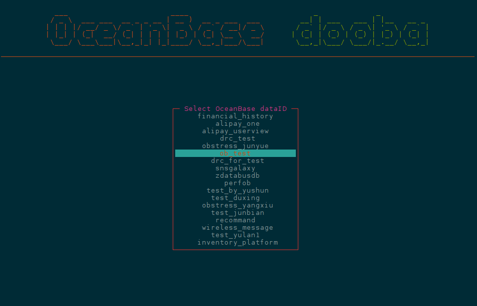

### dooba machine

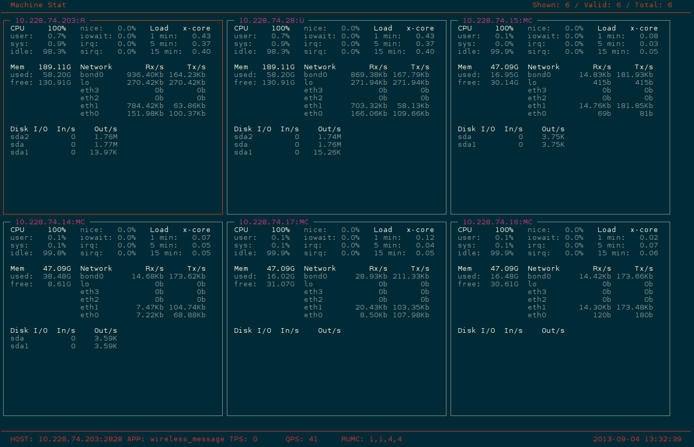

### dooba help

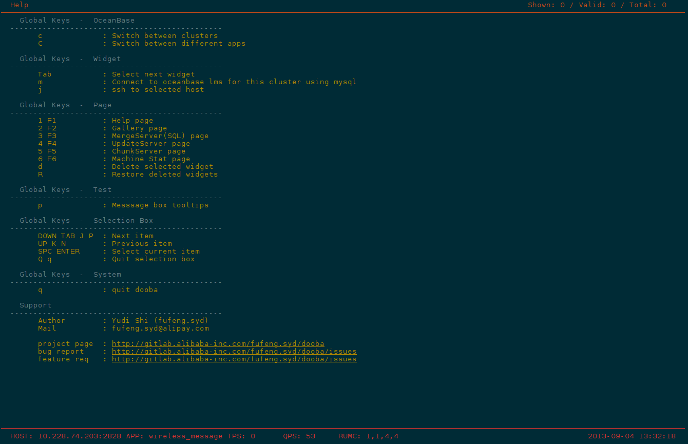

## version 0.4

### dooba shell

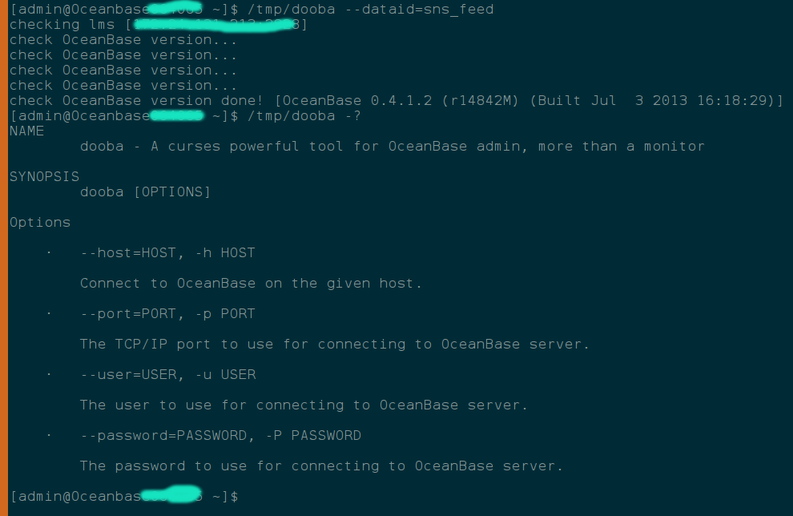

### dooba sql

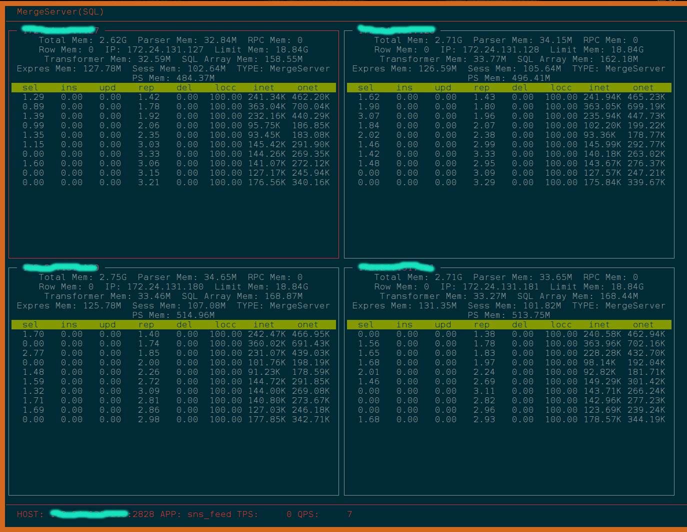

### dooba UpdateServer

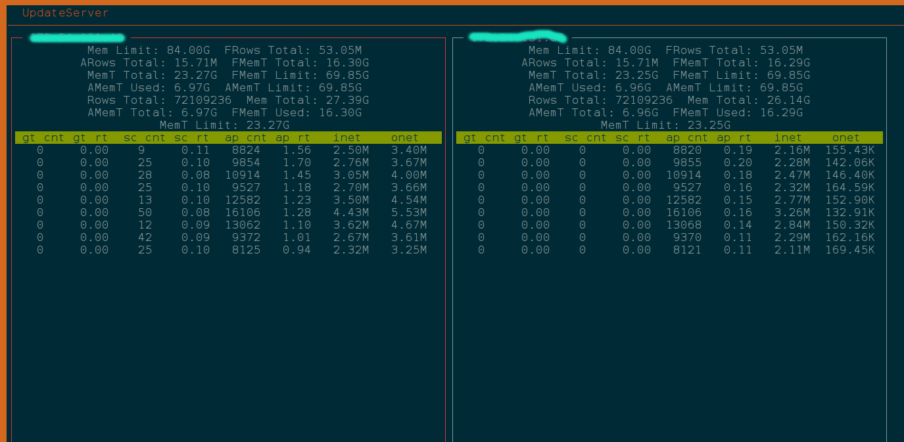

### dooba ChunkServer

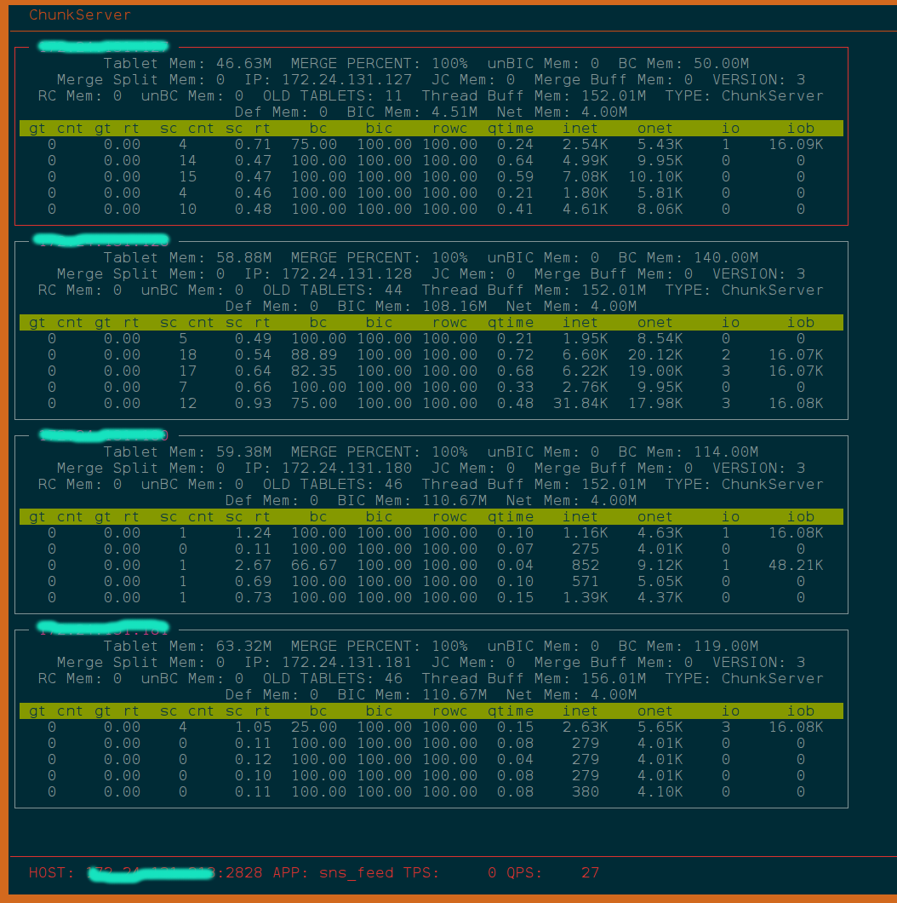

## version 0.2, 0.3

### Gallery of OceanBase

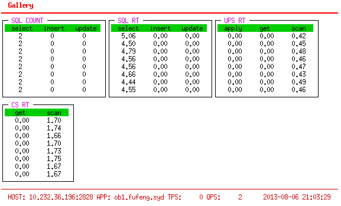

### SQL of OceanBase

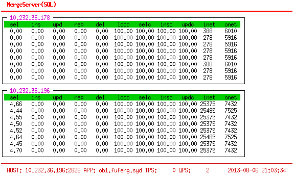

### UpdateServer of OceanBase

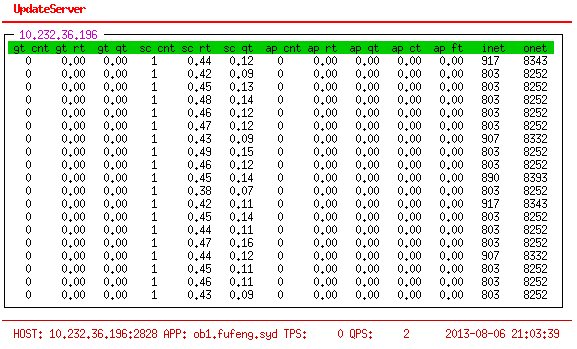

### ChunkServer of OceanBase

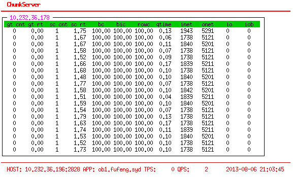

## version 0.1

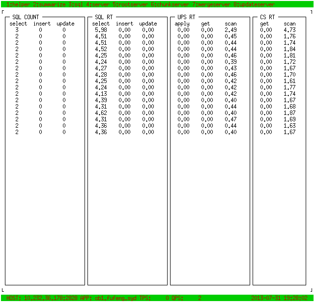
