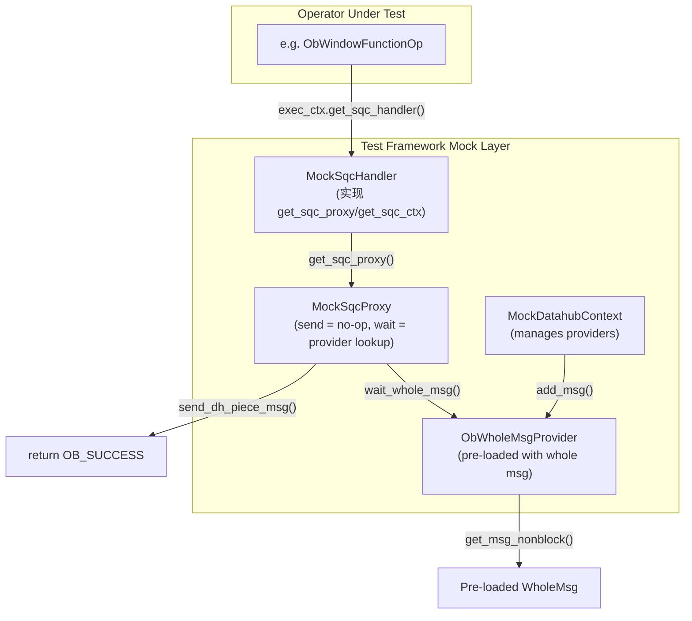

# Datahub Mock Support for op_test Framework

## 算子与 Datahub 交互分析

### 完整调用链

```
算子 (如 ObWindowFunctionOp::inner_get_next_row)
    ↓
ctx.get_sqc_handler()
    ↓
handler->get_sqc_proxy()
    ↓
proxy.get_dh_msg_sync<PieceMsg, WholeMsg>(op_id, msg_type, piece, whole, timeout)
    ↓
inner_get_dh_msg()
    ├── get_whole_msg_provider(op_id, msg_type, provider)  // 从 sqc_ctx 获取 provider
    ├── sync_wait_all(*provider)        // 可选：同步等待
    ├── send_dh_piece_msg(piece)        // 发送 piece 消息 (DTL channel)
    └── wait_whole_msg(provider, whole) // 等待 whole 消息
            ↓
        provider->get_msg_nonblock()     // 从 provider 获取预加载的 whole 消息
```

### 算子调用示例 (ObWindowFunctionOp)

```cpp
// 1. 获取 sqc_handler 和 proxy
ObPxSqcHandler *handler = ctx_.get_sqc_handler();
ObPxSQCProxy &proxy = handler->get_sqc_proxy();

// 2. 创建 piece 消息
ObWinbufPieceMsg piece;
piece.op_id_ = MY_SPEC.id_;
piece.thread_id_ = GETTID();

// 3. 调用 get_dh_msg_sync
const ObWinbufWholeMsg *whole = NULL;
ret = proxy.get_dh_msg_sync(
    MY_SPEC.id_,                          // op_id
    dtl::DH_WINBUF_WHOLE_MSG,             // msg_type
    piece,                                // piece message
    whole,                                // output: whole message
    ctx_.get_physical_plan_ctx()->get_timeout_timestamp()
);
```

### Provider 注册机制

```cpp
// 算子在 register_to_datahub 中注册 provider
int ObWindowFunctionSpec::register_to_datahub(ObExecContext &ctx) const {
  // 创建 provider
  void *buf = ctx.get_allocator().alloc(sizeof(ObWinbufWholeMsg::WholeMsgProvider));
  auto *provider = new (buf) ObWinbufWholeMsg::WholeMsgProvider();

  // 注册到 sqc_ctx
  ObSqcCtx &sqc_ctx = ctx.get_sqc_handler()->get_sqc_ctx();
  sqc_ctx.add_whole_msg_provider(get_id(), dtl::DH_WINBUF_WHOLE_MSG, *provider);
}
```

### 消息类型映射

| 场景 | Piece 消息类型 | Whole 消息类型 | 消息类 |
|------|---------------|----------------|--------|
| 窗口函数 | `DH_WINBUF_PIECE_MSG` | `DH_WINBUF_WHOLE_MSG` | `ObWinbufPieceMsg/WholeMsg` |
| Barrier 同步 | `DH_BARRIER_PIECE_MSG` | `DH_BARRIER_WHOLE_MSG` | `ObBarrierPieceMsg/WholeMsg` |
| Range Dist WF | `DH_RANGE_DIST_WF_PIECE_MSG` | `DH_RANGE_DIST_WF_WHOLE_MSG` | `ObRDWFPieceMsg/WholeMsg` |
| Reporting WF | `DH_SECOND_STAGE_REPORTING_WF_PIECE_MSG` | `DH_SECOND_STAGE_REPORTING_WF_WHOLE_MSG` | `ObReportingWFPieceMsg/WholeMsg` |

## 探索发现的关键问题

### 1. ObPxSqcHandler 依赖链（原计划低估的复杂性）

```cpp
// ob_px_sqc_handler.h:105-106
ObPxSQCProxy &get_sqc_proxy() { return sub_coord_->get_sqc_proxy(); }
ObSqcCtx &get_sqc_ctx() { return sub_coord_->get_sqc_ctx(); }
```

`ObPxSqcHandler` **必须**持有有效的 `ObPxSubCoord *sub_coord_`，因为 `get_sqc_proxy()` 完全委托给 `sub_coord_`。

**ObPxSqcHandler::valid() 检查**（行 88-93）：
```cpp
bool valid() { return  ((nullptr != notifier_)      &&
                       (nullptr != exec_ctx_)       &&
                       (nullptr != des_phy_plan_)   &&
                       (nullptr != sqc_init_args_)  &&
                       (nullptr != sub_coord_)      &&  // sub_coord_ 必须非空
                       (nullptr != mem_context_));}
```

### 2. ObSqcCtx 构造依赖

```cpp
// ob_sqc_ctx.h:46
ObSqcCtx(ObPxRpcInitSqcArgs &sqc_arg);

// ob_sqc_ctx.h:110
ObPxSQCProxy sqc_proxy_; // 作为成员变量，在 ObSqcCtx 构造时初始化
```

`ObPxSQCProxy` 是 `ObSqcCtx` 的成员，而非独立创建。

### 3. ObPxSQCProxy::init() 依赖

```cpp
// ob_px_sqc_proxy.cpp:88-97
int ObPxSQCProxy::init() {
  if (OB_FAIL(link_sqc_qc_channel(sqc_arg_))) {  // 需要 sqc_arg_.sqc_.get_sqc_channel() 返回有效 channel
    LOG_WARN("fail to link sqc qc channel", K(ret));
  } else if (OB_FAIL(setup_loop_proc(sqc_ctx_))) {  // 注册消息处理器到 DTL channel loop
    LOG_WARN("fail to setup loop proc", K(ret));
  }
}
```

### 4. ObWholeMsgProvider 注入点（可行路径）

```cpp
// ob_dh_msg_provider.h:125-134
int add_msg(const WholeMsg &msg) {
  if (OB_FAIL(whole_msg_.assign(msg))) {
    SQL_ENG_LOG(WARN,"fail assign msg", K(msg), K(ret));
  } else {
    whole_msg_set_ = true;  // 设置此标志后，get_msg_nonblock() 立即返回消息
  }
}
```

## 修订后的架构设计

**核心策略**：创建 Mock 类绕过 `ObPxSubCoord` 依赖链，直接提供算子所需的接口。



## 关键组件设计

### 重要发现：ObPxSubCoord 方法不是虚函数

```cpp
// ob_px_sub_coord.h:59-60
ObPxSQCProxy &get_sqc_proxy() { return sqc_ctx_.sqc_proxy_; }  // 非虚函数！
ObSqcCtx &get_sqc_ctx() { return sqc_ctx_; }                  // 非虚函数！
```

**结论**：无法通过继承和 override 改变行为。必须直接操作 `sqc_ctx_` 私有成员。

### 1. MockSqcProxy（核心 Mock 类）

提供 datahub 消息通信的 mock 实现，需要实现 `get_dh_msg_sync` 模板方法：

```cpp
class MockSqcProxy {
public:
  int init() {
    // 最小化初始化：初始化 msg_ready_cond_
    return msg_ready_cond_.init(common::ObWaitEventIds::DH_LOCAL_SYNC_COND_WAIT);
  }

  // ============ 核心 mock 方法 ============

  // get_dh_msg_sync: 返回预注册的 whole 消息
  template <class PieceMsg, class WholeMsg>
  int get_dh_msg_sync(uint64_t op_id,
                      dtl::ObDtlMsgType msg_type,
                      const PieceMsg &piece,
                      const WholeMsg *&whole,
                      int64_t timeout_ts,
                      bool send_piece = true,
                      bool need_wait_whole_msg = true) {
    return inner_get_dh_msg<PieceMsg, WholeMsg>(
        op_id, msg_type, piece, whole, timeout_ts,
        true, send_piece, need_wait_whole_msg);
  }

  // get_dh_msg: 非同步版本
  template <class PieceMsg, class WholeMsg>
  int get_dh_msg(uint64_t op_id,
                 dtl::ObDtlMsgType msg_type,
                 const PieceMsg &piece,
                 const WholeMsg *&whole,
                 int64_t timeout_ts,
                 bool send_piece = true,
                 bool need_wait_whole_msg = true) {
    return inner_get_dh_msg<PieceMsg, WholeMsg>(
        op_id, msg_type, piece, whole, timeout_ts,
        false, send_piece, need_wait_whole_msg);
  }

  // ============ 辅助方法 ============

  // 返回有效的 dfo_id 和 sqc_id（用于 piece 消息）
  int64_t get_dfo_id() const { return dfo_id_; }
  int64_t get_sqc_id() const { return sqc_id_; }
  void set_dfo_id(int64_t id) { dfo_id_ = id; }
  void set_sqc_id(int64_t id) { sqc_id_ = id; }

  // 获取条件变量
  common::ObThreadCond &get_msg_ready_cond() { return msg_ready_cond_; }

private:
  // 内部实现
  template <class PieceMsg, class WholeMsg>
  int inner_get_dh_msg(uint64_t op_id,
                       dtl::ObDtlMsgType msg_type,
                       const PieceMsg &piece,
                       const WholeMsg *&whole,
                       int64_t timeout_ts,
                       bool need_sync,
                       bool send_piece,
                       bool need_wait_whole_msg) {
    int ret = OB_SUCCESS;
    ObPxDatahubDataProvider *provider = nullptr;

    // 1. 从 mock_ctx 获取 provider
    if (OB_FAIL(mock_ctx_->get_whole_msg_provider(op_id, msg_type, provider))) {
      SQL_LOG(WARN, "fail get provider", K(ret), K(op_id), K(msg_type));
    } else if (OB_ISNULL(provider)) {
      ret = OB_ERR_UNEXPECTED;
      SQL_LOG(WARN, "provider is null", K(ret));
    } else {
      // 2. send_piece 被忽略（mock 场景下不需要真正发送）
      // 3. 直接获取预加载的 whole 消息
      if (need_wait_whole_msg) {
        const dtl::ObDtlMsg *msg = nullptr;
        if (OB_FAIL(provider->get_msg_nonblock(msg, timeout_ts))) {
          SQL_LOG(WARN, "fail get whole msg", K(ret));
        } else {
          whole = static_cast<const WholeMsg *>(msg);
        }
      }
    }
    return ret;
  }

  MockSqcCtx *mock_ctx_;  // 由 MockDatahubContext 设置
  common::ObThreadCond msg_ready_cond_;
  int64_t dfo_id_ = 0;
  int64_t sqc_id_ = 0;
};
```

### 2. MockSqcCtx（Provider 管理类）

管理 provider 列表，模拟 `ObSqcCtx` 的 datahub 相关功能：

```cpp
class MockSqcCtx {
public:
  MockSqcCtx() : providers_() {}

  // 注册 provider（对应 ObSqcCtx::add_whole_msg_provider）
  int add_whole_msg_provider(uint64_t op_id, dtl::ObDtlMsgType msg_type,
                             ObPxDatahubDataProvider &provider) {
    int ret = OB_SUCCESS;
    if (OB_FAIL(provider.init(op_id, msg_type))) {
      SQL_LOG(WARN, "fail init provider", K(ret), K(op_id), K(msg_type));
    } else if (OB_FAIL(providers_.push_back(&provider))) {
      SQL_LOG(WARN, "fail push provider", K(ret));
    }
    return ret;
  }

  // 查找 provider（对应 ObSqcCtx::get_whole_msg_provider）
  int get_whole_msg_provider(uint64_t op_id, dtl::ObDtlMsgType msg_type,
                             ObPxDatahubDataProvider *&provider) {
    int ret = OB_SUCCESS;
    provider = nullptr;

    // 遍历列表查找匹配的 provider
    for (int i = 0; i < providers_.count(); ++i) {
      if (OB_NOT_NULL(providers_.at(i)) &&
          providers_.at(i)->op_id_ == op_id &&
          providers_.at(i)->msg_type_ == msg_type) {
        provider = providers_.at(i);
        break;
      }
    }

    if (OB_ISNULL(provider)) {
      ret = OB_ERR_UNEXPECTED;
      SQL_LOG(WARN, "provider not found", K(op_id), K(msg_type));
    }
    return ret;
  }

  void reset() {
    for (int i = 0; i < providers_.count(); ++i) {
      if (OB_NOT_NULL(providers_.at(i))) {
        providers_.at(i)->reset();
      }
    }
    providers_.reset();
  }

private:
  // 使用 OceanBase 容器保持一致性
  common::ObSEArray<ObPxDatahubDataProvider*, 4> providers_;
};
```

### 3. MockDatahubContext（核心管理类）

统一管理整个 mock 环境，负责组装 mock 链路：

```cpp
// 在 mock 实现文件中，使用宏访问私有成员
#define private public
#include "sql/engine/px/ob_px_sqc_handler.h"
#include "sql/engine/px/ob_px_sub_coord.h"
#include "sql/engine/px/ob_sqc_ctx.h"
#undef private

class MockDatahubContext {
public:
  MockDatahubContext()
    : allocator_("MockDatahub"),
      sqc_handler_(nullptr),
      sub_coord_(nullptr),
      inited_(false) {}

  ~MockDatahubContext() { destroy(); }

  // ============ 初始化 ============
  int init(ObExecContext &exec_ctx) {
    int ret = OB_SUCCESS;
    if (inited_) {
      ret = OB_INIT_TWICE;
    } else {
      // 1. 初始化 mock 组件
      if (OB_FAIL(mock_proxy_.init())) {
        SQL_LOG(WARN, "fail init mock proxy", K(ret));
      }

      // 2. 关联 mock_proxy 和 mock_ctx
      mock_proxy_.set_mock_ctx(&mock_ctx_);

      // 3. 创建 ObPxSqcHandler（使用 placement new）
      sqc_handler_ = OB_NEWx(ObPxSqcHandler, &allocator_);
      if (OB_ISNULL(sqc_handler_)) {
        ret = OB_ALLOCATE_MEMORY_FAILED;
        SQL_LOG(WARN, "fail alloc sqc handler", K(ret));
      }

      // 4. 创建 ObPxSubCoord（需要最小化参数）
      // ObPxSubCoord 构造需要 ObGlobalContext 和 ObPxRpcInitSqcArgs
      // 这里使用 #define private public 跳过构造函数
      if (OB_SUCC(ret)) {
        // 分配内存但不调用构造函数
        void *buf = allocator_.alloc(sizeof(ObPxSubCoord));
        if (OB_ISNULL(buf)) {
          ret = OB_ALLOCATE_MEMORY_FAILED;
        } else {
          sub_coord_ = new (buf) ObPxSubCoord(gctx_, sqc_arg_);
          // 直接替换 sqc_ctx_ 中的 sqc_proxy_ 为我们的 mock
          // 注意：ObSqcCtx::sqc_proxy_ 是成员变量，无法直接替换
          // 但我们可以利用 ObPxSubCoord::get_sqc_proxy() 返回 sqc_ctx_.sqc_proxy_
          // 这意味着我们需要另一种方案
        }
      }

      // 5. 设置 sqc_handler_ 的 sub_coord_
      if (OB_SUCC(ret)) {
        sqc_handler_->sub_coord_ = sub_coord_;
        exec_ctx.set_sqc_handler(sqc_handler_);
      }

      if (OB_SUCC(ret)) {
        inited_ = true;
      }
    }
    return ret;
  }

  // ============ 注册 Whole Message ============
  template <class PieceMsg, class WholeMsg>
  int register_whole_msg(uint64_t op_id, dtl::ObDtlMsgType msg_type,
                         std::function<void(WholeMsg&)> setup_fn) {
    int ret = OB_SUCCESS;
    if (!inited_) {
      ret = OB_NOT_INIT;
    } else {
      // 创建 provider
      using ProviderType = ObWholeMsgProvider<PieceMsg, WholeMsg>;
      void *buf = allocator_.alloc(sizeof(ProviderType));
      if (OB_ISNULL(buf)) {
        ret = OB_ALLOCATE_MEMORY_FAILED;
      } else {
        auto *provider = new (buf) ProviderType();

        // 创建并填充 whole message
        WholeMsg whole_msg;
        setup_fn(whole_msg);

        // 预加载 whole message
        if (OB_FAIL(provider->add_msg(whole_msg))) {
          SQL_LOG(WARN, "fail add msg", K(ret));
        } else if (OB_FAIL(mock_ctx_.add_whole_msg_provider(op_id, msg_type, *provider))) {
          SQL_LOG(WARN, "fail register provider", K(ret));
        }
      }
    }
    return ret;
  }

  // Barrier 便捷方法
  int register_barrier(uint64_t op_id) {
    return register_whole_msg<ObBarrierPieceMsg, ObBarrierWholeMsg>(
        op_id, dtl::DH_BARRIER_WHOLE_MSG,
        [](ObBarrierWholeMsg &msg) {
          // Barrier whole message 不需要填充数据
        });
  }

  // ============ 清理 ============
  void destroy() {
    if (inited_) {
      mock_ctx_.reset();
      if (OB_NOT_NULL(sub_coord_)) {
        sub_coord_->~ObPxSubCoord();
        sub_coord_ = nullptr;
      }
      if (OB_NOT_NULL(sqc_handler_)) {
        sqc_handler_->~ObPxSqcHandler();
        sqc_handler_ = nullptr;
      }
      allocator_.reset();
      inited_ = false;
    }
  }

private:
  ObArenaAllocator allocator_;
  ObPxSqcHandler *sqc_handler_;
  ObPxSubCoord *sub_coord_;
  MockSqcProxy mock_proxy_;
  MockSqcCtx mock_ctx_;
  bool inited_;

  // 最小化的全局上下文（用于 ObPxSubCoord 构造）
  observer::ObGlobalContext gctx_;
  ObPxRpcInitSqcArgs sqc_arg_;
};
```

## 最终实现方案

### 核心策略：Mock DTL Channel + 预加载 Provider

由于 `ObPxSQCProxy` 的核心方法是模板方法，无法通过继承 override，我们采用以下策略：

1. **保持 `ObPxSQCProxy` 原有实现**
2. **Mock `ObPxSqcMeta::get_sqc_channel()`** 返回 `MockDtlChannel`，使 `send_dh_piece_msg` 成功
3. **预加载 `ObWholeMsgProvider`**，使 `get_msg_nonblock` 直接返回预设消息
4. **Mock `process_dtl_msg()`**，使 `wait_whole_msg` 不阻塞

### 组件设计

#### 1. MockDtlChannel

```cpp
// 继承 ObDtlChannel，实现最小化的 no-op 方法
class MockDtlChannel : public dtl::ObDtlChannel {
public:
  int init(dtl::ObDtlFlowControl *dfc = nullptr) override { return OB_SUCCESS; }
  int send(const dtl::ObDtlMsg &msg, int64_t timeout_ts,
           ObEvalCtx *eval_ctx = nullptr, bool is_eof = false) override {
    return OB_SUCCESS;  // 丢弃消息，返回成功
  }
  int flush(bool wait = true, bool wait_response = true) override { return OB_SUCCESS; }
  int feedup(dtl::ObDtlLinkedBuffer *&buffer) override { return OB_SUCCESS; }
  int attach(dtl::ObDtlLinkedBuffer *&linked_buffer, bool inc_recv_buf_cnt = true) override {
    return OB_SUCCESS;
  }
  bool is_empty() const override { return true; }
  int process1(dtl::ObIDtlChannelProc *proc, int64_t timeout,
               bool &last_row_in_buffer) override { return OB_SUCCESS; }
  int send1(std::function<int(const dtl::ObDtlLinkedBuffer &buffer)> &proc,
            int64_t timeout) override { return OB_SUCCESS; }
  void set_dfc_idx(int64_t idx) override {}
  int clear_response_block() override { return OB_SUCCESS; }
  int wait_response() override { return OB_SUCCESS; }
  int clean_recv_list() override { return OB_SUCCESS; }
  int push_buffer_batch_info() override { return OB_SUCCESS; }
};
```

#### 2. MockPxSqcMeta（用于 Mock get_sqc_channel）

```cpp
#define private public
#include "sql/engine/px/ob_dfo.h"
#undef private

class MockPxSqcMeta {
public:
  void set_sqc_channel(MockDtlChannel *ch) {
    // 利用 #define private public 设置私有成员
    sqc_meta_.sqc_ch_ = ch;
  }

  dtl::ObDtlChannel* get_sqc_channel() {
    return sqc_meta_.get_sqc_channel();
  }

private:
  ObPxSqcMeta sqc_meta_;
};
```

#### 3. MockDatahubContext（核心管理类）

```cpp
#define private public
#include "sql/engine/px/ob_px_sqc_handler.h"
#include "sql/engine/px/ob_px_sub_coord.h"
#include "sql/engine/px/ob_sqc_ctx.h"
#include "sql/engine/px/ob_dfo.h"
#undef private

class MockDatahubContext {
public:
  int init(ObExecContext &exec_ctx) {
    int ret = OB_SUCCESS;

    // 1. 创建 ObPxSqcHandler
    sqc_handler_ = OB_NEWx(ObPxSqcHandler, &allocator_);

    // 2. 创建 ObPxSubCoord（需要最小化 ObGlobalContext 和 ObPxRpcInitSqcArgs）
    // 这里使用 placement new 跳过构造函数
    void *buf = allocator_.alloc(sizeof(ObPxSubCoord));
    sub_coord_ = new (buf) ObPxSubCoord(gctx_, sqc_arg_);

    // 3. 设置 MockDtlChannel
    mock_channel_ = OB_NEWx(MockDtlChannel, &allocator_);
    sqc_arg_.sqc_.sqc_ch_ = mock_channel_;  // 直接设置私有成员

    // 4. 初始化 sqc_proxy_ 的 msg_ready_cond_（避免 wait_whole_msg 阻塞）
    sub_coord_->sqc_ctx_.sqc_proxy_.msg_ready_cond_.init(
        common::ObWaitEventIds::DH_LOCAL_SYNC_COND_WAIT);

    // 5. 关联 handler 和 sub_coord
    sqc_handler_->sub_coord_ = sub_coord_;
    exec_ctx.set_sqc_handler(sqc_handler_);

    return ret;
  }

  template <class PieceMsg, class WholeMsg>
  int register_whole_msg(uint64_t op_id, dtl::ObDtlMsgType msg_type,
                         std::function<void(WholeMsg&)> setup_fn) {
    int ret = OB_SUCCESS;

    // 创建 provider
    using ProviderType = ObWholeMsgProvider<PieceMsg, WholeMsg>;
    auto *provider = OB_NEWx(ProviderType, &allocator_);

    // 初始化 provider
    provider->init(op_id, msg_type);

    // 填充 whole message
    WholeMsg whole_msg;
    setup_fn(whole_msg);
    provider->add_msg(whole_msg);

    // 注册到 sqc_ctx
    sub_coord_->sqc_ctx_.whole_msg_provider_list_.push_back(provider);

    return ret;
  }

  int register_barrier(uint64_t op_id) {
    return register_whole_msg<ObBarrierPieceMsg, ObBarrierWholeMsg>(
        op_id, dtl::DH_BARRIER_WHOLE_MSG,
        [](ObBarrierWholeMsg&) {});
  }

private:
  ObArenaAllocator allocator_{"MockDatahub"};
  ObPxSqcHandler *sqc_handler_ = nullptr;
  ObPxSubCoord *sub_coord_ = nullptr;
  MockDtlChannel *mock_channel_ = nullptr;

  // 最小化全局上下文
  observer::ObGlobalContext gctx_;
  ObPxRpcInitSqcArgs sqc_arg_;
};
```

### 需要解决的问题

#### 问题 1：process_dtl_msg() 会阻塞

`wait_whole_msg` 中调用 `process_dtl_msg(timeout_ts)`，需要确保它不阻塞。

**解决方案**：由于我们预加载了 whole message（`whole_msg_set_ = true`），`get_msg_nonblock` 会立即返回，不会进入 `OB_DTL_WAIT_EAGAIN` 循环。

#### 问题 2：ObPxSubCoord 构造函数依赖

`ObPxSubCoord` 构造函数需要 `ObGlobalContext` 和 `ObPxRpcInitSqcArgs` 引用。

**解决方案**：创建成员变量 `gctx_` 和 `sqc_arg_`，传递引用给构造函数。

#### 问题 3：sync_wait_all() 同步等待

`inner_get_dh_msg` 中可能调用 `sync_wait_all(*provider)`，需要确保不阻塞。

**解决方案**：在单测场景下使用 `need_sync = false`（调用 `get_dh_msg` 而非 `get_dh_msg_sync`），或者预设置 `provider.dh_msg_cnt_` 为预期值。

### 4. 关键问题：ObPxSubCoord 构造函数依赖

`ObPxSubCoord` 构造函数需要 `observer::ObGlobalContext` 和 `ObPxRpcInitSqcArgs`：

```cpp
// ob_px_sub_coord.h:41-52
explicit ObPxSubCoord(const observer::ObGlobalContext &gctx,
                      ObPxRpcInitSqcArgs &arg)
```

**解决方案选项**：

1. **构造最小化参数**：创建空的 `ObGlobalContext` 和 `ObPxRpcInitSqcArgs`
2. **使用 placement new + memset**：跳过构造函数，直接初始化内存
3. **直接替换 sqc_ctx_ 成员**：利用 `#define private public` 直接设置 `sub_coord_->sqc_ctx_` 为我们的 `mock_ctx_`

**推荐方案 3**：最简洁，避免复杂的依赖链。

### 5. Builder API 扩展

在 `OpSpecBuilder` 中添加 datahub 配置方法：

```cpp
// 注册 mock whole message（传入 lambda 填充消息内容）
template <class WholeMsg>
Derived& with_datahub_whole_msg(dtl::ObDtlMsgType msg_type,
                                std::function<void(WholeMsg &)> setup_fn);

// 注册空 whole message（用于 barrier 等不需要数据的场景）
Derived& with_datahub_barrier();
```

在 `run()` 中，在 `op->open()` 之前：

1. 如果有 datahub 配置，创建 `MockDatahubContext` 并 `init(exec_ctx)`
2. 使用被测算子的 `spec.get_id()` 作为 `op_id`
3. 对每个注册的 whole msg 调用 `register_whole_msg()`

### 6. 文件结构

- **新增**: `unittest/sql/engine/op_tests/ob_op_test_datahub.h` - 所有 mock 类定义
- **修改**: `unittest/sql/engine/op_tests/ob_op_test_base.h` - 添加 `with_datahub_whole_msg()` builder API
- **修改**: `unittest/sql/engine/op_tests/ob_op_test_engine.h` - `execute()` 支持 datahub context
- **修改**: `unittest/sql/engine/op_tests/ob_op_test_engine.cpp` - datahub 环境初始化和清理

## 实现细节分析

### 1. ObWinbufWholeMsg 结构和填充

**文件位置**: `src/sql/engine/px/datahub/components/ob_dh_winbuf.h`

```cpp
class ObWinbufWholeMsg : public ObDatahubWholeMsg<dtl::ObDtlMsgType::DH_WINBUF_WHOLE_MSG>
{
public:
  using WholeMsgProvider = ObWholeMsgProvider<ObWinbufPieceMsg, ObWinbufWholeMsg>;

  int ready_state_;                        // 占位符，实际不使用
  bool is_empty_;                          // 标记是否没有任何数据
  bool is_datum_;                          // 数据格式: true=datum array, false=ObNewRow
  sql::ObChunkRowStore row_store_;         // 存储 ObNewRow 格式数据
  sql::ObChunkDatumStore datum_store_;     // 存储 datum 格式数据
  common::ObArenaAllocator assign_allocator_;
};
```

**填充方式**：
```cpp
// Mock 场景下填充 whole message
ObWinbufWholeMsg msg;
msg.is_empty_ = false;
msg.is_datum_ = true;  // 使用 datum 格式

// 初始化 datum_store
msg.datum_store_.init(
    common::OB_INVALID_ID,  // mem_limit
    tenant_id,
    ObCtxIds::DEFAULT_CTX_ID,
    "WinbufDatum",
    false /* enable_dump */);

// 添加聚合结果行
ObChunkDatumStore::StoredRow *stored_row = nullptr;
msg.datum_store_.alloc(stored_row);
stored_row->init(cells, cell_cnt);  // cells 为聚合结果
msg.datum_store_.add_row(stored_row);
```

### 2. register_to_datahub 流程

**文件位置**: `src/sql/engine/window_function/ob_window_function_op.cpp:3187-3222`

```cpp
int ObWindowFunctionSpec::register_to_datahub(ObExecContext &ctx) const
{
  int ret = OB_SUCCESS;

  if (single_part_parallel_) {
    // 单分区并行模式：注册 ObWinbufWholeMsg provider
    void *buf = ctx.get_allocator().alloc(sizeof(ObWinbufWholeMsg::WholeMsgProvider));
    ObWinbufWholeMsg::WholeMsgProvider *provider =
        new (buf) ObWinbufWholeMsg::WholeMsgProvider();

    ObSqcCtx &sqc_ctx = ctx.get_sqc_handler()->get_sqc_ctx();
    // 注册到 sqc_ctx，key 为 op_id 和消息类型
    sqc_ctx.add_whole_msg_provider(get_id(), dtl::DH_WINBUF_WHOLE_MSG, *provider);
  }
  return ret;
}
```

**注册时机**: 在 `ObPxSubCoord::setup_op_input()` 中通过 `root.register_to_datahub(ctx)` 调用。

**Mock 场景下的替代**:
```cpp
// 在 MockDatahubContext 中直接注册预填充的 provider
template <class PieceMsg, class WholeMsg>
int register_whole_msg(uint64_t op_id, dtl::ObDtlMsgType msg_type,
                       std::function<void(WholeMsg&)> setup_fn) {
  // 创建 provider
  auto *provider = OB_NEWx(ObWholeMsgProvider<PieceMsg, WholeMsg>, &allocator_);

  // 填充 whole message
  WholeMsg whole_msg;
  setup_fn(whole_msg);

  // 预加载到 provider
  provider->init(op_id, msg_type);
  provider->add_msg(whole_msg);

  // 注册到 sqc_ctx
  sub_coord_->sqc_ctx_.whole_msg_provider_list_.push_back(provider);
}
```

### 3. ObPxSubCoord 初始化依赖

**必须初始化的成员**:

| 组件 | 必须初始化 | 说明 |
|------|-----------|------|
| `ObPxSqcMeta` | `execution_id_`, `qc_id_`, `sqc_id_`, `dfo_id_` | 标识信息 |
| `ObPxSqcMeta` | `task_count_` | 任务数量 |
| `ObPxSqcMeta` | `exec_addr_`, `qc_addr_` | 地址信息 |
| `ObPxSqcMeta` | `sqc_channel_` | DTL 通道（关键！） |
| `ObPxRpcInitSqcArgs` | `exec_ctx_`, `op_spec_root_`, `des_phy_plan_` | 执行上下文 |

**可以为空的成员**:
- `access_table_locations_` - 表位置信息
- `transmit_channel_`, `receive_channel_` - 数据通道消息
- 大部分 `ObGlobalContext` 成员

**最小化初始化方案**:
```cpp
int MockDatahubContext::init(ObExecContext &exec_ctx) {
  int ret = OB_SUCCESS;

  // 1. 配置 ObPxSqcMeta
  sqc_arg_.sqc_.set_execution_id(1);
  sqc_arg_.sqc_.set_qc_id(1);
  sqc_arg_.sqc_.set_sqc_id(0);
  sqc_arg_.sqc_.set_dfo_id(0);
  sqc_arg_.sqc_.set_task_count(1);  // 单任务模式

  // 2. 设置本地地址
  common::ObAddr local_addr(common::ObAddr::IPV4, "127.0.0.1", 0);
  sqc_arg_.sqc_.set_exec_addr(local_addr);
  sqc_arg_.sqc_.set_qc_addr(local_addr);

  // 3. 创建 MockDtlChannel 并设置
  mock_channel_ = OB_NEWx(MockDtlChannel, &allocator_);
  // 使用 #define private public 访问私有成员
  sqc_arg_.sqc_.sqc_ch_ = mock_channel_;

  // 4. 配置 ObPxRpcInitSqcArgs
  sqc_arg_.exec_ctx_ = &exec_ctx;
  // op_spec_root_ 和 des_phy_plan_ 可以指向空或最小化对象

  // 5. 创建 ObPxSubCoord
  void *buf = allocator_.alloc(sizeof(ObPxSubCoord));
  sub_coord_ = new (buf) ObPxSubCoord(gctx_, sqc_arg_);

  // 6. 初始化 sqc_proxy_ 的条件变量
  sub_coord_->sqc_ctx_.sqc_proxy_.msg_ready_cond_.init(
      common::ObWaitEventIds::DH_LOCAL_SYNC_COND_WAIT);

  // 7. 关联 handler
  sqc_handler_ = OB_NEWx(ObPxSqcHandler, &allocator_);
  sqc_handler_->sub_coord_ = sub_coord_;
  exec_ctx.set_sqc_handler(sqc_handler_);

  return ret;
}
```

### 4. process_dtl_msg 处理

**阻塞条件**:
```cpp
int ObPxSQCProxy::process_dtl_msg(int64_t timeout_ts) {
  while (OB_SUCC(do_process_dtl_msg(timeout_ts))) {
    // 循环直到没有消息
  }
  // OB_DTL_WAIT_EAGAIN 表示没有消息
}

int ObPxSQCProxy::do_process_dtl_msg(int64_t timeout_ts) {
  // 调用 msg_loop_.process_any(10) - 10ms 超时
  return sqc_ctx_.msg_loop_.process_any(10);
}
```

**避免阻塞的策略**:

由于 `wait_whole_msg()` 的实现：
```cpp
template <class WholeMsg>
int ObPxSQCProxy::wait_whole_msg(ObPxDatahubDataProvider *provider, ...) {
  do {
    ret = OB_SUCCESS;
    ObSqcLeaderTokenGuard guard(leader_token_lock_, msg_ready_cond_);
    if (guard.hold_token()) {
      ret = process_dtl_msg(timeout_ts);  // Leader 处理
    }
    if (OB_DTL_WAIT_EAGAIN == ret || OB_SUCCESS == ret) {
      const dtl::ObDtlMsg *msg = nullptr;
      if (OB_FAIL(provider->get_msg_nonblock(msg, timeout_ts))) {
        // 继续等待
      } else {
        whole = static_cast<const WholeMsg *>(msg);
      }
    }
  } while (OB_DTL_WAIT_EAGAIN == ret && OB_SUCC(THIS_WORKER.check_status()));
}
```

**关键发现**: 如果 `provider->get_msg_nonblock()` 返回成功（因为 `whole_msg_set_ = true`），循环会立即退出！

**Mock 策略**:
1. **预填充 provider**: `add_msg()` 设置 `whole_msg_set_ = true`
2. **MockDtlChannel**: 使 `process_dtl_msg` 中的 DTL 操作成为 no-op
3. **初始化 msg_ready_cond_**: 避免条件变量未初始化错误

```cpp
// MockDtlChannel 的关键：使 send 和 flush 返回成功
class MockDtlChannel : public dtl::ObDtlChannel {
  int send(const dtl::ObDtlMsg &msg, int64_t timeout_ts, ...) override {
    return OB_SUCCESS;  // 丢弃消息，返回成功
  }
  int flush(bool wait = true, bool wait_response = true) override {
    return OB_SUCCESS;
  }
};

// ObDtlChannelLoop::process_any 在没有注册处理器时返回 OB_DTL_WAIT_EAGAIN
// 这会被 process_dtl_msg 转换为 OB_SUCCESS
```

### 5. 完整调用链总结

```
算子调用: proxy.get_dh_msg_sync(op_id, msg_type, piece, whole, timeout)
    │
    ├── inner_get_dh_msg()
    │   ├── get_whole_msg_provider(op_id, msg_type, provider)
    │   │   └── sqc_ctx_.get_whole_msg_provider()  // 查找预注册的 provider
    │   │
    │   ├── sync_wait_all(*provider)  // 如果 need_sync=true
    │   │   └── 等待 dh_msg_cnt_ == task_count
    │   │   └── Mock: 设置 provider->dh_msg_cnt_ = 1
    │   │
    │   ├── send_dh_piece_msg(piece)
    │   │   └── sqc_arg_.sqc_.get_sqc_channel()->send()
    │   │   └── Mock: MockDtlChannel::send() 返回 OB_SUCCESS
    │   │
    │   └── wait_whole_msg(provider, whole, timeout)
    │       ├── process_dtl_msg(timeout)  // Leader 线程
    │       │   └── msg_loop_.process_any(10)
    │       │   └── Mock: 返回 OB_DTL_WAIT_EAGAIN → OB_SUCCESS
    │       │
    │       └── provider->get_msg_nonblock(msg, timeout)
    │           └── 检查 whole_msg_set_
    │           └── Mock: whole_msg_set_ = true，立即返回消息
    │
    └── 返回 whole 消息
```

### 难点 1：ObPxSQCProxy 核心方法是模板方法

```cpp
// ob_px_sqc_proxy.h:122-129
template <class PieceMsg, class WholeMsg>
int get_dh_msg_sync(uint64_t op_id, dtl::ObDtlMsgType msg_type,
                    const PieceMsg &piece, const WholeMsg *&whole,
                    int64_t timeout_ts, ...);
```

**问题**：模板方法在编译时实例化，无法通过继承 override。即使创建 `MockPxSQCProxy` 继承 `ObPxSQCProxy`，算子调用 `proxy.get_dh_msg_sync<...>()` 时仍会绑定到基类实现。

### 难点 2：ObSqcCtx::sqc_proxy_ 是成员变量

```cpp
// ob_sqc_ctx.h:110
ObPxSQCProxy sqc_proxy_; // 成员变量，非指针
```

**问题**：`sqc_proxy_` 在 `ObSqcCtx` 构造时初始化，无法直接替换为其他对象。

### 解决方案：直接替换内存中的 ObPxSQCProxy 对象

利用 `#define private public` + placement new，直接在 `sqc_ctx_.sqc_proxy_` 的内存位置构造我们的 mock 对象：

```cpp
// 在 MockDatahubContext::init() 中
#define private public
#include "sql/engine/px/ob_sqc_ctx.h"
#undef private

// 1. 先调用原对象的析构函数
sub_coord_->sqc_ctx_.sqc_proxy_.~ObPxSQCProxy();

// 2. 使用 placement new 在同一位置构造 MockPxSQCProxy
new (&sub_coord_->sqc_ctx_.sqc_proxy_) MockPxSQCProxy(mock_ctx_);
```

**但这有一个问题**：`MockPxSQCProxy` 无法 override 模板方法！

### 最终方案：修改 ObPxSQCProxy 行为的两种策略

#### 策略 A：Mock get_whole_msg_provider() 返回的 Provider

**核心思路**：不 mock `ObPxSQCProxy`，而是 mock 它依赖的 provider。

调用链：
```
ObPxSQCProxy::inner_get_dh_msg()
    → get_whole_msg_provider(op_id, msg_type, provider)  // 查找 provider
        → sqc_ctx_.get_whole_msg_provider(op_id, msg_type, provider)
    → provider->get_msg_nonblock()  // 从 provider 获取 whole 消息
```

**实现**：
1. 保持 `ObPxSQCProxy` 原样
2. 预先在 `sqc_ctx_.whole_msg_provider_list_` 中注册带有预加载消息的 provider
3. Mock `ObPxSQCProxy::send_dh_piece_msg()` 使其返回成功（避免 DTL channel 错误）

**需要解决的问题**：
- `send_dh_piece_msg` 中调用 `sqc_arg_.sqc_.get_sqc_channel()` 需要返回有效的 channel
- `wait_whole_msg` 中调用 `process_dtl_msg(timeout_ts)` 需要不报错

#### 策略 B：使用最小的 Mock 链路（推荐）

完全绕过 `ObPxSqcHandler` → `ObPxSubCoord` → `ObPxSQCProxy` 链路，创建一个简化的 mock 层：

```cpp
// MockDatahubContext 提供一个独立的 datahub 接口
class MockDatahubContext {
public:
  // 算子调用时，不通过 exec_ctx.get_sqc_handler()
  // 而是通过我们提供的静态方法获取 mock context
  static MockDatahubContext* get_current() { return current_; }

  template <class WholeMsg>
  int get_whole_msg(uint64_t op_id, dtl::ObDtlMsgType msg_type,
                    const WholeMsg *&whole) {
    ObPxDatahubDataProvider *provider = nullptr;
    int ret = mock_ctx_.get_whole_msg_provider(op_id, msg_type, provider);
    if (OB_SUCC(ret)) {
      const dtl::ObDtlMsg *msg = nullptr;
      ret = provider->get_msg_nonblock(msg, INT64_MAX);
      if (OB_SUCC(ret)) {
        whole = static_cast<const WholeMsg*>(msg);
      }
    }
    return ret;
  }

private:
  static MockDatahubContext* current_;
  MockSqcCtx mock_ctx_;
};
```

**但这需要修改算子代码**，不适合单测框架。

### 最终推荐方案：策略 A + 条件编译

**核心**：利用条件编译，在单测环境下使用简化的 datahub 实现。

1. **Mock DTL Channel**：使 `send_dh_piece_msg` 返回成功
2. **预加载 Provider**：在 `sqc_ctx_.whole_msg_provider_list_` 中注册预填充的 provider
3. **Mock process_dtl_msg**：使 `wait_whole_msg` 不阻塞

```cpp
class MockDatahubContext {
public:
  int init(ObExecContext &exec_ctx) {
    // 1. 创建 ObPxSqcHandler 和 ObPxSubCoord
    // 2. 创建 MockDtlChannel 并设置到 sqc_arg_.sqc_
    // 3. 初始化 sqc_ctx_.sqc_proxy_（不调用 init()，避免 DTL 依赖）
    // 4. 预加载 whole message provider
  }

  template <class PieceMsg, class WholeMsg>
  int register_whole_msg(uint64_t op_id, dtl::ObDtlMsgType msg_type,
                         std::function<void(WholeMsg&)> setup_fn) {
    // 创建 provider 并预加载消息
    auto *provider = OB_NEWx(ObWholeMsgProvider<PieceMsg, WholeMsg>, &allocator_);
    WholeMsg msg;
    setup_fn(msg);
    provider->add_msg(msg);
    // 注册到 sqc_ctx_.whole_msg_provider_list_
    sqc_ctx_->whole_msg_provider_list_.push_back(provider);
  }
};
```

### Provider 类型推导

使用模板自动推导 PieceMsg 和 WholeMsg 类型：

```cpp
// 通过 dtl::ObDtlMsgType 映射到具体消息类型
template <dtl::ObDtlMsgType MsgType>
struct DatahubMsgTraits;

template <>
struct DatahubMsgTraits<dtl::DH_BARRIER_WHOLE_MSG> {
  using PieceMsg = ObBarrierPieceMsg;
  using WholeMsg = ObBarrierWholeMsg;
};
```

## 测试示例

### WindowFunctionSpec Builder 详解

WindowFunctionSpec builder 是实现 datahub mock 测试的关键难点之一。与 ScalarAggTestSpec 等简单 builder 不同，WindowFunctionSpec 包含复杂的 `WinFuncInfo` 结构，需要正确填充多种表达式数组和配置标志。

#### WinFuncInfo 核心结构

```cpp
// src/sql/engine/window_function/ob_window_function_op.h:30-117
class WinFuncInfo {
public:
  // 窗口类型
  WindowType win_type_;           // MAX, ROWS, RANGE 等
  ObItemType func_type_;          // T_FUN_SUM, T_FUN_COUNT, T_FUN_MAX 等
  bool is_ignore_null_;
  bool is_from_first_;
  uint64_t remove_type_;

  // 表达式
  ObExpr *expr_;                  // 输出表达式（同 aggr_info_.expr_）
  ObAggrInfo aggr_info_;          // 聚合函数信息（核心！）

  // 窗口边界
  ExtBound upper_;                // 上界
  ExtBound lower_;                // 下界

  // 分区和排序表达式
  ExprFixedArray param_exprs_;    // 函数参数
  ExprFixedArray partition_exprs_; // PARTITION BY 列
  ExprFixedArray sort_exprs_;     // ORDER BY 列

  // 排序配置
  ObSortCollations sort_collations_;
  ObSortFuncs sort_cmp_funcs_;

  bool can_push_down_;
};
```

#### ObWindowFunctionSpec 核心成员

```cpp
// src/sql/engine/window_function/ob_window_function_op.h:202-297
class ObWindowFunctionSpec : public ObOpSpec {
public:
  WFInfoFixedArray wf_infos_;     // 窗口函数信息数组
  ExprFixedArray all_expr_;       // child output + all sort expr

  // ★ 关键标志：决定是否使用 datahub
  bool single_part_parallel_;     // 单分区并行模式 → 使用 winbuf datahub
  bool range_dist_parallel_;      // range distribution 模式

  // Range Distribution 相关字段
  common::ObFixedArray<int64_t, common::ObIAllocator> rd_wfs_;
  ExprFixedArray rd_coord_exprs_;
  ObSortCollations rd_sort_collations_;
  ObSortFuncs rd_sort_cmp_funcs_;
  int64_t rd_pby_sort_cnt_;

  int64_t role_type_;             // NORMAL, PARTICIPATOR, CONSOLIDATOR
  ObExpr *wf_aggr_status_expr_;
  double input_rows_mem_bound_ratio_;
  int64_t estimated_part_cnt_;
  bool enable_hash_base_distinct_;
};
```

#### 关键触发条件：single_part_parallel_

```cpp
// src/sql/engine/window_function/ob_window_function_op.cpp:3187-3206
int ObWindowFunctionSpec::register_to_datahub(ObExecContext &ctx) const
{
  int ret = OB_SUCCESS;
  if (single_part_parallel_) {  // ★ 单分区并行模式触发 winbuf datahub
    void *buf = ctx.get_allocator().alloc(sizeof(ObWinbufWholeMsg::WholeMsgProvider));
    ObWinbufWholeMsg::WholeMsgProvider *provider =
        new (buf) ObWinbufWholeMsg::WholeMsgProvider();
    ObSqcCtx &sqc_ctx = ctx.get_sqc_handler()->get_sqc_ctx();
    sqc_ctx.add_whole_msg_provider(get_id(), dtl::DH_WINBUF_WHOLE_MSG, *provider);
  }
  // ... range_dist_parallel_ 和 participator 模式处理
}
```

**重要**：设置 `single_part_parallel_ = true` 会触发 `register_to_datahub()` 注册 winbuf provider。

#### 完整的 WindowFunctionSpec Builder 实现

```cpp
// unittest/sql/engine/op_tests/ob_op_test_window_function.h

#ifndef OCEANBASE_UNITTEST_SQL_ENGINE_OP_TEST_OB_OP_TEST_WINDOW_FUNCTION_H_
#define OCEANBASE_UNITTEST_SQL_ENGINE_OP_TEST_OB_OP_TEST_WINDOW_FUNCTION_H_

#include "unittest/sql/engine/op_tests/ob_op_test_base.h"
#include "sql/engine/window_function/ob_window_function_op.h"
#include "sql/code_generator/ob_static_engine_expr_cg.h"

namespace oceanbase
{
namespace sql
{

/**
 * @brief WindowFunctionTestSpec - Test specification for Window Function operator.
 *
 * 支持测试场景：
 * 1. 普通窗口函数（无 datahub）
 * 2. 单分区并行模式（single_part_parallel_ = true，需要 winbuf datahub mock）
 *
 * 使用示例：
 *   // 普通窗口函数
 *   WindowFunctionTestSpec()
 *       .table("t", "a int, b int")
 *       .select("sum(b) over ()")
 *       .with_data({{1, 10}, {2, 20}, {3, 30}})
 *       .run(engine);
 *
 *   // 单分区并行模式（需要 datahub mock）
 *   WindowFunctionTestSpec()
 *       .table("t", "a int, b int")
 *       .select("sum(b) over ()")
 *       .with_data({{1, 10}, {2, 20}, {3, 30}})
 *       .enable_single_part_parallel()  // ★ 触发 datahub
 *       .with_datahub_winbuf_whole_msg([](ObWinbufWholeMsg &msg) {
 *         // 预填充聚合结果
 *       })
 *       .run(engine);
 */
class WindowFunctionTestSpec : public OpSpecBuilder<WindowFunctionTestSpec>
{
public:
  WindowFunctionTestSpec()
    : single_part_parallel_(false),
      range_dist_parallel_(false),
      role_type_(0)
  {}
  ~WindowFunctionTestSpec() = default;

  // ===== 配置方法 =====

  /**
   * @brief 启用单分区并行模式。
   * 设置 single_part_parallel_ = true，触发 winbuf datahub 注册。
   */
  WindowFunctionTestSpec& enable_single_part_parallel(bool enable = true)
  {
    single_part_parallel_ = enable;
    return *this;
  }

  /**
   * @brief 启用 Range Distribution 并行模式。
   * 设置 range_dist_parallel_ = true。
   */
  WindowFunctionTestSpec& enable_range_dist_parallel(bool enable = true)
  {
    range_dist_parallel_ = enable;
    return *this;
  }

  /**
   * @brief 设置角色类型（PARTICIPATOR, CONSOLIDATOR）。
   */
  WindowFunctionTestSpec& set_role_type(int64_t role_type)
  {
    role_type_ = role_type;
    return *this;
  }

  // ===== Create Spec =====

  ObOpSpec *create_spec(common::ObIAllocator &alloc, MockDataSourceSpec *child_spec,
                        const ExprFixedArray &output_exprs,
                        ObExpr *limit_expr, ObExpr *offset_expr, bool use_rich_format)
  {
    int ret = OB_SUCCESS;

    // 1. 分配 ObWindowFunctionSpec
    void *mem = alloc.alloc(sizeof(ObWindowFunctionSpec));
    if (OB_ISNULL(mem)) {
      LOG_WARN("alloc ObWindowFunctionSpec failed");
      return nullptr;
    }

    ObWindowFunctionSpec *wf_spec = new (mem) ObWindowFunctionSpec(alloc, PHY_WINDOW_FUNCTION);

    // 2. 设置基础属性
    wf_spec->plan_ = child_spec->plan_;
    wf_spec->max_batch_size_ = child_spec->max_batch_size_;
    wf_spec->use_rich_format_ = use_rich_format;
    wf_spec->output_ = output_exprs;

    // 3. ★ 设置 datahub 相关标志
    wf_spec->single_part_parallel_ = single_part_parallel_;
    wf_spec->range_dist_parallel_ = range_dist_parallel_;
    wf_spec->role_type_ = role_type_;

    // 4. 设置 child
    void *child_mem = alloc.alloc(sizeof(ObOpSpec *));
    if (OB_ISNULL(child_mem)) {
      LOG_WARN("alloc child spec array failed");
      return nullptr;
    }
    ObOpSpec **children = reinterpret_cast<ObOpSpec **>(child_mem);
    children[0] = child_spec;
    if (OB_FAIL(wf_spec->set_children_pointer(children, 1))) {
      LOG_WARN("set children pointer failed", K(ret));
      return nullptr;
    }

    // 5. ★★★ 填充 WinFuncInfo（核心难点）★★★
    // 注意：output_exprs 中的表达式已经由 OpTestEngine 通过 SQL 解析生成
    // 我们需要从解析结果中提取窗口函数信息
    if (OB_FAIL(fill_wf_infos(alloc, *wf_spec, output_exprs, child_spec->output_))) {
      LOG_WARN("fill wf_infos failed", K(ret));
      return nullptr;
    }

    return wf_spec;
  }

  // ===== Create Operator =====

  ObOperator *create_op(ObExecContext &ctx, ObOpSpec &spec, ObOperator *child_op)
  {
    int ret = OB_SUCCESS;

    void *mem = ctx.get_allocator().alloc(sizeof(ObWindowFunctionOp));
    if (OB_ISNULL(mem)) {
      LOG_WARN("alloc ObWindowFunctionOp failed");
      return nullptr;
    }

    ObWindowFunctionOp *wf_op = new (mem) ObWindowFunctionOp(ctx, spec, nullptr);

    // 设置 child
    void *children_mem = ctx.get_allocator().alloc(sizeof(ObOperator *));
    if (OB_ISNULL(children_mem)) {
      LOG_WARN("alloc children array failed");
      return nullptr;
    }
    ObOperator **children = reinterpret_cast<ObOperator **>(children_mem);
    children[0] = child_op;

    if (OB_FAIL(wf_op->set_children_pointer(children, 1))) {
      LOG_WARN("set children pointer failed", K(ret));
      return nullptr;
    }
    if (OB_FAIL(wf_op->set_child(0, child_op))) {
      LOG_WARN("set child failed", K(ret));
      return nullptr;
    }

    return wf_op;
  }

private:
  /**
   * @brief 填充 WinFuncInfo 数组。
   *
   * 这是 builder 的核心难点。需要从 output_exprs 中识别窗口函数表达式，
   * 并正确填充 WinFuncInfo 的各个字段。
   *
   * @param alloc 分配器
   * @param spec ObWindowFunctionSpec
   * @param output_exprs SELECT 输出表达式（已由 OpTestEngine 解析）
   * @param child_output 子算子输出表达式
   */
  int fill_wf_infos(common::ObIAllocator &alloc,
                    ObWindowFunctionSpec &spec,
                    const ExprFixedArray &output_exprs,
                    const ExprFixedArray &child_output)
  {
    int ret = OB_SUCCESS;

    // 遍历 output_exprs，识别窗口函数表达式
    for (int64_t i = 0; OB_SUCC(ret) && i < output_exprs.count(); ++i) {
      ObExpr *expr = output_exprs.at(i);
      if (OB_ISNULL(expr)) {
        continue;
      }

      // 检查是否为窗口函数表达式（T_WINDOW_FUNCTION）
      if (T_WINDOW_FUNCTION == expr->type_) {
        // 创建 WinFuncInfo
        void *wf_mem = alloc.alloc(sizeof(WinFuncInfo));
        if (OB_ISNULL(wf_mem)) {
          ret = OB_ALLOCATE_MEMORY_FAILED;
          LOG_WARN("alloc WinFuncInfo failed", K(ret));
          break;
        }

        WinFuncInfo *wf_info = new (wf_mem) WinFuncInfo();
        wf_info->set_allocator(&alloc);

        // ★ 填充 WinFuncInfo 各字段
        if (OB_FAIL(fill_win_func_info(alloc, *wf_info, expr, child_output))) {
          LOG_WARN("fill WinFuncInfo failed", K(ret), K(i));
        } else if (OB_FAIL(spec.wf_infos_.push_back(*wf_info))) {
          LOG_WARN("push WinFuncInfo failed", K(ret));
        }
      }
    }

    // 设置 all_expr_ = child_output + sort_exprs
    if (OB_SUCC(ret)) {
      if (OB_FAIL(spec.all_expr_.init(child_output.count()))) {
        LOG_WARN("init all_expr_ failed", K(ret));
      } else {
        for (int64_t i = 0; OB_SUCC(ret) && i < child_output.count(); ++i) {
          if (OB_FAIL(spec.all_expr_.push_back(child_output.at(i)))) {
            LOG_WARN("push all_expr_ failed", K(ret));
          }
        }
      }
    }

    return ret;
  }

  /**
   * @brief 填充单个 WinFuncInfo。
   *
   * 从 ObExpr 中提取窗口函数信息。
   */
  int fill_win_func_info(common::ObIAllocator &alloc,
                         WinFuncInfo &wf_info,
                         ObExpr *wf_expr,
                         const ExprFixedArray &child_output)
  {
    int ret = OB_SUCCESS;

    // 1. 设置输出表达式
    wf_info.expr_ = wf_expr;

    // 2. 设置窗口类型（默认 MAX，实际应从表达式解析）
    wf_info.win_type_ = WINDOW_MAX;

    // 3. ★ 设置函数类型（从 ObExpr::type_ 提取）
    // 例如：T_FUN_SUM, T_FUN_COUNT, T_FUN_MAX 等
    // 注意：窗口函数的 func_type_ 存储在内部参数中
    wf_info.func_type_ = extract_func_type(wf_expr);

    // 4. ★ 填充 aggr_info_（聚合函数信息）
    if (OB_FAIL(fill_aggr_info_for_wf(alloc, wf_info, wf_expr))) {
      LOG_WARN("fill aggr_info failed", K(ret));
    }

    // 5. 填充 partition_exprs_ 和 sort_exprs_
    // 这些表达式需要从窗口定义中提取
    // 简化场景：空 OVER() 子句，partition_exprs_ 和 sort_exprs_ 为空
    if (OB_SUCC(ret)) {
      wf_info.partition_exprs_.init(0);
      wf_info.sort_exprs_.init(0);
      wf_info.sort_collations_.init(0);
      wf_info.sort_cmp_funcs_.init(0);
    }

    // 6. 设置窗口边界（默认 UNBOUNDED PRECEDING 到 UNBOUNDED FOLLOWING）
    wf_info.upper_.is_unbounded_ = true;
    wf_info.lower_.is_unbounded_ = true;

    return ret;
  }

  /**
   * @brief 为窗口函数填充 ObAggrInfo。
   *
   * 对于聚合窗口函数（SUM, COUNT, AVG 等），需要填充 aggr_info_。
   */
  int fill_aggr_info_for_wf(common::ObIAllocator &alloc,
                            WinFuncInfo &wf_info,
                            ObExpr *wf_expr)
  {
    int ret = OB_SUCCESS;

    // 设置 allocator
    wf_info.aggr_info_.set_allocator(&alloc);

    // 设置输出表达式
    wf_info.aggr_info_.expr_ = wf_expr;

    // 设置聚合类型
    wf_info.aggr_info_.real_aggr_type_ = wf_info.func_type_;

    // ★ 提取参数表达式
    // 对于 SUM(b)，参数是 b 列
    // ObExpr 的 args_ 数组包含子表达式
    if (OB_NOT_NULL(wf_expr->args_) && wf_expr->arg_cnt_ > 0) {
      if (OB_FAIL(wf_info.aggr_info_.param_exprs_.init(wf_expr->arg_cnt_))) {
        LOG_WARN("init param_exprs failed", K(ret));
      } else {
        for (uint32_t i = 0; OB_SUCC(ret) && i < wf_expr->arg_cnt_; ++i) {
          if (OB_NOT_NULL(wf_expr->args_[i])) {
            if (OB_FAIL(wf_info.aggr_info_.param_exprs_.push_back(wf_expr->args_[i]))) {
              LOG_WARN("push param_expr failed", K(ret), K(i));
            }
          }
        }
      }
    } else {
      // 无参数的聚合函数（如 COUNT(*)）
      wf_info.aggr_info_.param_exprs_.init(0);
    }

    wf_info.aggr_info_.has_distinct_ = false;
    wf_info.aggr_info_.group_concat_param_count_ = 0;

    return ret;
  }

  /**
   * @brief 从窗口函数表达式中提取函数类型。
   */
  ObItemType extract_func_type(ObExpr *wf_expr)
  {
    // 窗口函数内部结构：
    // - T_WINDOW_FUNCTION 包含一个子表达式，类型为具体聚合函数
    if (OB_NOT_NULL(wf_expr->args_) && wf_expr->arg_cnt_ > 0) {
      ObExpr *inner = wf_expr->args_[0];
      if (OB_NOT_NULL(inner)) {
        return inner->type_;  // T_FUN_SUM, T_FUN_COUNT 等
      }
    }
    return T_INVALID;
  }

private:
  bool single_part_parallel_;
  bool range_dist_parallel_;
  int64_t role_type_;
};

}  // namespace sql
}  // namespace oceanbase

#endif  // OCEANBASE_UNITTEST_SQL_ENGINE_OP_TEST_OB_OP_TEST_WINDOW_FUNCTION_H_
```

#### 关键实现要点

1. **`single_part_parallel_` 标志**：设置此标志为 `true` 会触发 `register_to_datahub()` 注册 winbuf provider。

2. **`WinFuncInfo` 初始化**：
   - 必须调用 `set_allocator(&alloc)` 初始化内部数组
   - `aggr_info_` 需要正确设置 `expr_`、`real_aggr_type_`、`param_exprs_`

3. **表达式关联**：
   - `output_exprs` 来自 OpTestEngine 的 SQL 解析结果
   - 需要识别 `T_WINDOW_FUNCTION` 类型的表达式
   - 从窗口函数表达式提取内部聚合函数类型

4. **简化场景处理**：
   - `OVER()` 空窗口子句：`partition_exprs_` 和 `sort_exprs_` 为空数组
   - 默认窗口边界：`UNBOUNDED PRECEDING` 到 `UNBOUNDED FOLLOWING`

### Winbuf Datahub 测试用例

```cpp
// test_window_function_datahub.cpp

class WindowFunctionDatahubTest : public OpTestKit {
protected:
  void SetUp() override {
    OpTestKit::SetUp();
    // 初始化 datahub mock context
    datahub_ctx_ = std::make_unique<MockDatahubContext>();
  }

  void TearDown() override {
    datahub_ctx_.reset();
    OpTestKit::TearDown();
  }

  std::unique_ptr<MockDatahubContext> datahub_ctx_;
};

// TC1: 基础 winbuf whole message mock（单分区并行模式）
TEST_F(WindowFunctionDatahubTest, WinbufWholeMsgMock) {
  auto result = WindowFunctionTestSpec()
      .table("t", "a int, b int")
      .select("sum(b) over ()")
      .with_data({{1, 10}, {2, 20}, {3, 30}})
      .enable_single_part_parallel()  // ★ 启用单分区并行模式，触发 datahub
      .with_datahub_whole_msg<ObWinbufPieceMsg, ObWinbufWholeMsg>(
          dtl::DH_WINBUF_WHOLE_MSG,
          [](ObWinbufWholeMsg &msg) {
            // 预填充全局聚合结果
            msg.is_empty_ = false;
            // 设置聚合值为 60 (10+20+30)
            // 具体字段取决于 ObWinbufWholeMsg 的定义
          })
      .run(engine_);

  EXPECT_EQ(3, result.row_count());
  // 每行应该输出全局 sum = 60
  EXPECT_TRUE(result.verify_column(0, {"60", "60", "60"}));
}

// TC2: 空数据 + winbuf mock
TEST_F(WindowFunctionDatahubTest, WinbufEmptyData) {
  auto result = WindowFunctionTestSpec()
      .table("t", "a int, b int")
      .select("sum(b) over ()")
      .with_data({})
      .enable_single_part_parallel()
      .with_datahub_whole_msg<ObWinbufPieceMsg, ObWinbufWholeMsg>(
          dtl::DH_WINBUF_WHOLE_MSG,
          [](ObWinbufWholeMsg &msg) {
            msg.is_empty_ = true;  // 空结果
          })
      .run(engine_);

  EXPECT_EQ(0, result.row_count());
}

// TC3: Barrier whole message mock（非窗口函数场景）
TEST_F(WindowFunctionDatahubTest, BarrierWholeMsgMock) {
  auto result = WindowFunctionTestSpec()
      .table("t", "a int")
      .select("a")
      .with_data({{1}, {2}, {3}})
      .with_datahub_barrier()  // Barrier 同步点
      .run(engine_);

  EXPECT_EQ(3, result.row_count());
}
```

### 简化的测试入口

为了简化测试，可以创建一个辅助函数：

```cpp
// 辅助函数：创建预填充的 winbuf whole message
template <typename AggregateFunc>
ObWinbufWholeMsg create_winbuf_whole_msg(AggregateFunc &&agg_func) {
  ObWinbufWholeMsg msg;
  msg.is_empty_ = false;
  agg_func(msg);
  return msg;
}

// 使用示例
TEST_F(WindowFunctionDatahubTest, SimplifiedUsage) {
  auto result = WindowFunctionTestSpec()
      .table("t", "a int, b int")
      .select("sum(b) over ()")
      .with_data({{1, 10}, {2, 20}, {3, 30}})
      .enable_single_part_parallel()
      .with_datahub_whole_msg<ObWinbufPieceMsg, ObWinbufWholeMsg>(
          dtl::DH_WINBUF_WHOLE_MSG,
          create_winbuf_whole_msg([](ObWinbufWholeMsg &msg) {
            // 设置 sum = 60
          }))
      .run(engine_);

  EXPECT_EQ(3, result.row_count());
}
```

### 文件结构

```
unittest/sql/engine/op_tests/
├── ob_op_test_datahub.h              # 新增：MockDtlChannel + MockDatahubContext
├── ob_op_test_window_function.h      # 新增：WindowFunctionTestSpec builder
├── ob_op_test_base.h                 # 修改：添加 with_datahub_* 方法
├── ob_op_test_engine.h               # 修改：支持 datahub context 创建
├── ob_op_test_engine.cpp             # 修改：datahub 初始化和清理
├── test_window_function_datahub.cpp  # 新增：WindowFunction datahub 测试用例
└── test_datahub_mock.cpp             # 新增：datahub mock 基础测试用例
```

## 验证方法

### 编译验证

```bash
# 在 OceanBase 项目根目录
cd build_debug
make -j8 ob_op_test  # 或使用 ob-make
```

### 单元测试验证

```bash
# 运行 datahub mock 测试
./unittest/sql/engine/op_tests/test_datahub_mock
```

### 集成验证

```bash
# 运行完整 op_test 测试套件
ctest -R op_test -V
```

## 实现风险与缓解

| 风险 | 缓解措施 |
|-----|---------|
| `reinterpret_cast` 类型不安全 | 详细分析算子调用路径，确保所有接口已 mock |
| 算子调用未 mock 的方法 | 添加单元测试覆盖，失败时补充 mock |
| 消息类型不匹配 | 使用模板和 traits 确保 type safety |
| 内存管理复杂 | 使用 RAII 和 arena allocator |

## 下一步

1. 实现核心 mock 类（MockSqcHandler, MockSqcProxy, MockSqcCtx）
2. 实现 MockDatahubContext 管理类
3. 集成到 OpSpecBuilder 和 OpTestEngine
4. 编写测试用例验证